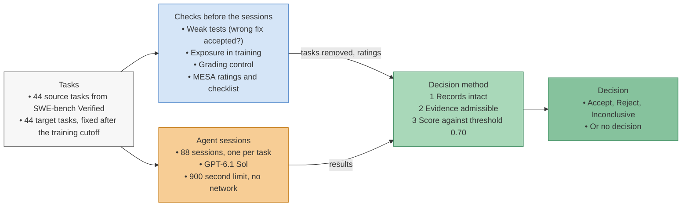

# Paper 2: how the study runs

Source: `paper2_study_overview.tex`

```mermaid
flowchart LR
    T["Tasks<br/>• 44 source tasks from SWE-bench Verified<br/>• 44 target tasks, fixed after the training cutoff"]
    K["Checks before the sessions<br/>• Weak tests (wrong fix accepted?)<br/>• Exposure in training<br/>• Grading control<br/>• MESA ratings and checklist"]
    S["Agent sessions<br/>• 88 sessions, one per task<br/>• GPT-6.1 Sol<br/>• 900 second limit, no network"]
    M["Decision method<br/>1 Records intact<br/>2 Evidence admissible<br/>3 Score against threshold 0.70"]
    D["Decision<br/>• Accept, Reject, Inconclusive<br/>• Or no decision"]
    T --> K
    T --> S
    K -- "tasks removed, ratings" --> M
    S -- "results" --> M
    M --> D
    classDef input fill:#F7F7F7,stroke:#555555
    classDef check fill:#D5E5F7,stroke:#3A78C2
    classDef run fill:#F7CD95,stroke:#C06F00
    classDef method fill:#A9D8B9,stroke:#2A7F4F
    classDef decision fill:#86C29D,stroke:#2A7F4F
    class T input
    class K check
    class S run
    class M method
    class D decision
```
