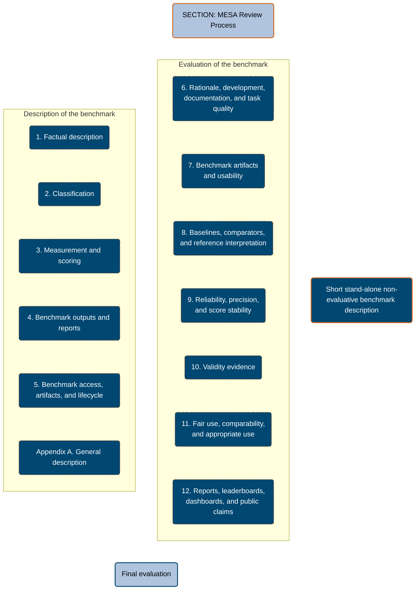
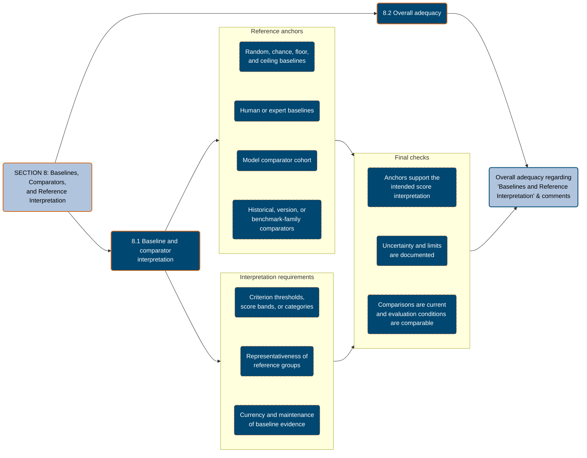
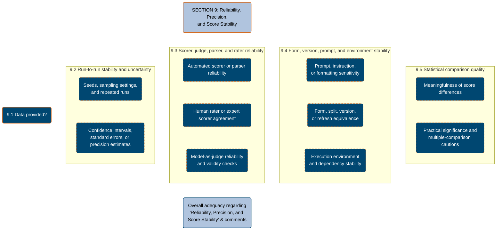
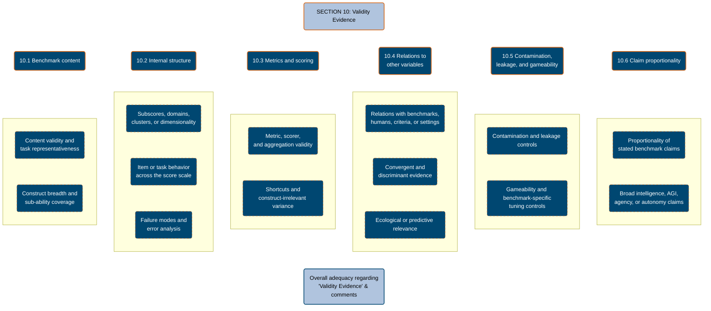
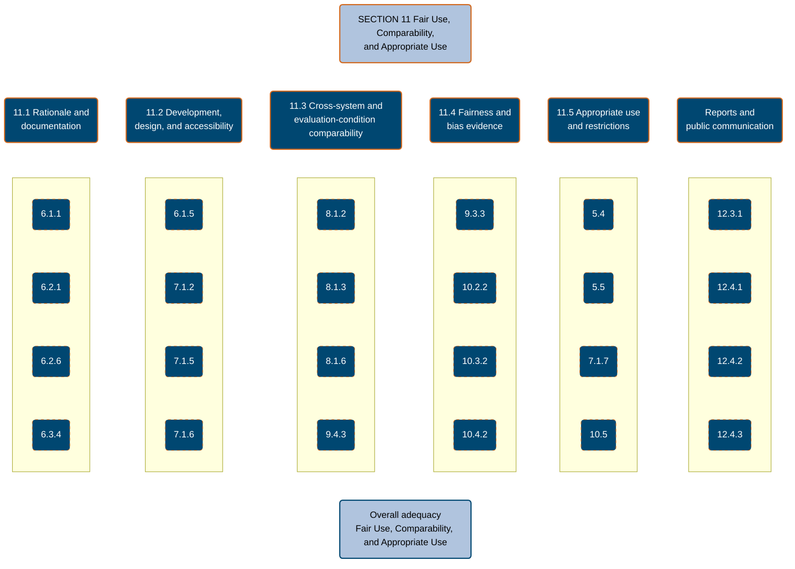

# MESA EFPA Template v6

## Introduction

MESA is a structured description and evaluation model for AI benchmarks treated as measurement instruments. It adapts the EFPA Test Review Model 2025 from human psychological and educational testing to AI benchmark review. It provides a structure for describing and evaluating AI benchmarks, task suites, leaderboards, evaluation harnesses, score reports, and related benchmark artifacts used in research, model development, safety evaluation, deployment governance, procurement, policy analysis, and public communication.

In MESA, an AI benchmark is treated as a structured measurement instrument: it samples the behavior of an AI system in a specified domain, then quantifies, scores, interprets, and reports that behavior through a standardized or documented process for evaluative or comparative conclusions. This includes benchmarks for language, reasoning, knowledge, coding, multimodality, tool use, agency, safety, robustness, calibration, domain expertise, or other claimed capabilities.

Review information presented in this structure should support benchmark developers, maintainers, suppliers, platform hosts, evaluators, auditors, trainers, policy makers, model developers, procurement teams, and benchmark users. It should help improve benchmark design and evaluation practice, support standards for benchmark review, and give users a more authoritative, unbiased, and consistent basis for interpreting benchmark claims.

This model is divided into two main review parts plus supporting appendices. Part A describes the benchmark in detail: what it is, what it claims to measure, how it is administered and scored, what materials exist, and what artifacts are available. Part B evaluates whether the benchmark supports its intended interpretation, using EFPA-style ratings translated for AI benchmark concerns such as construct validity, scoring validity, reproducibility, contamination, maintenance, fair comparison, and public reporting. The appendices and checklists support review discipline and template validation.

## How the MESA Model Should Be Used

Use this template as a review instrument, not as a scoring shortcut. Effective implementation depends on expert judgment, source-grounded interpretation, and careful separation between description and evaluation. Part A should remain descriptive: record facts, uncertainty, access limits, and documentation gaps without assigning quality ratings. Part B should remain evaluative: use Part A as the factual base, then judge adequacy for the benchmark's stated use.

This model is designed to guide reviewers, not to provide a closed set of rules. It should be adapted to the benchmark's domain, modality, evaluation setting, and claim scope while preserving the core review logic: first describe the benchmark as a measurement instrument, then evaluate whether the available evidence supports the intended interpretation. Missing documentation is an evidence gap, not automatic proof that the benchmark is poor. Do not mechanically average ratings; the final judgment should explain how the strongest support and most consequential gaps affect the intended interpretation.

Version 6 adds more explicit prompts from recent AI benchmark-quality literature on construct validity, contamination-resistant infrastructure, response-format confounds, perturbation sensitivity, temporal comparability, reproducible implementation, and benchmark retirement. Treat these as context-sensitive evidence sources. Strong cryptographic or proctored safeguards may be important for high-stakes, live, or contamination-prone benchmarks, but they are not universal requirements for every benchmark or every `4` rating.

MESA reviews evaluate benchmarks and the technical information supporting them. A completed MESA review does not imply endorsement, approval, or recommendation by MESA or by the reviewer unless this is stated explicitly. Public descriptions of a reviewed benchmark should not imply such endorsement; they should reference the review model and the evidence basis of the review.

Before completing the review, inspect the most authoritative available materials. Prefer official benchmark papers, websites, repositories, data hosts, leaderboards, harnesses, changelogs, and maintainer statements. Independent commentary should be used only for context, external critique, or disputed claims, and should not replace official benchmark facts.

### Figure 1. Structure of the MESA Review Model

---

# Part A. Description of the Benchmark

## Section 1. Factual Description

Section 1 identifies the review event, the benchmark, and the public artifacts inspected. EFPA begins with factual identification of the instrument and the information available to reviewers. MESA keeps that function but moves the inventory of reviewed materials into this section so later descriptive and evaluative judgments can be traced to the review base.

### 1.1 Review Information

| Prompt                                 | Response |
| :------------------------------------- | :------- |
| Reviewer                               |          |
| Date of current review                 |          |
| Date of previous review, if applicable |          |
| Review scope                           |          |
| Review boundary                        |          |

Review notes:

### 1.2 Information Sources Reviewed

Record the materials inspected for this review. Include access dates and distinguish official benchmark materials from contextual literature. Use this inventory to support later review notes rather than adding citation columns to every table.

| Material type                                   | Artifact reviewed | Access date | Role in review |
| :---------------------------------------------- | :---------------- | :---------- | :------------- |
| Official paper or technical report              |                   |             |                |
| Benchmark website or documentation hub          |                   |             |                |
| Repository                                      |                   |             |                |
| Dataset card, data host, or task host           |                   |             |                |
| Leaderboard, dashboard, or results page         |                   |             |                |
| Evaluation harness, package, or hosted runner   |                   |             |                |
| User guide, scoring guide, or contributor guide |                   |             |                |
| Release log, changelog, or maintenance record   |                   |             |                |
| Maintainer statement or official announcement   |                   |             |                |
| Contextual literature                           |                   |             |                |

Additional materials comments:

### 1.3 Benchmark Information

| Prompt                                                             | Response |
| :----------------------------------------------------------------- | :------- |
| Benchmark name                                                     |          |
| Short name or acronym                                              |          |
| Benchmark version, edition, or release                             |          |
| Original benchmark name, if this is an adaptation                  |          |
| Benchmark creators or authors                                      |          |
| Current maintainers                                                |          |
| Host organization, platform host, repository owner, or distributor |          |
| Date of original release                                           |          |
| Date of current release or revision                                |          |
| License or access terms                                            |          |
| Persistent identifier, citation, or DOI                            |          |

Review notes:

### 1.4 Public Artifacts

Record artifact existence and access status only. Evaluate artifact quality later in Part B.

| Artifact                                  | URL or location | Access status | Review detail |
| :---------------------------------------- | :-------------- | :------------ | :------------ |
| Paper or technical report                 |                 |               |               |
| Benchmark website                         |                 |               |               |
| Code repository                           |                 |               |               |
| Evaluation harness                        |                 |               |               |
| Dataset or task set                       |                 |               |               |
| Prompt set                                |                 |               |               |
| Rubric or scoring guide                   |                 |               |               |
| Leaderboard or result display             |                 |               |               |
| Release log or changelog                  |                 |               |               |
| Contact, issue channel, or feedback route |                 |               |               |

Additional artifact comments:

---

## Section 2. Classification

Section 2 classifies the benchmark's intended measurement domain, target AI systems, users, item/task structure, and administration conditions. EFPA uses this section to clarify who and what the test is for. MESA translates that into benchmark-use context: what systems are evaluated, what response modes are required, and which technical or contextual conditions shape interpretation.

### 2.1 Claimed Capability Domains

Specify what the benchmark claims to measure using up to five keywords. Select all that apply.

- [ ] Not explicitly stated
- [ ] General capability or intelligence
- [ ] Reasoning
- [ ] Knowledge
- [ ] Language understanding
- [ ] Writing or generation quality
- [ ] Mathematics
- [ ] Coding or software engineering
- [ ] Scientific or technical expertise
- [ ] Domain-specific professional expertise
- [ ] Multimodal perception
- [ ] Audio or speech
- [ ] Video understanding
- [ ] Tool use
- [ ] Planning or agency
- [ ] Web or browser interaction
- [ ] Embodied or simulated environment interaction
- [ ] Safety, refusal, or policy compliance
- [ ] Robustness
- [ ] Calibration or uncertainty

Additional capability domain comments:

### 2.2 Area of Use

Select all documented use contexts.

- [ ] Not explicitly stated
- [ ] Model comparison
- [ ] Leaderboard ranking
- [ ] Capability profiling
- [ ] Research diagnostics
- [ ] Safety evaluation
- [ ] Deployment gating
- [ ] Procurement or vendor comparison
- [ ] Internal regression testing
- [ ] Public communication or marketing
- [ ] Policy or governance analysis

Additional area-of-use comments:

### 2.3 Intended AI Systems

Only record systems stated or clearly implied by benchmark documentation.

- [ ] Not explicitly stated
- [ ] Frontier general-purpose language models
- [ ] Chat or instruction-following models
- [ ] Base language models
- [ ] Code models
- [ ] Multimodal models
- [ ] Audio or speech models
- [ ] Agentic systems
- [ ] Tool-using systems
- [ ] Retrieval-augmented systems
- [ ] Domain-specialized models
- [ ] Open-weight local models
- [ ] API-hosted models

Additional evaluated-system comments:

### 2.4 Intended Users of Benchmark Outputs

Select all that apply.

- [ ] Not explicitly stated
- [ ] Benchmark creators or maintainers
- [ ] AI researchers
- [ ] Model developers
- [ ] Product teams
- [ ] Safety evaluators
- [ ] Policy or governance actors
- [ ] Procurement or enterprise decision-makers
- [ ] Educators or academic reviewers
- [ ] Public leaderboard users

Additional user comments:

### 2.5 Task Families, Subdomains, and Scores

Describe the number and meaning of task families, subdomains, splits, score families, aggregate metrics, subscores, or derived outputs. This section is descriptive; do not judge representativeness here.

| Component                                                                                    | Description |
| :------------------------------------------------------------------------------------------- | :---------- |
| Claimed construct or phenomenon                                                              |             |
| Claimed capability definition                                                                |             |
| Construct subcomponents                                                                      |             |
| Excluded scope or non-target abilities                                                       |             |
| Task families or subdomains                                                                  |             |
| Task sources, including reused datasets or adapted benchmarks                                |             |
| Task sampling method, such as random, stratified, criterion, targeted, convenience, or mixed |             |
| Task selection or filtering logic                                                            |             |
| Splits or partitions                                                                         |             |
| Primary score                                                                                |             |
| Subscores                                                                                    |             |
| Derived or aggregate scores                                                                  |             |
| Qualitative labels or bands                                                                  |             |
| Claim boundaries or caveats                                                                  |             |

Review notes:

### 2.6 Model Response Mode

Select all that apply.

- [ ] Not explicitly stated
- [ ] Multiple choice
- [ ] Short text
- [ ] Long-form text
- [ ] Structured output, such as JSON or XML
- [ ] Code
- [ ] Mathematical expression
- [ ] Tool call
- [ ] Browser or web action
- [ ] File, document, or artifact generation
- [ ] Image output
- [ ] Audio output
- [ ] Video output
- [ ] Interaction in a simulated environment
- [ ] Interaction in a real or external environment

Additional response mode comments:

### 2.7 Prerequisites for Evaluated Systems

EFPA asks about demands placed on the person being assessed. MESA translates this into prerequisites placed on the evaluated AI system. Record what capabilities, interfaces, resources, or access conditions a system must have to participate as intended. Distinguish a true requirement from a convenience or from information that is simply missing.

| Requirement                                                     | Irrelevant or not necessary | Necessary information given | Information missing | Evidence / notes |
| :-------------------------------------------------------------- | :-------------------------: | :-------------------------: | :-----------------: | :--------------- |
| Language support                                                |             [ ]             |             [ ]             |         [ ]         |                  |
| Context length                                                  |             [ ]             |             [ ]             |         [ ]         |                  |
| Multimodal input support                                        |             [ ]             |             [ ]             |         [ ]         |                  |
| Structured output support                                       |             [ ]             |             [ ]             |         [ ]         |                  |
| Exact format, schema, or parser compatibility                   |             [ ]             |             [ ]             |         [ ]         |                  |
| Retry, repair, or correction-loop support for malformed outputs |             [ ]             |             [ ]             |         [ ]         |                  |
| Tool access                                                     |             [ ]             |             [ ]             |         [ ]         |                  |
| Browser or internet access                                      |             [ ]             |             [ ]             |         [ ]         |                  |
| Code execution                                                  |             [ ]             |             [ ]             |         [ ]         |                  |
| Memory or persistent state                                      |             [ ]             |             [ ]             |         [ ]         |                  |
| API compatibility                                               |             [ ]             |             [ ]             |         [ ]         |                  |
| Latency or time budget                                          |             [ ]             |             [ ]             |         [ ]         |                  |
| Cost or compute budget                                          |             [ ]             |             [ ]             |         [ ]         |                  |

Additional requirement comments:

### 2.8 Evaluation Conditions

EFPA records special testing conditions because scores can change when administration changes. MESA records the prompt, environment, tool, timing, access, and human-intervention conditions under which AI systems are evaluated. These conditions are part of the benchmark definition, not implementation trivia.

| Condition                         | Description |
| :-------------------------------- | :---------- |
| Prompting protocol                |             |
| System prompt                     |             |
| Few-shot examples                 |             |
| Sampling settings                 |             |
| Tool permissions                  |             |
| Time limits                       |             |
| Human intervention rules          |             |
| Hardware or hosted service        |             |
| Network requirements              |             |
| Sandbox or security constraints   |             |
| Special administration conditions |             |

Additional condition comments:

### 2.9 Task and Response Types

Selection-based responses:

- [ ] Multiple choice, single correct answer
- [ ] Multiple choice, multiple correct answers
- [ ] Ranking
- [ ] Classification
- [ ] Pairwise preference

Production-based responses:

- [ ] Open-ended text
- [ ] Code generation
- [ ] Proof, derivation, or explanation
- [ ] Structured data
- [ ] Generated media
- [ ] Artifact production

Interaction-based responses:

- [ ] Tool use
- [ ] Browser or web navigation
- [ ] API interaction
- [ ] Computer-use interaction
- [ ] Simulated environment task
- [ ] Real or external environment task

Process data:

- [ ] Response latency
- [ ] Token usage
- [ ] Cost
- [ ] Tool traces
- [ ] Intermediate reasoning traces
- [ ] Execution logs

Other task/response types:

### 2.10 Input Stimulus Type

Select all that apply.

- [ ] Not explicitly stated
- [ ] Text
- [ ] Code
- [ ] Tables or structured data
- [ ] Images
- [ ] Audio
- [ ] Video
- [ ] Documents
- [ ] Web pages
- [ ] APIs or tools
- [ ] Dynamic environment

Additional stimulus type comments:

### 2.11 Number of Items or Measurement Points

Where the benchmark is dynamic, record minimum, maximum, and typical task counts.

| Prompt                                  | Response |
| :-------------------------------------- | :------- |
| Total public items or tasks             |          |
| Total private or hidden items           |          |
| Development or example items            |          |
| Test items                              |          |
| Dynamic or generated tasks              |          |
| Episodes, trials, or measurement points |          |
| Item count uncertainty                  |          |

Review notes:

### 2.12 Mode of Evaluation

Select all that apply.

- [ ] Not indicated
- [ ] Local batch evaluation
- [ ] Hosted benchmark platform
- [ ] Leaderboard submission
- [ ] Private controlled evaluation
- [ ] Public open evaluation
- [ ] Interactive agent evaluation
- [ ] Human-in-the-loop evaluation
- [ ] Continuous or rolling evaluation

Additional evaluation mode comments:

Identity and condition controls:

- [ ] No control over submitted systems
- [ ] Some control over submitted systems
- [ ] Controlled model access or audit
- [ ] Controlled evaluation center or private harness
- [ ] Not documented

Additional identity and control comments:

### 2.13 Technological Arrangements

Mark A for available and R for required where documentation permits.

| Technology            |  A  |  R  | Evidence / notes |
| :-------------------- | :-: | :-: | :--------------- |
| API access            | [ ] | [ ] |                  |
| Local inference       | [ ] | [ ] |                  |
| GPU                   | [ ] | [ ] |                  |
| CPU-only execution    | [ ] | [ ] |                  |
| Docker or container   | [ ] | [ ] |                  |
| Python package or CLI | [ ] | [ ] |                  |
| Browser               | [ ] | [ ] |                  |
| External tools        | [ ] | [ ] |                  |
| Internet access       | [ ] | [ ] |                  |
| Proprietary platform  | [ ] | [ ] |                  |

Additional technology comments:

### 2.14 Time and Resource Requirements

Record documented estimates. Mark missing if not stated.

| Activity                           | Time, compute, or cost estimate |
| :--------------------------------- | :------------------------------ |
| Setup                              |                                 |
| Model inference or task completion |                                 |
| Scoring                            |                                 |
| Human adjudication                 |                                 |
| Analysis or reporting              |                                 |
| Full benchmark run                 |                                 |
| API or compute cost                |                                 |

Additional requirement comments:

### 2.15 Benchmark Forms, Versions, and Variants

Describe public/private forms, alternate forms, short forms, language variants, domain subsets, and deprecated versions.

| Form or variant | Purpose | Equivalence claim | Status |
| :-------------- | :------ | :---------------- | :----- |
|                 |         |                   |        |

Additional form and variant comments:

### 2.16 Static or Dynamic Task Determination

Select all that apply.

- [ ] Static fixed task set
- [ ] Random sample from fixed pool
- [ ] Hidden test set selected by maintainers
- [ ] Procedurally generated tasks
- [ ] Adaptive routing based on performance
- [ ] Dynamic environment generation
- [ ] Rolling or periodically refreshed task set
- [ ] Not explicitly stated

Additional task selection comments:

Describe task selection method:

### 2.17 Evidence Sources Used in Scoring

Select all that apply.

- [ ] Model final answer
- [ ] Model intermediate trace
- [ ] Tool-use trace
- [ ] Code execution result
- [ ] Environment state
- [ ] Reference answer
- [ ] Unit test
- [ ] Human judge
- [ ] Model judge
- [ ] Ensemble or panel adjudication
- [ ] External verifier

Additional scoring input comments:

---

## Section 3. Measurement and Scoring

Section 3 describes how model behavior becomes a score. EFPA separates scoring procedure from scores. MESA keeps that distinction: 3.1 identifies scoring method classes, while 3.2 describes the scoring pipeline and the meaning of global and partial metrics.

### 3.1 Scoring Procedure

Select scoring methods only. Do not describe the scoring pipeline in this subsection.

- [ ] Not explicitly stated
- [ ] Automated exact-match scoring
- [ ] Automated semantic or embedding-based scoring
- [ ] Unit-test or execution-based scoring
- [ ] Rule-based scoring
- [ ] Human rating
- [ ] Model-as-judge scoring
- [ ] Output parser or extractor
- [ ] Fuzzy, schema-aware, or admissible-variant parsing
- [ ] Pairwise preference scoring
- [ ] Hybrid automated and human scoring
- [ ] Leaderboard service scoring
- [ ] Manual adjudication

Additional scoring method comments:

### 3.2 Scores and Metrics

Describe the scoring pipeline, including how model responses, logs, judge decisions, reference answers, unit tests, or platform outputs become global and partial scores.

| Score or metric  | Definition | Aggregation | Interpretation stated by authors |
| :--------------- | :--------- | :---------- | :------------------------------- |
| Primary score    |            |             |                                  |
| Subscore         |            |             |                                  |
| Derived score    |            |             |                                  |
| Qualitative band |            |             |                                  |

Treatment of invalid, missing, malformed, or refused responses:

Response-format retry, repair, parser fallback, or manual adjudication policy:

Review notes:

### 3.3 Scale or Metric Types

Select all that apply.

- [ ] Raw score
- [ ] Accuracy
- [ ] Success rate
- [ ] Pass rate or pass@k
- [ ] Unit-test pass rate
- [ ] Win rate
- [ ] Elo or ranking score
- [ ] Pairwise preference score
- [ ] Reward or return
- [ ] Cost-adjusted score
- [ ] Calibration or uncertainty score
- [ ] Percentile or normalized score
- [ ] Threshold or decision index

Additional metric type comments:

### 3.4 Score Transformation

Select all that apply.

- [ ] No transformation
- [ ] Linear transformation
- [ ] Non-linear transformation
- [ ] Normalization against baseline
- [ ] Weighting across subdomains
- [ ] Aggregation formula documented
- [ ] Aggregation formula partially documented
- [ ] Aggregation formula not documented
- [ ] Not applicable

Formula or transformation comments:

### 3.5 Reference Groups, Baselines, and Comparators

Select all that apply.

- [ ] No baseline or comparator documented
- [ ] Random or chance baseline
- [ ] Human baseline
- [ ] Expert human baseline
- [ ] Model baseline
- [ ] Previous model cohort
- [ ] Commercial system comparator
- [ ] Open-weight model comparator
- [ ] Domain-specific reference group

Additional comparator comments:

| Comparator or baseline               | Construction method | Intended interpretation |
| :----------------------------------- | :------------------ | :---------------------- |
| Random or chance baseline            |                     |                         |
| Human baseline                       |                     |                         |
| Expert baseline                      |                     |                         |
| Model cohort                         |                     |                         |
| Prior benchmark or version           |                     |                         |
| Criterion threshold or floor/ceiling |                     |                         |

Review notes:

### 3.6 Score Uncertainty and Stability

This remains descriptive in Part A. Record whether uncertainty or run-to-run stability is reported.

- [ ] Confidence intervals
- [ ] Standard errors
- [ ] Bootstrap intervals
- [ ] Hierarchical, clustered, or item-level bootstrap intervals
- [ ] Multiple runs or seeds
- [ ] Judge agreement statistics
- [ ] Human inter-rater agreement
- [ ] Sensitivity analyses
- [ ] Prompt, input-perturbation, or response-format sensitivity metrics
- [ ] IRT, adaptive testing, or item-parameter precision estimates
- [ ] Not reported

Additional uncertainty and stability comments:

### 3.7 Metric-to-Claim Linkage

This remains descriptive in Part A. Record the documented link between metric behavior and benchmark claims.

| Prompt                                                                   | Response |
| :----------------------------------------------------------------------- | :------- |
| Why the primary metric was chosen                                        |          |
| Whether metric floors or ceilings are documented                         |          |
| Whether the metric may reward non-target behavior named by the benchmark |          |
| Whether parsing, judge, or scorer validation is documented               |          |
| Whether response-format burden is separated from the target capability   |          |
| Whether perturbation or prompt-sensitivity evidence affects the claim    |          |
| Whether score uncertainty affects claim interpretation                   |          |
| Whether score differences are interpreted statistically                  |          |
| Whether benchmark reports state what users should not infer              |          |

Review notes:

---

## Section 4. Benchmark Outputs and Reports

Section 4 adapts EFPA's digitally generated reports to AI benchmark outputs: papers, leaderboards, dashboards, result files, scorecards, APIs, raw traces, and public claims. Record what reports exist and how they present scores; evaluate report quality in Part B.

### 4.1 Output Availability

- [ ] Public leaderboard available
- [ ] Public aggregate scores available
- [ ] Public per-domain scores available
- [ ] Public per-item scores available
- [ ] Public raw model outputs available
- [ ] Public traces or logs available
- [ ] Private reports available only to submitters
- [ ] No formal report or leaderboard documented

Additional output availability comments:

### 4.2 Output Name or Description

| Output | Description | Public/private |
| :----- | :---------- | :------------- |
|        |             |                |

Review notes:

### 4.3 Output Design or Presentation

Select all that apply.

- [ ] Static text report
- [ ] Tables
- [ ] Graphs or visualizations
- [ ] Leaderboard
- [ ] Interactive dashboard
- [ ] Downloadable CSV or JSON
- [ ] API output
- [ ] Paper-only results

Additional presentation comments:

### 4.4 Output Structure

Select all that apply.

- [ ] Aggregate-score based
- [ ] Capability-domain based
- [ ] Task-family based
- [ ] Criterion-threshold based
- [ ] Pairwise-comparison based
- [ ] Rank based
- [ ] Cost or efficiency adjusted
- [ ] Error-analysis based
- [ ] Trace or process based

Additional output structure comments:

### 4.5 Sensitivity to Context

Select one.

- [ ] One output format for all contexts
- [ ] User-definable output contexts
- [ ] Pre-defined versions adapted to audience or use
- [ ] Context sensitivity not documented

List available contexts:

Review notes:

### 4.6 Development of Outputs

Select all that apply.

- [ ] Based on benchmark authors' design
- [ ] Based on empirical or actuarial relationships
- [ ] Based on expert judgment
- [ ] Based on human annotation
- [ ] Based on model-as-judge outputs
- [ ] Automatically generated by benchmark platform

Additional development basis comments:

Describe origin of report content:

### 4.7 Modifiability

Select one.

- [ ] Not modifiable
- [ ] Limited modification by submitter or user
- [ ] Fully user-generated reports possible
- [ ] Not documented

Review notes:

### 4.8 Transparency

Select one.

- [ ] Clear linkage between tasks, scores, and reported claims
- [ ] Partial linkage between tasks, scores, and reported claims
- [ ] Linkage is not obvious from available documentation
- [ ] Mixture of clear and concealed linkage
- [ ] Not documented

Review notes:

### 4.9 Output Content

Select all that apply.

- [ ] Capability descriptions
- [ ] Aggregate rankings
- [ ] Subdomain comparisons
- [ ] Error categories
- [ ] Examples of successes or failures
- [ ] Cost, latency, or efficiency data
- [ ] Process traces
- [ ] Recommendations or interpretation notes
- [ ] Warnings or caveats

Additional output content comments:

### 4.10 Intended Recipients

Select all that apply.

- [ ] Benchmark maintainers
- [ ] Model developers
- [ ] AI researchers
- [ ] Safety evaluators
- [ ] Policy or governance actors
- [ ] Product or deployment teams
- [ ] Procurement teams
- [ ] Public audience

Additional recipient comments:

---

## Section 5. Benchmark Access, Artifacts, and Lifecycle

Section 5 records how benchmark materials are distributed, accessed, reproduced, and maintained. MESA expands EFPA's supply-arrangement fields to include repositories, datasets, private splits, contamination controls, reproducibility materials, licenses, and maintenance policies.

### 5.1 Supporting Information Provided

Select all that apply.

- [ ] Technical report
- [ ] User guide
- [ ] Repository README
- [ ] API documentation
- [ ] Dataset card
- [ ] Model submission instructions
- [ ] Scoring documentation
- [ ] Rubric or annotation guide
- [ ] Evaluation examples
- [ ] FAQ or discussion forum
- [ ] Changelog or release notes

Additional supporting material comments:

### 5.2 Methods of Publication

Select all that apply.

- [ ] Academic paper
- [ ] Benchmark website
- [ ] Git repository
- [ ] Package registry
- [ ] Dataset hosting platform
- [ ] Leaderboard platform
- [ ] Downloadable documents
- [ ] Private distribution

Additional publication method comments:

### 5.3 User Requirements or Qualifications

Describe any requirements specified for running, submitting to, interpreting, or maintaining the benchmark.

| Requirement type                             | Requirement |
| :------------------------------------------- | :---------- |
| Technical skill                              |             |
| Model access                                 |             |
| Dataset access                               |             |
| Compute or budget                            |             |
| Human expertise                              |             |
| Account, license, or competition eligibility |             |
| Ethical, safety, or data-use obligations     |             |

Additional requirement comments:

### 5.4 Dataset and Item Access

| Component                                      | Public | Restricted | Hidden | Not available | Evidence / notes |
| :--------------------------------------------- | :----: | :--------: | :----: | :-----------: | :--------------- |
| Training or development items                  |  [ ]   |    [ ]     |  [ ]   |      [ ]      |                  |
| Public evaluation items                        |  [ ]   |    [ ]     |  [ ]   |      [ ]      |                  |
| Private or held-out evaluation items           |  [ ]   |    [ ]     |  [ ]   |      [ ]      |                  |
| Secret, encrypted, or reserve evaluation items |  [ ]   |    [ ]     |  [ ]   |      [ ]      |                  |
| Retired or archived evaluation items           |  [ ]   |    [ ]     |  [ ]   |      [ ]      |                  |
| Answer keys or reference solutions             |  [ ]   |    [ ]     |  [ ]   |      [ ]      |                  |
| Metadata or annotations                        |  [ ]   |    [ ]     |  [ ]   |      [ ]      |                  |
| Raw model outputs or logs                      |  [ ]   |    [ ]     |  [ ]   |      [ ]      |                  |

Additional access comments:

### 5.5 Provenance and Contamination Documentation

| Topic                                                      | Documented | Partially documented | Not documented | Evidence / notes |
| :--------------------------------------------------------- | :--------: | :------------------: | :------------: | :--------------- |
| Data origin or task creation                               |    [ ]     |         [ ]          |      [ ]       |                  |
| Persistent dataset or artifact identifier                  |    [ ]     |         [ ]          |      [ ]       |                  |
| Author or contributor qualifications                       |    [ ]     |         [ ]          |      [ ]       |                  |
| Deduplication or overlap checks                            |    [ ]     |         [ ]          |      [ ]       |                  |
| Public/private split rationale                             |    [ ]     |         [ ]          |      [ ]       |                  |
| Contamination screening                                    |    [ ]     |         [ ]          |      [ ]       |                  |
| Canary strings or training-data warnings                   |    [ ]     |         [ ]          |      [ ]       |                  |
| Memorization or `training_on_test_set` diagnostic task     |    [ ]     |         [ ]          |      [ ]       |                  |
| Pre-exposure or source-material searchability checks       |    [ ]     |         [ ]          |      [ ]       |                  |
| Hash commitments, signatures, or tamper-evident audit logs |    [ ]     |         [ ]          |      [ ]       |                  |
| Encrypted, secret, or controlled-release item reserve      |    [ ]     |         [ ]          |      [ ]       |                  |
| Refresh or rotation policy                                 |    [ ]     |         [ ]          |      [ ]       |                  |
| Reporting of known leaks or retired items                  |    [ ]     |         [ ]          |      [ ]       |                  |

Additional provenance and contamination comments:

### 5.6 Reproducibility Materials

Select all that apply.

- [ ] Complete task data
- [ ] Complete prompt templates
- [ ] Evaluation harness
- [ ] Scoring code
- [ ] Environment file or dependency list
- [ ] Container or reproducible environment
- [ ] Version pinning
- [ ] Random seeds or deterministic settings
- [ ] Raw outputs
- [ ] Reproduction script for published results
- [ ] Push-button replication script or single documented command
- [ ] Expected-output fixtures or smoke-test example
- [ ] Continuous integration or test suite
- [ ] Public build status or equivalent passing-test signal

Additional reproducibility comments:

### 5.7 Maintenance and Versioning

| Topic                                                    | Response |
| :------------------------------------------------------- | :------- |
| Maintainer identity                                      |          |
| Version naming or release tags                           |          |
| Changelog or update record                               |          |
| Issue or feedback process                                |          |
| Item correction process                                  |          |
| Deprecated item handling                                 |          |
| Private-set refresh policy                               |          |
| Last code-usability or harness health check              |          |
| Build, CI, or smoke-test status                          |          |
| Saturation threshold or retirement criteria              |          |
| Retirement, deprecation, or archival policy              |          |
| Retired-item publication or audit policy                 |          |
| Score comparability across versions                      |          |
| Cohort, rolling-window, or temporal comparability policy |          |
| Long-term archival plan                                  |          |

Review notes:

---

## Appendix A. General Description of the Benchmark

Write a concise descriptive summary of the benchmark for readers who have not inspected the materials. Keep this descriptive and defer evaluation to Part B.

Draft:

---

# Part B. Evaluation of the Benchmark

Part B evaluates whether the benchmark is adequate as a measurement instrument for its intended use. It should be completed only after the Part A description is sufficiently grounded. Descriptive facts, access limits, and missing materials should be recorded before assigning ratings. When evidence is incomplete, identify the missing evidence and its consequence for interpretation; do not treat absence of documentation as proof of poor benchmark quality.

## Information Sources

Information sources that might inform Part B include:

- Official benchmark papers, technical reports, model cards, dataset cards, websites, documentation hubs, repositories, leaderboards, scorecards, dashboards, and changelogs supplied or maintained by benchmark creators.
- Public benchmark artifacts such as task files, prompts, rubrics, reference answers, scorer code, harness code, examples, raw outputs, submission rules, issue trackers, release notes, and archived versions.
- Open information in academic literature, benchmark-quality literature, audit reports, replication studies, contamination analyses, validation studies, and independent technical commentary. Use these sources to contextualize or challenge claims, not to replace official facts.
- Maintainer-provided or access-controlled information that is not normally supplied to users. If such material affects a rating, state clearly in the review notes that the rating depends on non-public material inspected by the reviewer.
- Confidential or restricted technical information, such as private test splits, item provenance, contamination audits, scorer validation reports, model-as-judge calibration data, or security details. If reviewed under access restrictions, describe only the rating implication and the access status, without disclosing restricted content.

## Explanation of Ratings

All rating items use the EFPA-style scale below unless a section states otherwise. Detailed "Excellent" anchors identify what a rating of `4` would require for that item. Lower ratings should be assigned by reviewer judgment, considering the benchmark's intended use, claim scope, decision stakes, technical complexity, evidence quality, and consequences of misinterpretation.

Where a `0` or `1` rating is assigned to an attribute that is critical for the benchmark's stated purpose, the review should caution that the benchmark is suitable only for limited exploratory, research, or expert-qualified use unless stronger evidence is supplied. Critical attributes will vary by benchmark: for example, contamination controls may be critical for public knowledge benchmarks, scorer reliability may be critical for open-ended generation benchmarks, and reference interpretation may be critical for leaderboards used in procurement or policy.

Overall ratings must be based on reviewer judgment rather than mechanical averaging. A single severe gap may dominate the overall rating when it undermines the intended interpretation; conversely, a narrow gap may be less consequential when the benchmark's claim is modest and clearly bounded.

### Rating Scale

| Rating  | Meaning                                                                                |
| :-----: | :------------------------------------------------------------------------------------- |
| **n/a** | This attribute is not applicable to this benchmark or its stated use.                  |
|  **0**  | Not possible to rate because no, or insufficient, information is provided.             |
|  **1**  | Inadequate for the benchmark's stated purpose or intended interpretation.              |
|  **2**  | Adequate: sufficient for cautious use, with limitations that should be stated.         |
|  **3**  | Good: clear, relevant, and mostly complete support, with no major interpretive threat. |
|  **4**  | Excellent: comprehensive, well-documented, and strongly aligned with the item anchor.  |

## General Guidance on Assigning Ratings

It is difficult to set universal thresholds for benchmark quality. The adequacy of evidence depends on what the benchmark claims to measure, how scores are used, whether comparisons are high stakes, whether tasks are public or private, whether scoring is deterministic or judgment-based, and whether the benchmark is stable or regularly refreshed. Ratings should therefore be anchored in the intended interpretation, not in a generic expectation that every benchmark must supply every possible form of evidence.

For descriptive gaps, first ask what evidence would be needed to support the benchmark's actual claim. A missing human baseline, for example, may be a serious gap for a benchmark claiming expert-level performance but less central for a narrow regression test. A missing contamination audit may be serious for public web-derived knowledge tasks but less central for a private live-environment evaluation with documented release controls.

For broad claims about intelligence, AGI, reasoning, agency, autonomy, or cross-domain competence, require stronger breadth and validity evidence than for narrow capability claims. Isolated high performance on one task family should be treated as evidence about that task family unless the benchmark supplies a validity argument for broader interpretation.

For every rating, reviewers should record the evidence used, missing evidence, rationale for the score, and cautions for interpretation. The final evaluation should explain how the most consequential strengths and gaps affect responsible benchmark use.

## Section 6. Quality of Rationale, Development, Documentation, and Task/Item Quality

EFPA Section 6 asks whether the test explains its rationale, development, documentation, and item quality. MESA asks whether the benchmark defines the target phenomenon, explains why its tasks and metrics operationalize that phenomenon, documents task development, supports item quality, and gives users enough procedural information for cautious qualified use.

This section should be revisited after completing Sections 8-12, because later evidence about baselines, reliability, validity, fair use, and reporting may reveal strengths or weaknesses in the original rationale and documentation. A benchmark can have useful tasks but still receive a low rating here if users cannot determine what the tasks are meant to support, how they were selected, or what claims should be avoided.

When rating this section, distinguish the quality of the benchmark's design argument from the benchmark's observed performance results. High model scores, leaderboard popularity, or broad adoption do not by themselves establish a clear construct definition, defensible task-development process, or adequate documentation. Conversely, a benchmark with modest scope can rate well if its claim is precise, its materials are traceable, and its limitations are explicit.

Section-level rating guidance:

| Rating | Guidance                                                                                                                                |
| :----: | :-------------------------------------------------------------------------------------------------------------------------------------- |
|   0    | No usable rationale, development account, documentation, or procedural information is available.                                        |
|   1    | Core claims, task-development procedures, or user instructions are too unclear for responsible interpretation.                          |
|   2    | The benchmark is documented well enough for cautious use, but important design, development, or procedural gaps remain.                 |
|   3    | Rationale, development, documentation, and instructions are clear and mostly complete, with only limited gaps.                          |
|   4    | The benchmark gives comprehensive, traceable, and well-justified support for its rationale, development, documentation, and procedures. |

### 6.1 Rationale and Development

- This sub-section concerns the benchmark's rationale, construct definition, task or item development, and evidence that the benchmark content was built to support its intended score interpretation.
- Consider whether reviewers can trace the benchmark from claimed capability to task design, item sources, scoring decisions, aggregation, and intended use. For broad claims, check whether the rationale covers the relevant subdomains rather than relying on a benchmark title or leaderboard framing.
- Items to be rated `n/a` or `0`-`4`.

#### 6.1.1 Rationale and construct definition

- Excellent: The benchmark gives a clear, theoretically grounded account of the target phenomenon or capability, explains why the benchmark was constructed, defines intended construct boundaries and exclusions, identifies whether the phenomenon is contested or composite, and distinguishes the target capability from adjacent or broader claims.
- Rating: [n/a | 0 | 1 | 2 | 3 | 4]

---

#### 6.1.2 Summary of prior research and benchmark context

- Excellent: The benchmark documentation situates the benchmark in relevant research and prior evaluations, explains what gap it addresses, and identifies how prior findings, benchmark failures, or measurement limitations informed the design.
- Rating: [n/a | 0 | 1 | 2 | 3 | 4]

---

#### 6.1.3 Phenomenon-task-metric-claim chain

- Excellent: The documentation explicitly links the claimed phenomenon to task design, response requirements, scoring metric, aggregation method, and intended interpretation, with plausible confounds, shortcuts, formatting effects, parser effects, memorization, perturbation sensitivity, and benchmark-specific tuning considered.
- Rating: [n/a | 0 | 1 | 2 | 3 | 4]

---

#### 6.1.4 Task or item design

- Excellent: Task formats, item types, response modes, difficulty range, scoring protocols, time or tool constraints, and aggregation choices are clearly justified as appropriate for the stated measurement aims and intended AI systems.
- Rating: [n/a | 0 | 1 | 2 | 3 | 4]

---

#### 6.1.5 Procedures for developing task or item content

- Excellent: Content development used relevant domain expertise, benchmark design expertise, qualitative review, clear inclusion and exclusion criteria, documented sampling or sourcing procedures, and task-quality checks to ensure task content represents the intended capability space.
- Rating: [n/a | 0 | 1 | 2 | 3 | 4]

---

#### 6.1.6 Thoroughness of the final task or item selection process

- Excellent: The final task or item pool is justified through documented selection decisions, a defensible sampling strategy such as random, stratified, criterion, targeted, or well-justified mixed sampling, review evidence, pilot results where available, coverage analysis, removal of unsuitable items, and explanation of tradeoffs between breadth, depth, difficulty, and feasibility. Convenience sampling is not automatically disqualifying when its limits are explicit and claims are narrow.
- Rating: [n/a | 0 | 1 | 2 | 3 | 4]

---

#### 6.1.7 Quantitative evidence of task or item quality

- Excellent: Quantitative item or task evidence is reported where appropriate, such as difficulty, discrimination, ceiling and floor effects, domain coverage, inter-item redundancy, scorer behavior, model cohort performance, human or expert performance, or other benchmark-relevant indicators.
- Rating: [n/a | 0 | 1 | 2 | 3 | 4]

---

#### 6.1.8 Adaptation, translation, or benchmark version derivation

- Excellent: Any adaptation, translation, domain transfer, dataset reuse, synthetic data generation, benchmark refresh, or derived version follows a documented process with expert review, source-limit analysis, equivalence checks, cultural or domain considerations where relevant, and clear limits on comparability with prior versions.
- Rating: [n/a | 0 | 1 | 2 | 3 | 4]

---

#### 6.1.9 Overall quality of rationale, development, and task or item quality

- Excellent: Reviewer judgment, based on items 6.1.1-6.1.8, supports the conclusion that the benchmark rationale, construct definition, development process, and task or item quality are comprehensive and fit for the intended interpretation. Do not mechanically average ratings.
- Rating: [n/a | 0 | 1 | 2 | 3 | 4]

---

### 6.2 Adequacy of Documentation Available to Users

- This sub-section covers the comprehensiveness, clarity, currency, and traceability of documentation available to benchmark users, reviewers, and maintainers.
- Documentation should be evaluated as a user-facing support for responsible benchmark use. Private evidence may inform a rating if inspected, but lack of public access should be described because it affects independent auditability and ordinary user interpretation.
- Items to be rated `n/a` or `0`-`4`.

#### 6.2.1 Documentation of benchmark purpose and intended use

- Excellent: Documentation clearly explains what the benchmark is designed to measure, what it is not designed to measure, intended users, intended AI systems, suitable use cases, and explicit non-use cases.
- Rating: [n/a | 0 | 1 | 2 | 3 | 4]

---

#### 6.2.2 Documentation of development process

- Excellent: Documentation gives full details of data or item sources, sampling method, task construction, filtering, review, piloting, scoring design, reused-dataset limitations, changes during development, and reasons for major design decisions.
- Rating: [n/a | 0 | 1 | 2 | 3 | 4]

---

#### 6.2.3 Documentation of scoring and metrics

- Excellent: Documentation clearly explains output parsing, scoring rules, metric definitions, aggregation, treatment of invalid, missing, malformed, or retried outputs, tie handling, uncertainty reporting, and how scores should be interpreted.
- Rating: [n/a | 0 | 1 | 2 | 3 | 4]

---

#### 6.2.4 Documentation of reliability, stability, and uncertainty

- Excellent: Documentation clearly explains how score stability, run variance, scorer or judge agreement, parser reliability, prompt or perturbation sensitivity, form or version equivalence, and statistical uncertainty were assessed and how these affect interpretation.
- Rating: [n/a | 0 | 1 | 2 | 3 | 4]

---

#### 6.2.5 Documentation of validity evidence

- Excellent: Documentation presents a clear validity argument for the intended score interpretations, including content support, task representativeness, metric validity, relations with other evidence, contamination controls, and limits of inference.
- Rating: [n/a | 0 | 1 | 2 | 3 | 4]

---

#### 6.2.6 Documentation of fair use and comparability

- Excellent: Documentation describes fairness, accessibility, language or domain coverage, cross-system comparability, evaluation-condition comparability, and any restrictions needed to interpret results responsibly.
- Rating: [n/a | 0 | 1 | 2 | 3 | 4]

---

#### 6.2.7 Documentation of maintenance and versioning

- Excellent: Documentation provides version history, changelog, release rules, refresh policy, deprecation or retirement policy, saturation or archival criteria where relevant, data or task updates, leaderboard update practices, and clear guidance on comparability across versions or temporal cohorts.
- Rating: [n/a | 0 | 1 | 2 | 3 | 4]

---

#### 6.2.8 Adequacy of documentation available to users

- Excellent: Reviewer judgment, based on items 6.2.1-6.2.7, supports the conclusion that documentation is comprehensive, current, traceable, and sufficient for qualified users to run, inspect, score, and interpret the benchmark responsibly. Do not mechanically average ratings.
- Rating: [n/a | 0 | 1 | 2 | 3 | 4]

---

### 6.3 Quality of Procedural Instructions

- This sub-section covers instructions for administering, running, scoring, interpreting, and maintaining the benchmark.
- Procedural quality includes reproducibility and error handling, not only whether a benchmark can be run by its creators. Instructions should make evaluation conditions explicit enough that qualified users can reproduce or audit scores and understand when runs are no longer comparable.
- Items to be rated `n/a` or `0`-`4`.

#### 6.3.1 Evaluation setup and administration

- Excellent: Step-by-step setup and administration instructions are complete, reproducible, and include required environment, dependencies, credentials, compute assumptions, seeds, sampling settings, tool permissions, smoke-test or replication commands where relevant, and handling of expected failures.
- Rating: [n/a | 0 | 1 | 2 | 3 | 4]

---

#### 6.3.2 Scoring procedure and error handling

- Excellent: Scoring instructions are clear and include checks for parser failures, malformed outputs, format retries or repairs, judge failures, missing responses, duplicate submissions, manual overrides, and audit trails for any corrections.
- Rating: [n/a | 0 | 1 | 2 | 3 | 4]

---

#### 6.3.3 Interpretation and reporting guidance

- Excellent: Users receive detailed guidance on interpreting aggregate scores, subscores, uncertainty, baseline comparisons, version differences, ceiling or floor effects, and common overinterpretation risks.
- Rating: [n/a | 0 | 1 | 2 | 3 | 4]

---

#### 6.3.4 Restrictions, prerequisites, and appropriate use

- Excellent: The benchmark clearly states system prerequisites, access requirements, tool-use assumptions, modality requirements, unsupported system classes, prohibited uses, and the consequences of violating evaluation conditions.
- Rating: [n/a | 0 | 1 | 2 | 3 | 4]

---

#### 6.3.5 Technical support and implementation guidance

- Excellent: Technical instructions cover software and hardware requirements, known failure modes, troubleshooting, test runs, expected outputs, dependency versions, issue-reporting channels, and support for reproducibility.
- Rating: [n/a | 0 | 1 | 2 | 3 | 4]

---

#### 6.3.6 References and supporting materials

- Excellent: Documentation provides source-linked references to benchmark papers, datasets, task sources, code repositories, validation materials, related benchmarks, and supporting literature needed for informed review.
- Rating: [n/a | 0 | 1 | 2 | 3 | 4]

---

#### 6.3.7 Quality of procedural instructions

- Excellent: Reviewer judgment, based on items 6.3.1-6.3.6, supports the conclusion that procedural instructions are complete, reproducible, and sufficient for qualified users to run and interpret the benchmark without hidden procedural knowledge. Do not mechanically average ratings.
- Rating: [n/a | 0 | 1 | 2 | 3 | 4]

---

### 6.4 Overall Adequacy of Rationale and Documentation

- This overall rating is based on reviewer judgment across sub-sections 6.1, 6.2, and 6.3. Do not mechanically average ratings.
- Excellent: The benchmark provides a comprehensive, source-grounded rationale, a defensible development account, strong task or item quality evidence, complete documentation, and procedural instructions sufficient for responsible qualified use.
- Rating: [n/a | 0 | 1 | 2 | 3 | 4]

Review notes:

---

## Section 7. Quality and Usability of Benchmark Artifacts

MESA evaluates benchmark artifacts: datasets, task files, prompts, rubrics, scoring code, harnesses, interfaces, access routes, setup instructions, accessibility, and usability. Artifact quality includes both what is available and whether intended users can run or inspect it without hidden procedural knowledge.

Rate artifacts in relation to the benchmark's intended users and access model. Fully public artifacts are not always required, especially when private splits are needed for contamination control, but the access route, restrictions, auditability, and consequences for reproducibility should be clear. A benchmark with controlled access can rate well when the controls are justified and reviewers can inspect enough information to judge quality.

For open-ended, interactive, tool-use, multimodal, or environment-based benchmarks, artifacts include more than item text. They also include system prompts, environment state, dependency versions, assets, scoring scripts, judge prompts, rubrics, examples, failure handling, and any infrastructure needed to produce comparable scores.

Section-level rating guidance:

| Rating | Guidance                                                                                                                      |
| :----: | :---------------------------------------------------------------------------------------------------------------------------- |
|   0    | Artifacts cannot be inspected or used well enough to judge or reproduce the benchmark.                                        |
|   1    | Artifacts are incomplete, inaccessible, unstable, or too poorly specified for the intended use.                               |
|   2    | Artifacts support cautious use but require substantial assumptions, workarounds, or controlled access caveats.                |
|   3    | Artifacts are usable, traceable, and mostly reproducible, with minor access or usability limitations.                         |
|   4    | Artifacts are complete, accessible or access-controlled with justification, reproducible, well documented, and fit for audit. |

### 7.1 Quality of Benchmark Artifacts

- This sub-section concerns the benchmark artifacts that users need to inspect, run, score, reproduce, or audit the evaluation.
- Judge both completeness and usability. Artifacts should be understandable by intended users, robust to ordinary execution errors, and specific enough to prevent hidden evaluator choices from changing the score interpretation.
- Items to be rated `n/a` or `0`-`4`.

#### 7.1.1 Dataset, task set, or evaluation environment availability

- Excellent: The dataset, task set, environment, or access route is complete, versioned, licensed where applicable, clearly linked, and available in a form that supports independent inspection or justified controlled access.
- Rating: [n/a | 0 | 1 | 2 | 3 | 4]

---

#### 7.1.2 Prompts, instructions, and input artifacts

- Excellent: Prompts, task instructions, examples, system messages, input files, context windows, multimodal assets, and any hidden or private instructions are documented or controlled in a way that supports reproducible evaluation and fair interpretation.
- Rating: [n/a | 0 | 1 | 2 | 3 | 4]

---

#### 7.1.3 Rubrics, reference answers, and response format requirements

- Excellent: Rubrics, answer keys, reference outputs, response schemas, parsing rules, admissible variants, retry or repair rules, and invalid-response handling are clear, versioned, tested where relevant, and appropriate for the intended construct.
- Rating: [n/a | 0 | 1 | 2 | 3 | 4]

---

#### 7.1.4 Evaluation harness, scorer, and implementation quality

- Excellent: The harness and scoring tools are runnable, documented, tested, robust to common errors and malformed outputs, version-pinned where needed, covered by smoke tests or CI/build status where relevant, and include a replication script or examples that reproduce expected outputs.
- Rating: [n/a | 0 | 1 | 2 | 3 | 4]

---

#### 7.1.5 Interface and workflow usability

- Excellent: The benchmark workflow is easy for intended users to understand and operate, with clear command paths, expected inputs and outputs, progress or failure signals, and no hidden procedural steps.
- Rating: [n/a | 0 | 1 | 2 | 3 | 4]

---

#### 7.1.6 Accessibility across modalities, languages, and system types

- Excellent: Artifacts are accessible by design for relevant modalities, languages, deployment modes, API or local systems, and assistive or alternate interaction needs, with justified adaptations when accessibility is limited.
- Rating: [n/a | 0 | 1 | 2 | 3 | 4]

---

#### 7.1.7 Licensing, use requirements, and risk warnings

- Excellent: Licenses, terms of use, redistribution limits, privacy constraints, sensitive-content warnings, safety restrictions, and required user qualifications are explicit and compatible with the benchmark's intended use.
- Rating: [n/a | 0 | 1 | 2 | 3 | 4]

---

#### 7.1.8 Overall quality of benchmark artifacts

- Excellent: Reviewer judgment, based on items 7.1.1-7.1.7, supports the conclusion that benchmark artifacts are complete, usable, accessible, reproducible, and appropriate for the intended evaluation. Do not mechanically average ratings.
- Rating: [n/a | 0 | 1 | 2 | 3 | 4]

Review notes:

---

## Section 8. Baselines, Comparators, and Reference Interpretation

EFPA Section 8 evaluates reference distributions and criterion interpretation. MESA translates that logic into AI benchmark reference interpretation: random or chance floors, human or expert baselines, model cohorts, previous benchmark versions, criterion thresholds, saturation ceilings, and score bands. A benchmark can be useful without human baseline samples, but the interpretation of scores should be anchored somehow.

The figure below visualizes the structure of the possible steps in the review of baselines, comparators, and reference interpretation.

#### Figure 2: Structure of Section 8 on Baselines, Comparators, and Reference Interpretation

Reference interpretation should be rated in relation to the claims users are expected to make from scores. If a benchmark only supports within-benchmark ordering under fixed conditions, then baselines and comparators should make that narrow use clear. If a benchmark supports claims about expert performance, real-world readiness, general capability, or benchmark saturation, stronger baseline evidence is required.

Baselines and comparators are not interchangeable. Chance and trivial-strategy baselines help detect whether tasks are meaningful; human and expert baselines help interpret difficulty and claim scope; model cohorts support relative comparison; criterion thresholds or score bands support categorical claims. Reviewers should note which kinds of reference evidence are available and which are missing for the intended interpretation.

Section-level rating guidance:

| Rating | Guidance                                                                                                                            |
| :----: | :---------------------------------------------------------------------------------------------------------------------------------- |
|   0    | No usable reference information is available for interpreting scores.                                                               |
|   1    | Available baselines or comparators are inappropriate, undocumented, stale, or misleading for the intended use.                      |
|   2    | Reference information supports cautious interpretation but leaves important gaps in comparator selection, uncertainty, or currency. |
|   3    | Baselines and comparators are relevant, documented, and mostly sufficient for the intended interpretation.                          |
|   4    | Reference interpretation is comprehensive, current, uncertainty-aware, and clearly tied to score claims and comparison limits.      |

### 8.1 Baseline and Comparator Interpretation

- This sub-section concerns the reference information used to make benchmark scores interpretable.
- Repeat or qualify ratings where the benchmark has multiple task families, subscores, model cohorts, or versions with different reference anchors. A strong baseline for one subdomain should not be assumed to support another without evidence.
- Items to be rated `n/a` or `0`-`4`.

#### 8.1.1 Random, chance, floor, and ceiling baselines

- Excellent: Random, chance, floor, ceiling, saturation, and trivial-strategy baselines are reported where relevant, empirically checked when possible, and integrated into score interpretation.
- Rating: [n/a | 0 | 1 | 2 | 3 | 4]

---

#### 8.1.2 Human or expert baselines

- Excellent: Human or expert baselines are collected or reported with clear sampling, qualification, task exposure, instructions, timing, tools, uncertainty, and limits on comparability to AI systems.
- Rating: [n/a | 0 | 1 | 2 | 3 | 4]

---

#### 8.1.3 Model comparator cohort

- Excellent: Model comparators are selected and documented to support the intended interpretation, including model identity, version, date, access mode, prompting, sampling settings, tools, compute conditions, and uncertainty.
- Rating: [n/a | 0 | 1 | 2 | 3 | 4]

---

#### 8.1.4 Historical, version, or benchmark-family comparators

- Excellent: Comparisons to previous benchmark versions, related benchmarks, earlier model generations, or reference suites are clearly documented, justified, and caveated for differences in task content, scoring, leakage risk, and evaluation conditions.
- Rating: [n/a | 0 | 1 | 2 | 3 | 4]

---

#### 8.1.5 Criterion thresholds, score bands, or performance categories

- Excellent: Any thresholds, score bands, pass/fail points, capability labels, saturation claims, or tier labels are empirically justified, uncertainty-aware, and tied to intended use rather than arbitrary leaderboard convenience.
- Rating: [n/a | 0 | 1 | 2 | 3 | 4]

---

#### 8.1.6 Representativeness of reference groups

- Excellent: Baseline and comparator groups are representative of the intended reference interpretation, with documented inclusion criteria, known gaps, subgroup coverage, and implications for interpreting benchmark results.
- Rating: [n/a | 0 | 1 | 2 | 3 | 4]

---

#### 8.1.7 Currency and maintenance of baseline evidence

- Excellent: Baseline and comparator evidence is current for the benchmark's intended use, with clear refresh practices, dates, model-version tracking, and guidance on when outdated comparisons should no longer be used.
- Rating: [n/a | 0 | 1 | 2 | 3 | 4]

---

### 8.2 Overall Adequacy of Baselines and Reference Interpretation

- This overall rating is based on reviewer judgment across sub-section 8.1. Do not mechanically average ratings.
- Excellent: Reference interpretation is comprehensive, relevant, current, uncertainty-aware, and sufficient to support cautious claims about benchmark scores and comparisons.
- Rating: [n/a | 0 | 1 | 2 | 3 | 4]

Review notes:

---

## Section 9. Reliability, Precision, and Score Stability

EFPA Section 9 evaluates reliability and precision. MESA asks whether benchmark scores are stable enough for their intended use across runs, prompts, seeds, forms, raters, judges, scorers, benchmark versions, and execution environments. Reliability is especially important when public leaderboards encourage small score differences to be interpreted as meaningful.

Reliability and precision refer to the consistency and uncertainty of benchmark scores across replications of the evaluation procedure. For AI benchmarks, the relevant sources of variation may include stochastic decoding, API or model-version changes, tool calls, execution environments, prompt wording, response parsing, judge models, human raters, task sampling, private/public splits, and dependency versions.

There is no single reliability coefficient that fits all AI benchmarks. Deterministic exact-match tests, open-ended generation evaluations, interactive environments, model-as-judge evaluations, and human-rated tasks require different evidence. Reviewers should judge whether the methods used are appropriate for the benchmark design and whether the reported uncertainty is sufficient for the intended comparison or decision.

The figure below visualizes the structure of the possible steps in the review of reliability, precision, and score stability.

#### Figure 3: Structure of Section 9 on Reliability, Precision, and Score Stability

When ratings depend on numerical evidence, reviewers should consider the benchmark's stakes and score use. A small amount of instability may be acceptable for exploratory research but unacceptable when leaderboards rank systems by narrow margins, when procurement or policy decisions rely on the scores, or when public claims imply meaningful superiority.

Section-level rating guidance:

| Rating | Guidance                                                                                                                                     |
| :----: | :------------------------------------------------------------------------------------------------------------------------------------------- |
|   0    | No usable evidence about reliability, precision, score uncertainty, or stability is available.                                               |
|   1    | Evidence is too limited or mismatched to support the intended comparisons or score interpretation.                                           |
|   2    | Evidence supports cautious interpretation but leaves important sources of score variation unexamined.                                        |
|   3    | Major sources of variation are examined with appropriate methods and clear interpretation guidance.                                          |
|   4    | Reliability, precision, and stability evidence comprehensively supports the intended score use, including uncertainty and comparison limits. |

### 9.1 Data Provided About Reliability, Precision, and Stability

- This sub-section concerns the evidence available for judging whether benchmark scores are stable enough for the intended use.
- Selectively note which sources of variation have evidence and which do not. A benchmark may have strong repeat-run evidence but weak scorer evidence, or strong scorer agreement but no evidence about prompt sensitivity or model-version drift.
- Items to be rated `n/a` or `0`-`4`.

#### 9.1.1 Coverage of reliability and stability evidence

- Excellent: The benchmark reports reliability, precision, or stability evidence across the major sources of score variation relevant to the benchmark, including runs, prompts, perturbations, scorers, judges, parsers, versions, forms, temporal cohorts, environments, and model settings.
- Rating: [n/a | 0 | 1 | 2 | 3 | 4]

---

### 9.2 Run-to-Run Stability and Uncertainty

This sub-section concerns score variation when the same benchmark is run repeatedly under documented conditions. Reviewers should check whether repeat-run evidence covers the settings that materially affect the benchmark, including temperature, sampling, seeds, tool use, API state, and environment variation.

#### 9.2.1 Run-to-run stability, seeds, and sampling settings

- Excellent: Repeat-run studies or equivalent analyses quantify score stability across relevant seeds, sampling settings, temperatures, tool-use conditions, and execution environments, with settings fully documented.
- Rating: [n/a | 0 | 1 | 2 | 3 | 4]

---

#### 9.2.2 Score uncertainty, confidence intervals, or standard errors

- Excellent: Scores and score differences are accompanied by appropriate uncertainty estimates, confidence intervals, standard errors, bootstrap intervals, clustered or hierarchical bootstrap intervals where the design requires them, or other justified precision estimates suitable for the benchmark design.
- Rating: [n/a | 0 | 1 | 2 | 3 | 4]

---

### 9.3 Scorer, Judge, Parser, and Rater Reliability

This sub-section concerns consistency introduced by the mechanism that converts model behavior into scores. For open-ended responses, human scoring, rubric scoring, parsers, and model-as-judge systems should be treated as measurement components requiring evidence, not as neutral implementation details.

#### 9.3.1 Automated scorer or parser reliability

- Excellent: Automated scoring and parsing are validated against representative outputs, edge cases, malformed formats, admissible variants, and failure modes, with documented error rates, regression tests, and procedures for resolving ambiguous cases.
- Rating: [n/a | 0 | 1 | 2 | 3 | 4]

---

#### 9.3.2 Human rater or expert scorer agreement

- Excellent: Human or expert scoring uses clear rubrics, training, representative response samples, adequate numbers of raters, agreement estimates, adjudication procedures, and reporting of residual disagreement.
- Rating: [n/a | 0 | 1 | 2 | 3 | 4]

---

#### 9.3.3 Model-as-judge reliability and validity checks

- Excellent: Model-as-judge scoring is validated against human or expert judgments, tested for bias and prompt sensitivity, checked across domains and response styles, and monitored for drift when judge models change.
- Rating: [n/a | 0 | 1 | 2 | 3 | 4]

---

### 9.4 Form, Version, Prompt, and Environment Stability

This sub-section concerns whether scores remain comparable when benchmark forms, prompts, versions, data refreshes, dependencies, execution environments, or external tools change. If comparability is not established, reviewers should treat cross-version or cross-condition comparisons as limited.

#### 9.4.1 Prompt, instruction, or formatting sensitivity

- Excellent: The benchmark assesses whether plausible prompt, instruction, item-phrasing, answer-order, formatting, or response-schema variations materially affect scores, reports sensitivity metrics where relevant, and documents which variants are official or comparable.
- Rating: [n/a | 0 | 1 | 2 | 3 | 4]

---

#### 9.4.2 Form, split, version, or refresh equivalence

- Excellent: Alternate forms, public and private splits, benchmark refreshes, translated versions, rolling cohorts, and version updates have documented equivalence evidence, score normalization or equating where needed, or clear warnings about non-comparability.
- Rating: [n/a | 0 | 1 | 2 | 3 | 4]

---

#### 9.4.3 Execution environment and dependency stability

- Excellent: Environment, dependency, API, hardware, external-tool, and data-access variation is controlled or tested, with guidance on how such variation affects reproducibility and score interpretation.
- Rating: [n/a | 0 | 1 | 2 | 3 | 4]

---

### 9.5 Statistical Comparison Quality

This sub-section concerns whether reported score differences are large enough and well-estimated enough to support rank ordering or comparative claims. Reviewers should distinguish statistical significance, practical significance, and leaderboard convenience.

#### 9.5.1 Meaningfulness of score differences

- Excellent: The benchmark provides statistically justified guidance for interpreting model differences, including uncertainty, multiple comparisons where relevant, practical significance, temporal or cohort comparability limits, and cases where rank differences should not be treated as meaningful.
- Rating: [n/a | 0 | 1 | 2 | 3 | 4]

---

### 9.6 Overall Reliability, Precision, and Score Stability

- This overall rating is based on reviewer judgment across sub-sections 9.1-9.5. Do not mechanically average ratings.
- Excellent: Reliability, precision, and stability evidence is comprehensive enough to support the intended score interpretation and comparisons across systems, conditions, and benchmark versions.
- Rating: [n/a | 0 | 1 | 2 | 3 | 4]

Review notes:

---

## Section 10. Validity Evidence

EFPA Section 10 evaluates validity support for intended score interpretation. MESA centers the phenomenon-task-metric-claim chain: what phenomenon is claimed, how tasks operationalize it, what metric converts behavior into a score, and what claim the score is used to support. For broad intelligence, AGI, reasoning, autonomy, or agency claims, validity review must check breadth, depth, modality, tools, memory, planning, and speed rather than treating isolated performance as broad capability.

Validity is not a property of a score in isolation; it is the degree to which evidence and theory support the interpretations and uses made from benchmark scores. The same benchmark may have strong validity support for a narrow claim and weak support for a broader public claim. Reviewers should therefore identify the intended interpretation before rating each source of validity evidence.

MESA validity review should consider both psychometric-style evidence and AI-specific threats. Content coverage, internal structure, relations with other evidence, and response-process logic remain central, but benchmark review must also examine metric validity, scoring artifacts, contamination, leakage, benchmark-specific tuning, public/private split design, and whether public claims are proportional to the evidence.

The figure below visualizes the structure of the possible steps in the review of validity evidence.

#### Figure 4: Structure of Section 10 on Validity Evidence

Ratings in this section should not be inferred from benchmark popularity, leaderboard difficulty, or whether current models perform poorly. Difficulty can be useful, but validity depends on whether task performance supports the intended interpretation and whether the scoring metric rewards the claimed capability rather than shortcuts, memorization, formatting compliance, or benchmark-specific optimization.

Section-level rating guidance:

| Rating | Guidance                                                                                                                               |
| :----: | :------------------------------------------------------------------------------------------------------------------------------------- |
|   0    | No usable validity argument or validity evidence is available for the intended interpretation.                                         |
|   1    | Evidence does not support the stated claim, or major threats such as scoring artifacts, contamination, or overclaiming are unresolved. |
|   2    | Evidence supports a limited or cautious interpretation, but important validity threats or claim-scope gaps remain.                     |
|   3    | Multiple relevant validity sources support the intended interpretation, with clear caveats and manageable threats.                     |
|   4    | A comprehensive validity argument links phenomenon, tasks, metrics, evidence, threat controls, and claims in a defensible way.         |

### 10.1 Validity Evidence Based on Benchmark Content

- This sub-section concerns whether the benchmark content represents the claimed capability domain or use context.
- Consider the match between the intended capability space and the sampled tasks, domains, modalities, difficulty levels, and contexts. For broad claims, the review should look for explicit coverage analysis and evidence across relevant sub-abilities.
- Items to be rated `n/a` or `0`-`4`.

#### 10.1.1 Content validity and task representativeness

- Excellent: The task sample comprehensively represents the intended capability domain or use context, with explicit coverage analysis, expert review where relevant, documented exclusions, and clear limits on generalization.
- Rating: [n/a | 0 | 1 | 2 | 3 | 4]

---

#### 10.1.2 Construct breadth and sub-ability coverage

- Excellent: The benchmark identifies relevant subdomains, sub-abilities, modalities, difficulty levels, and contexts, and shows that the score interpretation is supported across that breadth rather than by isolated task performance.
- Rating: [n/a | 0 | 1 | 2 | 3 | 4]

---

### 10.2 Validity Evidence Based on Internal Structure

This sub-section concerns whether the benchmark's internal organization supports the way scores and subscores are interpreted. Domain labels, task clusters, aggregate scores, and capability profiles should have conceptual or empirical support rather than being assumed from task labels alone.

#### 10.2.1 Internal structure, subscores, or dimensionality

- Excellent: Subscores, domains, clusters, task families, or dimensional claims are empirically and conceptually supported, with evidence that aggregation does not hide incompatible constructs or misleadingly combine unrelated abilities.
- Rating: [n/a | 0 | 1 | 2 | 3 | 4]

---

#### 10.2.2 Item or task behavior across the score scale

- Excellent: Task behavior supports the intended measurement structure, including appropriate difficulty spread, discriminative value, absence of severe redundancy, and lack of dominant artifacts such as formatting shortcuts, prompt sensitivity, parser artifacts, or memorized items.
- Rating: [n/a | 0 | 1 | 2 | 3 | 4]

---

#### 10.2.3 Failure modes and error analysis

- Excellent: Qualitative and quantitative error analysis shows that common failure modes plausibly reflect the intended construct rather than non-target confounders such as format compliance, parser behavior, memorized source material, instruction complexity, rater or judge bias, or shortcut strategies.
- Rating: [n/a | 0 | 1 | 2 | 3 | 4]

---

### 10.3 Validity Evidence Based on Metrics and Scoring

This sub-section concerns the score-production step in the phenomenon-task-metric-claim chain. Reviewers should check whether the metric rewards the intended capability or whether it can be driven by construct-irrelevant features such as formatting, verbosity, refusal style, memorized strings, judge preferences, or tool-specific advantages.

#### 10.3.1 Metric, scorer, and aggregation validity

- Excellent: Metrics, scorers, rubrics, parsers, model judges, and aggregation rules are justified and validated as measuring the intended capability rather than irrelevant behavior, output format compliance, parser strictness, verbosity, memorization, or benchmark-specific tactics; strict formats are tested, relaxed, retried, or justified when they are not part of the target construct.
- Rating: [n/a | 0 | 1 | 2 | 3 | 4]

---

#### 10.3.2 Sensitivity to shortcuts and construct-irrelevant variance

- Excellent: The benchmark tests or convincingly mitigates shortcut strategies, superficial cues, response-format artifacts, judge preferences, prompt leakage, perturbation sensitivity, memorization, tool-specific advantages, and other sources of construct-irrelevant variance.
- Rating: [n/a | 0 | 1 | 2 | 3 | 4]

---

### 10.4 Validity Evidence Based on Relations to Other Variables

This sub-section concerns whether benchmark results behave as expected in relation to other relevant evidence. Expected relations should be stated before interpreting results: for example, relations with related benchmarks, expert judgments, human performance, real-world criteria, model capability profiles, or deliberately different constructs.

#### 10.4.1 Relations with other benchmarks, humans, criteria, or realistic settings

- Excellent: Relationships with relevant benchmarks, human or expert performance, real-world tasks, external criteria, or expected model differences are hypothesized, justified, empirically examined, and interpreted with appropriate caution.
- Rating: [n/a | 0 | 1 | 2 | 3 | 4]

---

#### 10.4.2 Convergent and discriminant evidence

- Excellent: The benchmark shows expected relationships with measures of similar capabilities and appropriate separation from measures of different capabilities, with explanations for unexpected convergence or divergence.
- Rating: [n/a | 0 | 1 | 2 | 3 | 4]

---

#### 10.4.3 Ecological or predictive relevance

- Excellent: Evidence supports the relevance of benchmark performance to intended real-world, deployment, scientific, or policy interpretations, with limits clearly stated when the benchmark is abstract, synthetic, or narrow.
- Rating: [n/a | 0 | 1 | 2 | 3 | 4]

---

### 10.5 Contamination, Leakage, and Gameability

This sub-section concerns whether scores can be inflated by prior exposure, public availability, leakage, overfitting, reverse engineering, or repeated optimization against the benchmark. The seriousness of these threats depends on release model, task source, public/private split design, and how the benchmark is used.

#### 10.5.1 Contamination and leakage controls

- Excellent: The benchmark documents data provenance, public/private splits, release rules, canaries or audits where appropriate, searchability risks, training-data exposure risks, contamination diagnostics, and procedures for responding to suspected contamination. For high-leakage, live, or certification-style benchmarks, stronger evidence may include secret or encrypted reserves, hash commitments, signed logs, synchronized evaluation, post-retirement release, or memorization-diagnostic tasks.
- Rating: [n/a | 0 | 1 | 2 | 3 | 4]

---

#### 10.5.2 Gameability and benchmark-specific tuning controls

- Excellent: The benchmark identifies and mitigates risks from benchmark-specific tuning, prompt overfitting, leaderboard gaming, reverse engineering, repeated submissions, and optimization against known scoring artifacts.
- Rating: [n/a | 0 | 1 | 2 | 3 | 4]

---

### 10.6 Claim Proportionality

This sub-section concerns whether benchmark claims are bounded by the evidence. The broader the claim, the stronger and broader the evidence required; claims about general intelligence, AGI, agency, autonomy, or broad reasoning require more than high performance on a narrow task set.

#### 10.6.1 Proportionality of stated benchmark claims

- Excellent: Claims are explicitly bounded to what the task sample, scoring metric, validation evidence, and uncertainty support, and public language avoids unsupported extrapolation from scores to broad capability.
- Rating: [n/a | 0 | 1 | 2 | 3 | 4]

---

#### 10.6.2 Broad intelligence, AGI, agency, or autonomy claims

- Excellent: If broad claims are made, the benchmark provides evidence across relevant subdomains, modalities, planning horizons, memory demands, tool-use conditions, and transfer contexts; otherwise it explicitly rejects or limits such claims.
- Rating: [n/a | 0 | 1 | 2 | 3 | 4]

---

### 10.7 Overall Validity Support

- This overall rating is based on reviewer judgment across sub-sections 10.1-10.6. Do not mechanically average ratings.
- Excellent: The total validity argument convincingly supports the intended score interpretation, including content, structure, error analysis, scoring, relations with other evidence, contamination controls, gameability controls, and claim proportionality.
- Rating: [n/a | 0 | 1 | 2 | 3 | 4]

Review notes:

---

## Section 11. Fair Use, Comparability, and Appropriate Use

EFPA Section 11 evaluates fair use across groups and contexts. MESA evaluates whether benchmark use is fair and comparable across relevant AI systems, modalities, domains, languages, access modes, compute budgets, and user contexts. The question is not only whether a score can be produced, but whether it can be compared and interpreted responsibly.

Fair use in AI benchmark review includes, but is broader than, demographic fairness. It covers whether tasks, inputs, languages, modalities, domains, infrastructure, access rules, scoring, and reporting allow intended systems and users to be evaluated under comparable and appropriate conditions. It also covers whether users are warned when scores should not be compared or should not be used for a particular decision.

Relevant information for this section may also have been rated in other sections. The figure below shows sections where ratings will have particular relevance to fair use, comparability, and appropriate use. Ratings in this section may still take a broader perspective and therefore need not be identical to the referenced ratings.

#### Figure 5: Relevant Ratings for Fair Use, Comparability, and Appropriate Use from Other Sections

Groups, contexts, and systems should be defined by the benchmark's intended use. Relevant differences may include model family, language, modality, API versus local deployment, context window, tool access, refusal behavior, safety policy, compute budget, domain expertise, geographic or cultural coverage, user population, and accessibility needs. A benchmark may be fair for one intended context and not for another.

Section-level rating guidance:

| Rating | Guidance                                                                                                               |
| :----: | :--------------------------------------------------------------------------------------------------------------------- |
|   0    | No usable information is available about fair use, comparability, accessibility, or appropriate-use limits.            |
|   1    | Benchmark conditions or documentation create serious risks of unfair, incomparable, or inappropriate use.              |
|   2    | Fair use and comparability are partly supported, but important contexts, systems, or restrictions remain unclear.      |
|   3    | The benchmark gives clear guidance and evidence for fair, comparable use across most intended contexts.                |
|   4    | Fair use, accessibility, comparability, bias evidence, and appropriate-use restrictions are comprehensively addressed. |

### 11.1 Rationale and Documentation for Fair Use

This sub-section concerns whether the benchmark explains the contexts, systems, users, languages, modalities, and domains for which fair and appropriate use is intended. Reviewers should note whether exclusions are justified and visible to users.

#### 11.1.1 Relevance of the construct across systems, groups, and contexts

- Excellent: The benchmark explains whether the claimed capability is relevant across intended AI system classes, domains, languages, modalities, deployment contexts, and user groups, with limits and exclusions clearly justified.
- Rating: [n/a | 0 | 1 | 2 | 3 | 4]

---

#### 11.1.2 Documentation of fair-use considerations

- Excellent: Documentation gives clear details of fairness, accessibility, bias, language, domain, modality, sensitive-content, and comparability issues considered during benchmark design, evaluation, and interpretation.
- Rating: [n/a | 0 | 1 | 2 | 3 | 4]

---

### 11.2 Development, Design, and Accessibility

This sub-section concerns whether fairness, accessibility, and coverage were considered during benchmark design rather than added only as post-hoc caveats. Relevant adaptations should be documented together with their consequences for score interpretation.

#### 11.2.1 Inclusive and accessible benchmark design

- Excellent: Tasks, prompts, interfaces, rubrics, and evaluation materials are designed to avoid unnecessary exclusion of relevant systems or users, with adaptations and their interpretive consequences documented.
- Rating: [n/a | 0 | 1 | 2 | 3 | 4]

---

#### 11.2.2 Domain, language, modality, and subgroup coverage

- Excellent: Coverage across relevant domains, languages, modalities, cultures, and subgroups is analyzed and linked to the interpretation of scores, with coverage gaps explicitly stated.
- Rating: [n/a | 0 | 1 | 2 | 3 | 4]

---

### 11.3 Cross-System and Evaluation-Condition Comparability

This sub-section concerns whether different systems can be compared under conditions that preserve the intended interpretation. Differences in context length, tools, API access, local hardware, safety policies, latency limits, multimodal affordances, benchmark version, or evaluation cohort should be documented and managed.

#### 11.3.1 Cross-system comparability

- Excellent: Evaluation conditions support fair comparison across intended AI systems, including model versions, access modes, tool availability, context limits, multimodal inputs, refusals, latency constraints, and system-specific affordances.
- Rating: [n/a | 0 | 1 | 2 | 3 | 4]

---

#### 11.3.2 Access, compute, tooling, and API or local comparability

- Excellent: Access routes, compute requirements, hardware assumptions, API limitations, local execution constraints, and tool-use differences are documented and managed so that score comparisons are not distorted without warning.
- Rating: [n/a | 0 | 1 | 2 | 3 | 4]

---

#### 11.3.3 Temporal comparability for rolling or live benchmarks

- Excellent: Rolling, refreshed, or live benchmarks document evaluation dates, cohort identifiers, item-retirement rules, score normalization or equating methods where used, stale-score handling, and direct-comparison limits between models evaluated on different item sets or time windows.
- Rating: [n/a | 0 | 1 | 2 | 3 | 4]

---

### 11.4 Evidence for Fairness and Bias

This sub-section concerns evidence about differential performance, scorer bias, judge bias, coverage gaps, or unequal measurement quality across relevant systems, domains, languages, modalities, user groups, or use contexts.

#### 11.4.1 Differential performance or bias analysis

- Excellent: The benchmark investigates performance differences, scorer bias, model-judge bias, language or domain bias, accessibility effects, and other differential impacts relevant to the intended use, with implications clearly explained.
- Rating: [n/a | 0 | 1 | 2 | 3 | 4]

---

#### 11.4.2 Reliability and validity across relevant subgroups or contexts

- Excellent: Reliability, score stability, and validity evidence are examined across relevant subgroups, domains, languages, modalities, or system classes, and any differences are tied to interpretation limits.
- Rating: [n/a | 0 | 1 | 2 | 3 | 4]

---

### 11.5 Appropriate Use and Restrictions

This sub-section concerns whether users are given clear boundaries for responsible use. Restrictions should cover both technical limits, such as unsupported systems or conditions, and interpretive limits, such as unsupported policy, procurement, safety, or broad-capability claims.

#### 11.5.1 Appropriate-use guidance and non-use cases

- Excellent: The benchmark provides clear guidance about appropriate uses, prohibited or unsupported uses, interpretation limits, broad-claim cautions, and conditions under which comparison or deployment decisions would be inappropriate.
- Rating: [n/a | 0 | 1 | 2 | 3 | 4]

---

#### 11.5.2 Release rules and sensitive-content handling

- Excellent: Release rules, data access restrictions, sensitive-content warnings, privacy considerations, safety constraints, and benchmark refresh practices support fair and responsible use.
- Rating: [n/a | 0 | 1 | 2 | 3 | 4]

---

### 11.6 Overall Fair Use, Comparability, and Appropriate Use

- This overall rating is based on reviewer judgment across sub-sections 11.1-11.5. Do not mechanically average ratings.
- Excellent: The benchmark actively supports fair, accessible, comparable, and appropriately bounded use across its intended systems, users, contexts, domains, languages, and modalities.
- Rating: [n/a | 0 | 1 | 2 | 3 | 4]

Review notes:

---

## Section 12. Quality of Reports, Leaderboards, Dashboards, and Public Claims

EFPA Section 12 evaluates digitally generated reports. MESA applies that logic to AI benchmark outputs: paper tables, scorecards, leaderboards, dashboards, downloadable result files, raw traces, public claims, and score interpretations. A reporting artifact should make clear what score was produced, under what conditions, with what uncertainty, and what users should and should not infer.

This section should be completed for any artifact that translates benchmark runs into a result used by others, even when there is no formal generated report. A static paper table, public leaderboard, hosted dashboard, badge, press release, downloadable CSV, benchmark card, or model score page can all shape interpretation and should be reviewed when it is part of the benchmark's public use.

Ratings should consider whether reports support the level of inference they invite. Rank-ordered leaderboards need clear versioning, eligibility rules, uncertainty, evaluation conditions, and caveats about meaningful differences. Technical score reports need enough detail for audit and reproduction. Public-facing claims need stronger safeguards against overinterpretation, especially when the benchmark title implies broad intelligence or real-world readiness.

Section-level rating guidance:

| Rating | Guidance                                                                                                                                              |
| :----: | :---------------------------------------------------------------------------------------------------------------------------------------------------- |
|   0    | No usable report, leaderboard, dashboard, score artifact, or public interpretation guidance is available.                                             |
|   1    | Reporting is misleading, insufficiently traceable, or likely to support unsupported interpretations.                                                  |
|   2    | Reporting supports cautious use but lacks important detail about uncertainty, conditions, traceability, or claim limits.                              |
|   3    | Reports are clear, traceable, and mostly sufficient for intended users, with only limited gaps.                                                       |
|   4    | Reporting comprehensively communicates scores, conditions, uncertainty, traceability, validity limits, fair-use caveats, and public-claim governance. |

### 12.1 Scope and Coverage

This sub-section concerns whether reporting artifacts cover the scores, subscores, traces, and contextual information needed for the intended use without implying unsupported precision or unsupported granularity.

#### 12.1.1 Report, leaderboard, dashboard, or result artifact scope

- Excellent: Reports, leaderboards, dashboards, tables, scorecards, downloadable files, or papers cover the scores and subscores relevant to the benchmark's intended use without omitting essential context or implying unsupported granularity.
- Rating: [n/a | 0 | 1 | 2 | 3 | 4]

---

#### 12.1.2 Score granularity and level of detail

- Excellent: The level of detail in reported scores, subscores, item-level outputs, rankings, and qualitative labels is justified by the measurement precision, task coverage, and intended interpretation.
- Rating: [n/a | 0 | 1 | 2 | 3 | 4]

---

### 12.2 Reliability and Traceability of Reports

This sub-section concerns whether a reported score can be traced to the evaluation conditions that produced it and whether users can tell when differences are stable enough to interpret.

#### 12.2.1 Uncertainty, version labeling, and evaluation-condition labeling

- Excellent: Reports identify benchmark version, model version, evaluation date, cohort or rolling-window label where relevant, evaluation conditions, prompts or settings, uncertainty, confidence or variability information, and whether differences are meaningful or temporally comparable.
- Rating: [n/a | 0 | 1 | 2 | 3 | 4]

---

#### 12.2.2 Reproducibility and traceability of reported scores

- Excellent: Reported scores can be traced to documented runs, configurations, raw outputs or sufficient summaries, scoring code, scorer versions, build or replication status where relevant, and data or task versions needed to reproduce or audit the result.
- Rating: [n/a | 0 | 1 | 2 | 3 | 4]

---

### 12.3 Relevance and Validity of Reports

This sub-section concerns whether reports connect scores to justified interpretations and avoid converting narrow task performance into unsupported claims.

#### 12.3.1 Linkage from scores to interpretations and public claims

- Excellent: Reports clearly explain what each score supports, what it does not support, how scores relate to claims, and where uncertainty, validity limits, contamination risk, temporal comparability, stale scores, or benchmark saturation affect interpretation.
- Rating: [n/a | 0 | 1 | 2 | 3 | 4]

---

#### 12.3.2 Raw outputs, per-item data, or trace availability

- Excellent: Raw outputs, per-item results, traces, judge rationales, error categories, retired-item artifacts, signed logs, or sufficiently detailed audit artifacts are available or access-controlled in a way that supports independent scrutiny while respecting privacy and release limits.
- Rating: [n/a | 0 | 1 | 2 | 3 | 4]

---

### 12.4 Fairness, Acceptability, and Public Communication

This sub-section concerns whether reporting language, design, access, and governance support responsible use by intended audiences and avoid misleading or unfair comparisons.

#### 12.4.1 Fairness and freedom from bias in reports

- Excellent: Reports and public artifacts use inclusive, non-misleading language; identify potential bias or coverage limits; and avoid interpretations that would be unfair across relevant systems, domains, languages, or user groups.
- Rating: [n/a | 0 | 1 | 2 | 3 | 4]

---

#### 12.4.2 Acceptability and usability for intended audiences

- Excellent: Reports are understandable, appropriately detailed, accessible, and suited to intended audiences, including technical reviewers, benchmark users, model developers, decision-makers, or the public as applicable.
- Rating: [n/a | 0 | 1 | 2 | 3 | 4]

---

#### 12.4.3 Public communication and leaderboard governance

- Excellent: Public claims, rankings, badges, headlines, and leaderboard governance are transparent, cautious, versioned, resistant to overinterpretation, and clear about update rules, eligibility, cohort or refresh labels, retirement rules, and known limitations.
- Rating: [n/a | 0 | 1 | 2 | 3 | 4]

---

### 12.5 Overall Quality of Reports, Leaderboards, Dashboards, and Public Claims

- This overall rating is based on reviewer judgment across sub-sections 12.1-12.4. Do not mechanically average ratings.
- Excellent: Reporting artifacts make the benchmark's scores, conditions, uncertainty, validity limits, appropriate interpretations, non-uses, and public claims clear enough for responsible use by intended audiences.
- Rating: [n/a | 0 | 1 | 2 | 3 | 4]

Review notes:

---

## Final Evaluation

### Evaluative Report of the Benchmark

This section should contain a concise, clearly argued judgment about the benchmark as a measurement instrument. It should describe its strengths and limitations, give general recommendations about how and when it may be used, and include warnings where necessary about when it should not be used. Include relevant positive or negative points about adapted, translated, derived, rolling, or versioned benchmark forms. Include comments on known ongoing research, maintenance plans, planned revisions, or future developments by the benchmark creators, maintainers, platform hosts, or suppliers.

Free Text:

### Conclusions

This section provides a summary evaluation and recommendation for use. It should consist of one or two sentences indicating the quality of the benchmark, its main supported use(s), and any important strengths or caveats. A further sentence should indicate the type and level of expertise required to administer, audit, reproduce, or interpret the benchmark responsibly, and whether this matches the benchmark creators’ or maintainers’ stated recommendations and practices.

Free Text:

### Recommendations

State what users, maintainers, or future reviewers should do next. Keep recommendations tied to the review findings.

Free Text:

### Summary of Ratings

| Section                                                    | Overall Rating (`n/a`, `0`-`4`) |
| :--------------------------------------------------------- | :-----------------------------: |
| Section 6. Rationale, documentation, and task/item quality |                                 |
| Section 7. Benchmark artifacts and usability               |                                 |
| Section 8. Baselines and comparators                       |                                 |
| Section 9. Reliability and precision                       |                                 |
| Section 10. Validity support                               |                                 |
| Section 11. Fair use and comparability                     |                                 |
| Section 12. Reports, leaderboards, and public claims       |                                 |

Review notes:

### Gap Register

| Gap | Affected rating(s) | Why it matters | Needed for a higher rating |
| :-- | :----------------- | :------------- | :------------------------- |
|     |                    |                |                            |
