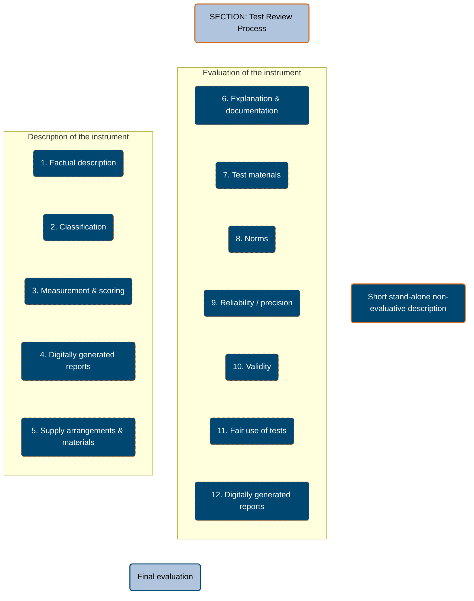
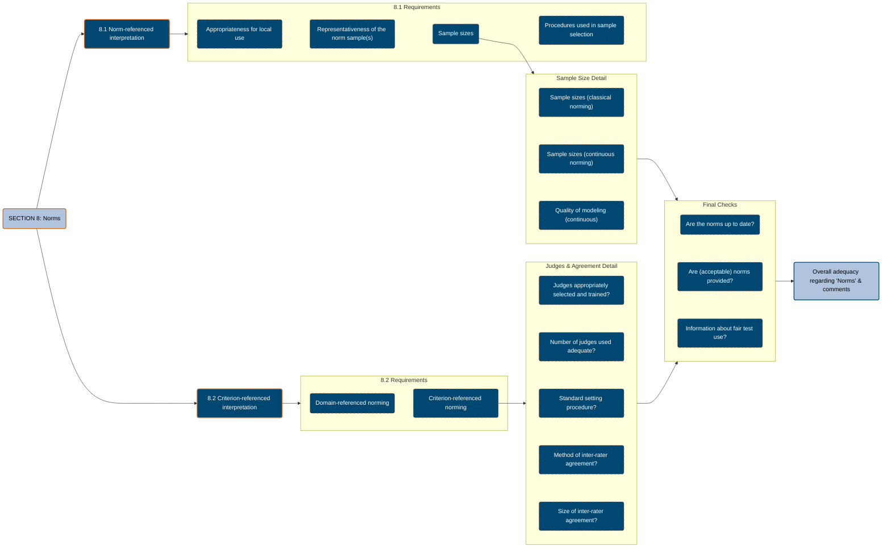
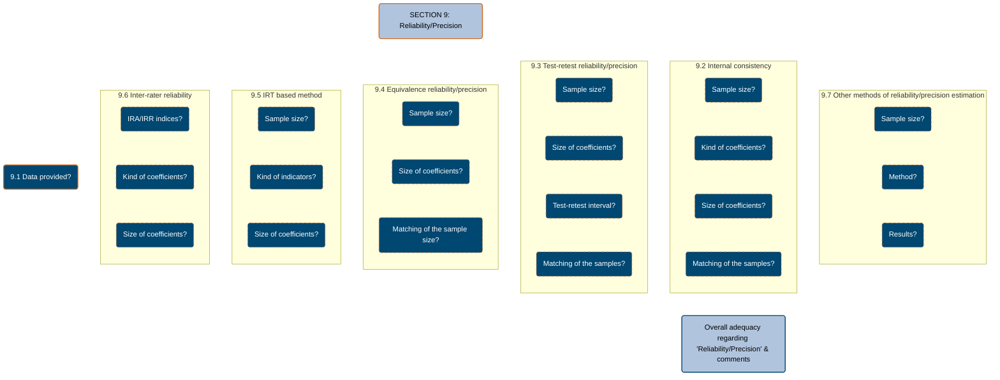
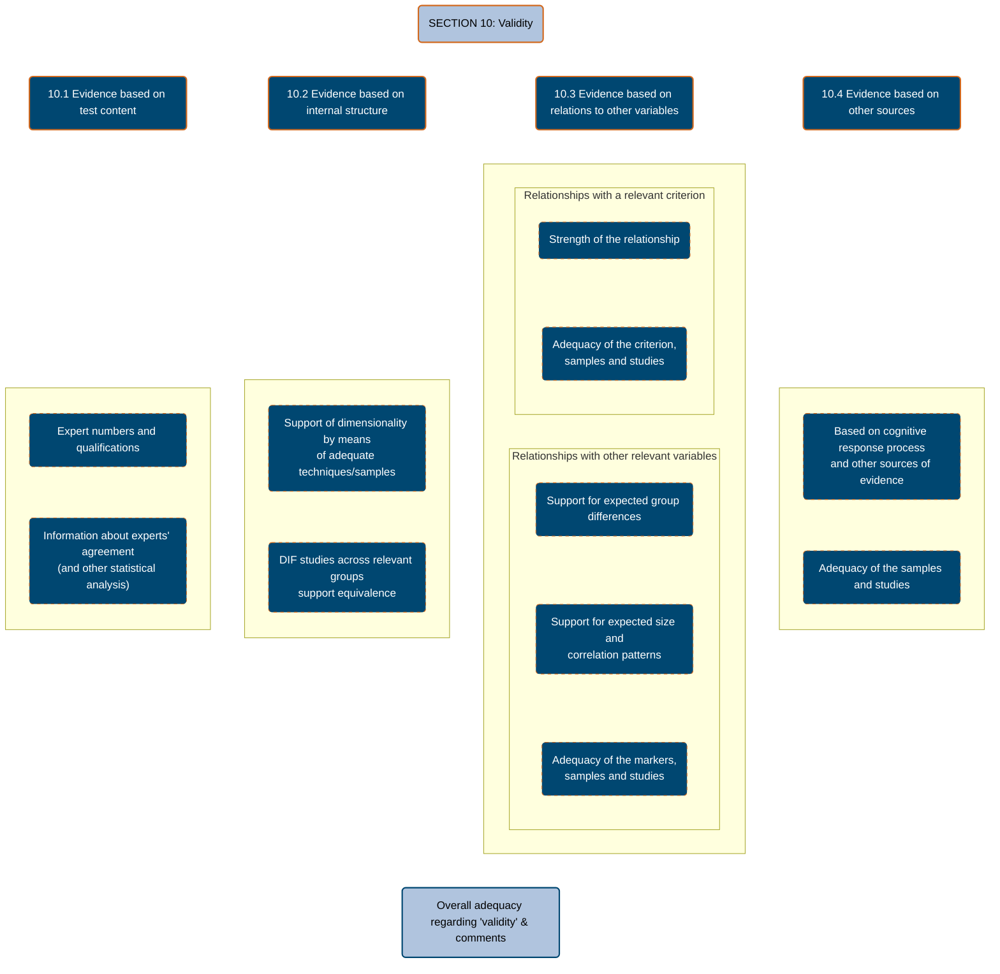
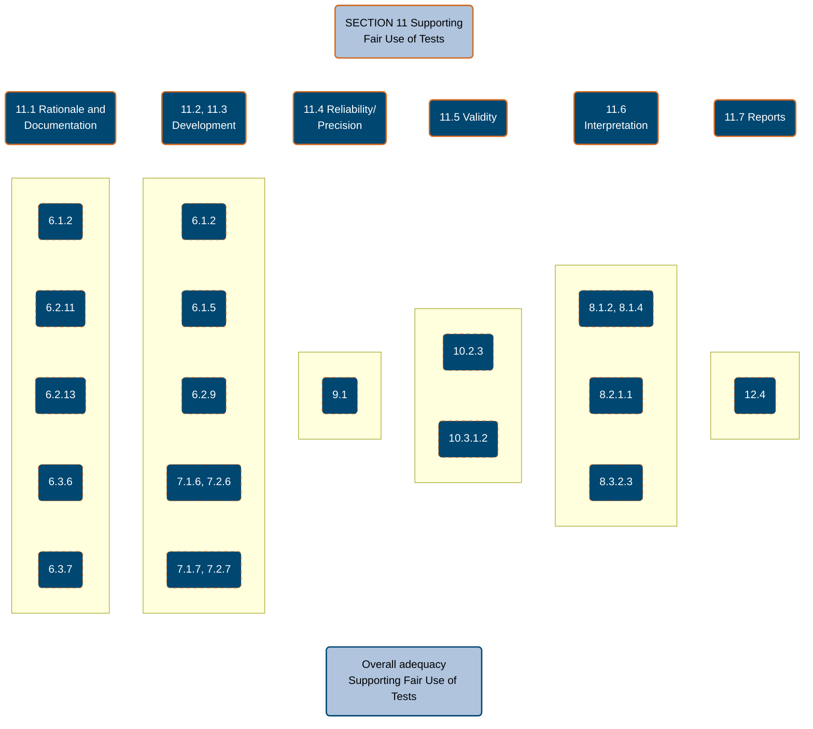

# EFPA Test Review Model – 2025 Edition

This document presents a markdown version of test review template used in the **EFPA Test Review Model (Version 2025)**.

## Introduction

The Model for the Review, Description and Evaluation of Psychological and Educational Tests (Test Review Model) developed by the European Federation of Psychologists’ Associations AISBL (EFPA) provides a structure for descriptions and rigorous evaluations of psychological assessments, tests, scales, profiles, and questionnaires used in work and organisational, educational, clinical and health (including clinical neuropsychology), sports, forensic, counselling, coaching and other contexts. It is designed to be adapted to reflect different national arrangements for psychometric testing and to be applied by expert reviewers.

Review information presented in this structure will support developers, authors, suppliers, publishers, and trainers to improve tests and testing practice. It will also inform policy makers in defining and supporting standards and, in particular, in creating a test review programme. In turn this will help users make the right assessment choices by providing authoritative, unbiased and consistent reviews of tests.

Following the Standards for Educational and Psychological Testing (AERA et al., 2014) the term “test” is used for any “psychometrically derived measurement instrument that assesses the psychological constructs in which a structured sample of an examinee’s behaviour in a specified domain is obtained and subsequently quantified, scored, interpreted, and synthesized using a standardized process for the purpose of evaluative conclusion or recommendation.” The EFPA Test Review Model can also be applied to instruments that measure groups of people (e.g., teams). It applies to all instruments that are covered by this definition, whether called a scale, questionnaire, projective technique, profile, structured interviewing system, structured life history or methodologies using artificial intelligence, machine learning and other innovative, digitally-based techniques.

This model is divided into three main parts: A, B and C. The first describes the test in detail. The second evaluates fundamental properties of the test, covering test materials, norms, reliability, validity, support for fair use and computer-generated reports, ending in a global evaluation. The final part provides a bibliography.

## How the Model Should Be Used

Effective implementation is as important as the model itself. Earlier editions have been operationalised by a number of organisations, most specifically by national psychological associations. Other organisations may want to use this model as the basis for review systems of tests used by their particular discipline/application in diverse media. It may also be used as an accreditation system if this is implemented by national bodies and regulators. The process of operationalising earlier versions has varied from country to country depending on local professional guidelines and laws defining who can use different kinds of tests and for what purposes. This model aims to be flexible enough to take these differences into account. It provides a firm structure which nevertheless allows expert local reviewers to apply their skills and knowledge in making judgements on any test. This version of the model is designed to guide reviewers, not to provide a closed set of rules.

Although harmonisation is one of the objectives of the model, another aim is to offer a system for test reviews to countries which do not have their own review procedures. It is realised that local issues may necessitate adaptations of the model or in the review procedures when countries start to use the model. In addition, test developers and publishers are encouraged to use the model to evaluate the quality of their own tests.

This model is designed to evaluate instruments and the technical information supporting them. The ratings given in this review do not imply EFPA’s endorsement, approval or recommendation of a test; advertising by publishing companies and others must not state or imply that this is the case but should reference the model if it was used.

Comments on this model are welcomed in the hope that the experiences of users will be instrumental in improving and clarifying the processes and should be addressed to EFPA using the contact information at the end of this document.

Each section of the review form is listed with its sub‑sections, prompts and the explicit options that reviewers can select. The template is organised using Markdown headings for clarity; bullet lists show the options provided in the official review form. No explanations or rating criteria are included, only the structure and selectable choices.

### Figure 1. Structure of the Test Review Model

---

# Part A. Description of the instrument

## Information Sources

In this part, unless otherwise indicated, select from those descriptions that the publisher provides. Where these are not clear, indicate this fact and judge from the information provided in the manual the most appropriate answers. Where the publishers’ suggestions seem inappropriate, the evaluation part of the review should include comments on this.

---

## Section 1. Factual description

### General information

| Prompt                                                       | Response  |
| :----------------------------------------------------------- | :-------- |
| Reviewer                                                     | Free text |
| Date of current review                                       | Free text |
| Date of previous review (if applicable)                      | Free text |
| Instrument name (local version)                              | Free text |
| Short name of the test (if applicable)                       | Free text |
| Original test name (if the local version is an adaptation)   | Free text |
| Authors of the original test                                 | Free text |
| Authors of the local adaptation                              | Free text |
| Local test distributor/publisher                             | Free text |
| Publisher of the original version of the test (if different) | Free text |
| Date of publication of current revision/edition              | Free text |
| Date of publication of adaptation for local use              | Free text |
| Date of publication of original test                         | Free text |

---

## Section 2. Classification

### 2.1 Content domains

- Specify what the test measures using up to 3 keywords.
- [ ] Not explicitly stated
- [ ] Ability
- [ ] Attention
- [ ] Emotional Intelligence
- [ ] Group Function
- [ ] Interests
- [ ] IQ
- [ ] Learning
- [ ] Manual Dexterity
- [ ] Motivation
- [ ] Personality
- [ ] Potential
- [ ] Projective
- [ ] Scholastic attainment
- [ ] Sensorimotor
- [ ] Verbal
- [ ] Other (describe): Free text

---

### 2.2 Area of use

- Select all that apply:
- [ ] Not explicitly stated
- [ ] Advice, guidance, and career choice
- [ ] Clinical
- [ ] Educational
- [ ] Forensic
- [ ] General health, life, and well-being
- [ ] Neurological
- [ ] Sports and Leisure
- [ ] Work and Organisational
- [ ] Other (describe): Free text

---

### 2.3 The populations for which the test is intended

- This item should be answered from information provided by the publisher. For
  some tests this may be very general (e.g., adults), for others it may be more
  specific (e.g., manual workers, or boys aged 10 to 14). Only the stated populations
  should be mentioned here. Where these may seem inappropriate, this should be
  commented on in the evaluation part of the review.
- Free text

---

### 2.4 Main intended users

- Select all that apply:
- [ ] Not explicitly stated
- [ ] Qualified Psychologists
- [ ] Health Professionals
- [ ] HR Professionals
- [ ] Specialist Teachers
- [ ] Speech and Language Therapists
- [ ] Other (describe): Free text

---

### 2.5 Number of scales and brief description of the variable(s) measured

- Indicate the number of scales and provide a brief description of each if its meaning
  is not clear from its name. These should include other derived scores where these
  are commonly used with the instrument and are described in the standard
  documentation (e.g., primary trait scores as well as Big Five secondary trait scores
  for a multi-trait personality test, or subtest, factor, and total scores on an
  intelligence test).
- Free text

---

### 2.6 Response mode

- Describe any special pieces of equipment which are required if they are not included
  in the list of options.
- Select all that apply:
- [ ] Not explicitly stated
- [ ] Behavioural interaction
- [ ] Drawing
- [ ] Keyboard or mouse responses
- [ ] Manual (physical) operations
- [ ] Oral
- [ ] Paper and pencil
- [ ] Touch screen
- [ ] Specialist response device (describe): Free text
- [ ] Other (describe): Free text

---

### 2.7 Demands on the test taker

- Which capabilities and skills are necessary for the test taker to work on the test as
  intended and to allow for a fair interpretation of the test score? It is usually clear if
  a total lack of some prerequisite impairs ability to complete a test (such as being
  blind and being given a normal paper-and-pencil test) but the requirements listed
  should be classified as follows:

| Capability                | Irrelevant / not necessary | Necessary information given | Information missing |
| ------------------------- | -------------------------- | --------------------------- | ------------------- |
| Attention                 | ☐                          | ☐                           | ☐                   |
| Command of test language  | ☐                          | ☐                           | ☐                   |
| Language fluency          | ☐                          | ☐                           | ☐                   |
| Digital skills/experience | ☐                          | ☐                           | ☐                   |
| Handedness                | ☐                          | ☐                           | ☐                   |
| Hearing                   | ☐                          | ☐                           | ☐                   |
| Motor capabilities        | ☐                          | ☐                           | ☐                   |
| Reading                   | ☐                          | ☐                           | ☐                   |
| Vision                    | ☐                          | ☐                           | ☐                   |
| Writing                   | ☐                          | ☐                           | ☐                   |

Other (describe): Free text

---

### 2.8 Special testing conditions

- Describe any specific test conditions that may be required, such as setting,
  environment, context, human-supervised, automated, recorded, with aids, cross￾cultural interaction.
- Free text

---

### 2.9 Item response types

- Selection-Based Responses (Choosing from predefined options)
- [ ] Multiple choice (right/wrong)
- [ ] Multiple choice (scaled)
- [ ] Likert scales
- [ ] Visual analogue scales
- [ ] Ranking
- Production-Based Responses (Generating a response)
- [ ] Open
- Interaction-Based Responses (Involving dynamic engagement with the test
  environment)
- [ ] Interactions/choices in a computer-generated environment
- [ ] Interactions/choices in a real environment
- [ ] Task success in a computer-generated environment
- [ ] Task success in a real environment
- Process Data Collection
- [ ] Response latency
- [ ] Other (describe): Free text

---

### 2.10 Item stimulus type

- Select all that apply
- [ ] Not explicitly stated
- [ ] Text Based
- [ ] Images
- [ ] Sound
- [ ] Video
- [ ] Dynamic
- [ ] Other (describe): Free text

---

### 2.11 Total number of items

- Where the test is not static, for example in adaptive testing or gamified environments, indicate the minimum, maximum and typical number of items or measurement points.
- Free text

---

### 2.12 Intended mode of administration

#### 2.12.1 Intended mode of administration

- Note that usage modes may vary across versions of a tool. Mark both if appropriate.
- Suitable for:
- [ ] Individual
- [ ] Group
- [ ] Not indicated

---

#### 2.12.2 Intended mode of use

- Select all that apply.
- [ ] Unsupervised administration without control over the identity of the test taker and without full control over the conditions of administration (e.g., open access Internet delivered test; test available for purchase from bookshops)
- [ ] Controlled but unsupervised administration. Control over conditions (timing etc.) and some control over the identity of the test taker (e.g., tests administered over the Internet but only to known individuals - password restricted access).
- [ ] Supervised and controlled administration. Test administration under the control of a qualified administrator or proctor
- [ ] Test administration only provided through specified testing centres (e.g., licensing and certification assessment programmes)

---

### 2.13 Technological arrangements available/required

- Mark A (available) / R (required) ) against each option
- [ ] PC without connectivity
- [ ] PC with connectivity
- [ ] Phone
- [ ] Tablet
- [ ] Proprietary apparatus
- [ ] Paper and Pencil
- [ ] Other (describe): Free text

---

### 2.14 Administrator/Test user time required

- In many cases, only general estimates of timing rather than precise figures will be possible. Where a function is automated, the required time is 0. Do not include the time needed to become familiar with the instrument itself. Assume the user is experienced and qualified.
  - Preparation: the time it takes the administrator to prepare and set out the materials for an assessment session; access and login time for an online administration.
    - Free text.
  - Administration: the time taken to complete all the items and an estimate of the time required to give instructions, work through example items and deal with any debriefing comments at the end of the session. In much automated test administration, these elements will be performed by the system and the time required will be 0.
    -Free text.
  - Scoring: the time taken to obtain raw-scores. This may be automated.
  - Analysis: the time taken to carry out further work on the raw scores to derive other measures and to produce a reasonably comprehensive interpretation. This may be automated.
    - Free text.
  - Feedback: the time required to prepare and provide feedback to a test taker and other stakeholders. Where automatically generated reports are used, only list the time required to support understanding of these. This could be through the provision of a helpline in case of queries or could be a session to explain the report’s findings and any time required to assimilate the report findings before such sessions.
    - Free text.

---

### 2.15 Different forms

- Are there alternative versions (genuine or pseudo-parallel forms, short versions, etc)? If so, describe the applicability of each for different groups of people. Some tests offer equivalent alternative forms. In other cases, various forms may exist for quite different groups (e.g., a children's form and an adult's form). Where more than one form exists, indicate whether these are equivalent/alternate forms, or whether they are designed to serve different functions (e.g., short and long versions; ipsative and normative versions). Also describe whether or not parts of the whole test can be used instead of the whole instrument.
- Free text

---

### 2.16 Static or dynamic determination

- Where the test is not static, for example with adaptive testing or in gamified
  environments, how is the content the test taker receives determined?
- Static Tests (Fixed Content)
  - Static test form(s)
- Adaptive Tests (Personalized Based on Responses or Scores)
  - When a test adapts to responses, it selects subsequent items directly based on the test taker’s most recent answers (e.g., correct/incorrect, chosen option, response time), without necessarily computing a formal ability estimate. In contrast, adaptation based on scores relies on an underlying trait estimate (e.g., a theta score in IRT or a cumulative raw score), and items are selected according to this evolving estimate, typically using an algorithm that aims to maximise information or minimise error at the current score level.
- Static Tests (Fixed Content)
  - Static test form(s)

---

### 2.17 Informant in the test

- Who are the informants that provide information in the test?
- Select all that apply:
- [ ] Self-report
- [ ] Parents
- [ ] Teachers
- [ ] Peers
- [ ] Partner
- [ ] Family
- [ ] Supervisors
- [ ] Coworkers
- [ ] Mental health professionals
- [ ] Caregivers
- [ ] Legal personnel
- [ ] Others

---

## Section 3. Measurement and scoring

### 3.1 Scoring procedure

- Select all that apply:
- [ ] Not explicitly stated
- [ ] Digital scoring (direct)
- [ ] Digital scoring (manual entry)
- [ ] Optical mark reader
- [ ] Simple manual scoring
- [ ] Complex manual scoring
- [ ] Bureau service
- [ ] Other (describe): Free text

---

### 3.2 Scores

- Brief description of the scoring system to obtain global and partial scores,
  (correction for guessing, qualitative interpretation aids, etc.).
- Free text

---

### 3.3 Scales used

- Percentile Based Scores
- [ ] Centiles
- [ ] 5-grade classification: 10:20:40:20:10 centile splits
- [ ] Deciles
- [ ] Other (describe): Free text
- Standard Scores
- [ ] IQ deviation quotients etc. (e.g., mean 100, SD=15)
- [ ] Stanines
- [ ] Stens
- [ ] T-scores
- [ ] Z-scores
- [ ] Other (describe): Free text
      Other
- [ ] Critical scores, expectancy tables or other specific decision-oriented indices
- [ ] Raw score use only
- [ ] Other (describe): Free text

---

### 3.4 Score transformation

Scores are normalised when a non-linear transformation is applied to make a previously non-normal distribution, normal. In practice this usually means that a look-up table is required to convert a score to the standard scale. When scores are not normalised a simple linear transformation can be applied without a look-up table, although in practice a look up-table may be used in this situation as well.

- [ ] Standard scores obtained by linear transformation
- [ ] Standard scores obtained by use of non-linear transformation, can be via normalisation look-up table
- [ ] Not applicable

---

### 3.5 Norming procedures

- [ ] Age-specific norms provided
- [ ] Other differentiated norms
      provided (describe)
- [ ] No differentiated norms

---

## Section 4. Digitally-generated reports

### 4.1 Are digitally generated reports available?

- If there is more than one report, please complete 4.2 to 4.10 for each report.
- [ ] Yes
- [ ] No

---

### 4.2 Name or description of report

- Free text

---

### 4.3 Design or presentation

- Some reports generate a text unit for the observed score in a scale-by-scale description. Others generate text units which relate to patterns or configurations of scale scores and consider scale interaction effects.
- Select all that apply.
- Static Electronic or Paper document
- [ ] Text only
- [ ] Unrelated text and graphics
- [ ] Integrated text and graphics
- [ ] Graphics only
- Interactive Electronic document
- [ ] Text only
- [ ] Unrelated text and graphics
- [ ] Integrated text and graphics
- [ ] Graphics only
- Multi-media reports
- [ ] Sound
- [ ] Video
- Other (describe): Free text

---

### 4.4 Structure

- Some reports generate a text unit for the observed score in a scale-by-scale description. Others generate text units which relate to patterns or configurations of scale scores and consider scale interaction effects.
- [ ] Construct-based: built around one or more sets of constructs (typology) derived from original/base scale scores.
- [ ] Criterion-based: where the report focuses on links to empirical outcomes.
- [ ] Factor-based: where the report is constructed around higher order factors such as the Big Five in a personality measure.
- [ ] Pattern-based: e.g., descriptions of patterns and configurations of scale scores, and scale interactions.
- [ ] Scale-based: e.g., a list of paragraphs giving scale descriptions.
- [ ] Other (describe): Free text

---

### 4.5 Sensitivity to context

- Reports generated from the same test but for different audiences, different purposes in different areas of activity will use different language, information, and design.
- Select one:
- [ ] One version for all contexts
- [ ] User definable contexts
- [ ] Pre-defined versions adapted to the context (list available contexts)

---

### 4.6 Development of the report

- The content (text units, etc.) of some report systems is based on the judgement of one or more people who are 'expert users' of the instrument.
- Others link scale scores to, for example, job performance measures, clinical classification, etc., while the content of some is generated by digital techniques with no initially identifiable author.
- [ ] Based on expert analysis of empirical/actuarial relationships (including empirical data and/or literature)
- [ ] Based on expert judgement of group of experts
- [ ] Based on expert judgement of one expert
- [ ] Artificial Intelligence generated based on empirical/actuarial relationships
- [ ] Artificial Intelligence generated based on corpus of clinical judgement of expert(s)
- [ ] Other (describe): Free text

---

### 4.7 Modifiability

- Select one:
- [ ] Not modifiable.
- [ ] Limited modification (limited to certain areas, e.g., biodata fields).
- [ ] Unlimited modification.

---

### 4.8 Transparency

- Select one:
- [ ] Clear linkage between constructs, scores, and text.
- [ ] Link between constructs, scores, and text not obvious (a ‘black box’).
- [ ] Mixture of clear/concealed linkage between constructs, scores, and text.

---

### 4.9 Type of content

- Select all that apply:
- [ ] Behavioural descriptions
- [ ] Competence descriptions
- [ ] Diagnostic categories
- [ ] Predictions/Potential
- [ ] Questions for consideration
- [ ] Suggested future points
- [ ] Suggested discussion points
- [ ] Others (describe): Free text

---

### 4.10 Intended recipients

- a) Qualified users. These are people who are sufficiently knowledgeable and skilled to be able to produce their own reports based on scale scores. They should be able to make use of reports that use technical psychometric terminology and make explicit linkages between scales and descriptions. They should also be able to customise and modify reports.
- b) Qualified system users. While not competent to generate their own reports from a set of scale scores, people in this group are competent to use the outputs generated by the system. The level of training required to attain this competence will vary considerably, depending on the nature of the computer reports (e.g. trait-based versus competency￾based, simple or complex) and the uses to which its reports are to be put (low stakes or high stakes).
- c) Test Takers. The subject of the assessment will generally have no prior knowledge of either the instrument or the type of report produced by the system. Reports for them will need to be in language that makes no assumptions about psychological, psychometric or instrument knowledge.
- d) Third parties. These include people - other than the subject of the assessment - who will be privy to the information presented in the report or who may receive a copy of the report. They may include potential employers, a person's manager or supervisor or the parent of a young person. The type of language required for people in this category would be similar to that required for reports intended for Test Takers.
- Select all that apply:
- [ ] Qualified test users
- [ ] Qualified system users
- [ ] Test takers
- [ ] Third parties
- [ ] Others (describe): Free text

---

## Section 5. Supply arrangements and materials

### 5.1 Supporting information provided by the distributor to users

- Select all that apply:
- [ ] Technical manual
- [ ] User manual
- [ ] Supplementary technical information and updates (e.g., local norms, local validation studies etc.)
- [ ] Books and articles of related interest
- [ ] Discussion/User groups
- [ ] Other (describe): Free text

---

### 5.2 Methods of publication

- Select all that apply:
- [ ] Website
- [ ] Downloadable documents
- [ ] Print documents
- [ ] Other (describe): Free text

---

### 5.3 Test-related qualifications required

- Describe the user requirements/qualifications the publisher specifies for test use.
- Examples might be:
  - Degree in Psychology
  - Psychologist (practitioner/board recognized/chartered)
  - Specific national or professional accreditation
  - Test specific accreditation
  - EFPA Level 2 qualification
- Where qualification requirements are not clear this should be stated. When it is explicitly stated that there is no required qualification, write ‘none’.
- Free text.

### Appendix A: General description of the instrument

Provide a concise non-evaluative description of the instrument. This should offer the reader a clear idea of what the instrument claims to be. It should be as objective and factual as possible in tone, describing what the instrument is, the scales it measures, its intended purpose, the availability and type of norm groups, general points of interest or unusual features and any relevant historical background. It should also indicate who the intended test users and takers are. This description may be quite short (200-300 words). However, for more complex multi-scale instruments, it may need to be longer (300-600 words in most cases but possibly longer for tests with many versions and reports). It should be written so that it can stand alone as a description of the instrument in other contexts. As a consequence, it may repeat some of the more specific information provided in response to Part A, sections 1-5. It should outline all versions of the instrument that are available and referred to on subsequent pages.

- Free Text

---

# Part B. Evaluation of the Instrument

## Information Sources

Information sources that might inform these reviews include:

- Manuals, white papers, website material, sample questions and reports that are supplied by the publisher for the user. They form core resources for the review.
- Open information that is available in academic or other literature, such as journal articles and books on testing, whether in printed or other formats: the reviewers may source and make use of this information in the review.
- Information held by the distributor/publisher that is not formally published or made available. The distributor/publisher may offer this at the outset or supply it when the review is sent to the publisher to check for factual accuracy. The reviewers should make use of this information but note very clearly at the beginning of the comments on the technical information that “the starred rating in this review refers to materials held by the publisher/distributor that is not [normally] supplied to test users.” If these contain valuable information, the overall evaluation should recommend that the publisher publishes these reports and/or make them available to test purchasers.
- Information that is commercially confidential. In some instances, publishers may have
  technically important material that they are unwilling to make public for commercial as well as copyright, contractual, and intellectual property reasons. Such information could include reports that cover the development of particular scoring algorithms, test or item generation procedures and report generation technology. Where the content of such reports might be important in making a judgement in a review, those responsible for the review should enter a non-disclosure agreement with the publisher. This agreement would be binding on the reviewers and editors. The reviewers could then evaluate the information and comment on the technical aspects and the overall evaluation to the effect that “the starred rating in this review refers to materials held by the distributor/publisher that have been examined by the reviewers on a commercial in confidence basis. These are not supplied to end users.” In such situations, the reviewers’ non-competitive position against the test publisher becomes critical.

---

## Explanation of Ratings

All sections (unless otherwise indicated) are scored using the following rating system. Detailed descriptions giving anchor points for ratings are provided where these help clarify the rating system for a particular item.

Where a [ 0 ] or [ 1 ] rating is provided for an attribute that is regarded as critical to the safe use of an instrument for the stated purpose, the review’s recommendation should be that the instrument must only be used in exceptional circumstances by highly skilled experts or in research. The review needs to indicate which, given the nature of the instrument and its intended use, are the critical technical qualities. It is suggested that the convention to adopt is that ratings of these critical qualities are then shown in bold print. In the following sections, overall ratings of the adequacy of information relating to validity, reliability and norms are shown, by default, in bold.

Any instrument rated with one or more [ 0 ] or [ 1 ] ratings in attributes that are regarded as critical to the safe use of that instrument should be considered as falling below the minimum standard for the purpose it is intended to fulfil.

### Rating Scale

| Rating    | Meaning                                |
| --------- | -------------------------------------- |
| **[n/a]** | Not applicable                         |
| **[0]**   | Cannot rate (insufficient information) |
| **[1]**   | Inadequate                             |
| **[2]**   | Adequate                               |
| **[3]**   | Good                                   |
| **[4]**   | Excellent                              |

---

$^1$ Note. Review systems can combine the points on the scale in their operationalisation of this model (for example combining points 3 and 4 into a single point). The only constraint is that there must be a distinction made between inadequate (or worse) on the one hand and adequate (or better) on the other. Where the five-point scale is replaced or customised, the user should provide a key that links the points and the nomenclature to the five-point scale in this model.

---

## General Guidance on Assigning Ratings

It is difficult to set clear criteria for rating the more technical, psychometric qualities of an instrument including norms, reliability, and validity. Notes provide some guidance on the sorts of values to associate with inadequate, adequate, good, and excellent ratings for many items. However, these are intended to act as guides only. The nature of the instrument, its area of application, the quality of the data used, as well as the types of decisions to be made using the instrument, will all affect the way in which ratings are assigned.

Metaphorically, we can say that we have provided a recipe and distinguished between ‘need to have’ and ‘nice to have’ ingredients, but the cook, the kitchen, the equipment, the available time, the region etc. may play a role.

---

# Section 6. Quality of the explanation of the rationale, its presentation and the information provided

In this section a number of ratings need to be given to various aspects or attributes of the documentation supplied with the instrument. The term ‘documentation’ is taken to cover all those materials supplied or readily available to the qualified user: e.g., the manual; technical handbooks; norm tables; manual supplements; updates from publishers/suppliers and so on.

---

## 6.1. Rationale and development

This sub-section relates to the procedures followed in the development of the instrument including developing a rationale, appropriate content for its measurement and adequate and appropriate analysis at the granular level of tasks or items. It is not always easy to rate these aspects of a test before looking at other aspects in the review. It may be worth re-examining this sub-section after completing other sections.

- Items to be rated n/a or 0 to 4

---

### 6.1.1 Theoretical foundations of the constructs

- Rating: [n/a | 0 | 1 | 2 | 3 | 4]

---

### 6.1.2 Summary of empirical research relating to the construct

- Rating: [n/a | 0 | 1 | 2 | 3 | 4]

---

### 6.1.3 Test development procedure

#### 6.1.3.1 Test design

- Excellent: Design decisions (such as item format, response scales, scoring protocols, test length, adaptive design, stopping rules, item order, differential age related starting points) clearly justified and appropriate for measurement aims.
- Rating: [n/a | 0 | 1 | 2 | 3 | 4]

---

#### 6.1.3.2 Procedures to develop item content including considerations of content validity

- Excellent: Rationale for item content is central to content development process; expertise in the construct to be measured, the subject of the assessment and test development incorporated into the process; significant review processes to ensure content is appropriate for use; qualitative and quantitative criteria for inclusion of items in final pool appropriate.
- Rating: [n/a | 0 | 1 | 2 | 3 | 4]

---

#### 6.1.3.3 Thoroughness of the decision process for selecting final item pool

- Including item analysis and content considerations to justify the final pool of items kept in the test or available for use in generated test forms.
- Rating: [n/a | 0 | 1 | 2 | 3 | 4]

---

### 6.1.4 Translation or adaptation procedure

- Excellent: the translation/adaptation process was done according to international guidelines (ITC, 2017) and included: input from native speakers of new language; multiple review by both language and content (of test) experts; independent checks of quality of translation/adaptation; consideration of cultural and linguistic differences.
- Rating: [n/a | 0 | 1 | 2 | 3 | 4]

---

### 6.1.5 Quantitative evidence of item quality

**Psychometric Framework Used**

- [ ] Classical Test Theory (CTT)
- [ ] Item Response Theory (IRT)
- [ ] Both CTT and IRT
- [ ] Other
- [ ] Not specified

**Item Indices/Parameters Reported**

- [ ] Item difficulty (p or proportion correct)
- [ ] Item mean and standard deviation
- [ ] Item-total correlation (r_i,T)
- [ ] Corrected item-total correlation (r_i,T-i)
- [ ] IRT discrimination parameter (a)
- [ ] IRT difficulty/location parameter(s) (b or category thresholds)
- [ ] IRT guessing parameter (c)
- [ ] Distractor functioning (e.g., frequency and mean scores per option)
- [ ] Differential item functioning (e.g., Logistic Regression, Mantel-Haenszel)
- [ ] Other (describe): Free text
- [ ] No specific indices reported

---

### 6.1.6 Item Analysis Methodology and Depth

- To what extent is the item analysis methodology clearly described and appropriate for the test's purpose?
- Rating
  - Not applicable (n/a)
  - No or insufficient presentation of item analysis results, whether conducted or not (0)
  - No or insufficient presentation of item analysis results, whether conducted or not (1)
  - Adequate (2)
  - Good (3)
  - Excellent: items show a good spread of difficulty/locations for the intended sample, enough variability and high discrimination (e.g., > .30 based on CTT) and satisfactory construct breadth. Note that very high correlations may mean that items are more or less synonymous and that the concept measured may be very narrow. In maximum performance, multiple choice items, distractors work as intended. For multi-scale instruments absence of unexpected cross-loadings.

---

### 6.1.7 Quality of Item Analysis Results

- Rating
  - Not applicable (n/a)
  - No or insufficient results (0)
  - Inadequate: low discrimination, ceiling/floor effects (1)
  - Adequate (2)
  - Good (3)
  - Excellent: : items show a good spread of difficulty/locations for the intended sample, enough variability and high discrimination (e.g., > .30 based on CTT) and satisfactory construct breadth. Note that very high correlations may mean that items are more or less synonymous and that the concept measured may be very narrow. In maximum performance, multiple choice items, distractors work as intended. For multi-scale instruments absence of unexpected cross-loadings. (4)

---

### 6.1.8 Overall rating of the quality of the rationale, development and item quality

- This overall rating is obtained by using judgement based on the ratings given for items 6.1.1 – 6.1.7.
- Rating: [n/a | 0 | 1 | 2 | 3 | 4]

---

### 6.2. Adequacy of documentation available to the user

- This sub-section covers the comprehensiveness and clarity of the coverage and explanation of the instrument and its use in documentation available to the user (user and technical manuals, norm supplements, etc.).
- The quality of the instrument itself, as evidenced by the documentation, is treated in other sections and reviewers may want to complete those first and then return to complete 6.2. The quality of the documentation is independent of the quality of the instrument and the work done to evidence its psychometric properties.
- ‘Benchmarks’ are provided for an ‘excellent’ (4) rating.

- **6.2.1 Rationale**
  - Excellent: logical and clearly presented description of what it is designed to measure and why it was constructed as it was.
  - Rating: [n/a | 0 | 1 | 2 | 3 | 4]

- **6.2.2 Development**
  - Excellent: full details are given of item sources, development of stimulus material, piloting, item analyses, comparison studies and changes made during development trials.
  - Rating: [n/a | 0 | 1 | 2 | 3 | 4]

- **6.2.3 Development of the test through translation/adaptation**
  - Excellent: information in the manual shows whether the translation/adaptation meets international guidelines. See e.g., Iliescu, et al. 2023.
  - Rating: [n/a | 0 | 1 | 2 | 3 | 4]

- **6.2.4 Standardisation procedure**
  - Excellent: clear and detailed information is provided about standardisation procedure.
  - Rating: [n/a | 0 | 1 | 2 | 3 | 4]

- **6.2.5 Norms**
  - Excellent: clear and detailed information is provided about sizes and sources of norms groups, representativeness, conditions of assessment, and any algorithms or procedures in the norming process that impact interpretation.
  - Rating: [n/a | 0 | 1 | 2 | 3 | 4]

- **6.2.6 Reliability / Precision**
  - Excellent: clear and detailed explanation of how reliability / precision was assessed, results of analyses and the appropriateness of the approach(es) used given the nature of the instrument.
  - Rating: [n/a | 0 | 1 | 2 | 3 | 4]

- **6.2.7 Validity based on content.**
  - Excellent: clear and detailed explanation of validity evidence based on content analysis, making explicit the means (number and qualifications of experts and statistical analysis used) that are appropriately used and interpreted.
  - Rating: [n/a | 0 | 1 | 2 | 3 | 4]

- **6.2.8 Validity based on internal structure.**
  - Excellent: clear and detailed explanation of validity based on internal structure with a wide range of studies clearly and fairly described.
  - Rating: [n/a | 0 | 1 | 2 | 3 | 4]

- **6.2.9 Validity based on relations with other variables**
  - Excellent: clear and detailed explanation of validity based on relations with other variables, with a wide range of studies clearly and fairly described. The justification for the choice of variables and the validation hypotheses are made explicit.
  - Rating: [n/a | 0 | 1 | 2 | 3 | 4]

- **6.2.10 Validity based on other sources**
  - Excellent: clear and detailed explanation of other sources of validity with a wide range of studies clearly and fairly described.
  - Rating: [n/a | 0 | 1 | 2 | 3 | 4]

- **6.2.11 Support for fair use of tests**
  - Excellent: clear and detailed information regarding group comparison analysis with any differences described and implications for fair use of the test discussed. Advice on test adaption provided.
  - Rating: [n/a | 0 | 1 | 2 | 3 | 4]

- **6.2.12 Digitally generated reports**
  - Excellent: clear and detailed information about the format, scope, reliability, and validity of computer-generated reports. This should also cover the language used and whether it is inclusive for diverse stakeholders.
  - Rating: [n/a | 0 | 1 | 2 | 3 | 4]

- **6.2.13 Language**
  - Excellent: clear descriptions and inclusive, non-discriminatory language used throughout.
  - Rating: [n/a | 0 | 1 | 2 | 3 | 4]

- **6.2.14 Adequacy of documentation available to the user**
  - This rating is obtained by using judgement based on the ratings given for items 6.2.1 – 6.2.13.
  - Rating: [n/a | 0 | 1 | 2 | 3 | 4]

### 6.3. Quality of the procedural instructions provided for the user

- ‘Benchmarks’ are provided for an ‘excellent’ (4) rating.

- **6.3.1 Test administration**
  - Excellent: clear and detailed explanations and step-by-step procedural guides provided, with good detailed advice on dealing with candidates' questions and potential problems.
  - Rating: [n/a | 0 | 1 | 2 | 3 | 4]

- **6.3.2 Test scoring**
  - Excellent: clear and detailed information provided, with checks described to deal with possible errors in scoring. If scoring is automated, transparency is provided that the scoring is done correctly.
  - Rating: [n/a | 0 | 1 | 2 | 3 | 4]

- **6.3.3 Norming**
  - Excellent: clear and detailed information provided, with checks described to deal with possible wrong norm groups and errors in score transformations. If transformation of raw scores into standard scores is done automatically, there is transparency that score transformation is correct and the right norm group is applied.
  - Rating: [n/a | 0 | 1 | 2 | 3 | 4]

- **6.3.4 Interpretation and reporting**
  - Excellent: detailed advice is provided on interpreting different scores, understanding normative measures, and dealing with relationships between different scales, with illustrative examples and case studies; also advice on how to deal with the possible influence of inconsistency in answering, response styles, social desirability, etc.
  - Rating: [n/a | 0 | 1 | 2 | 3 | 4]

- **6.3.5 Providing feedback and debriefing test takers and others**
  - Excellent: detailed advice provided on how to present feedback to test takers and other stakeholders including the use of computer-generated reports if available.
  - Rating: [n/a | 0 | 1 | 2 | 3 | 4]

- **6.3.6 Providing good practice issues on fairness and bias**
  - Excellent: detailed information is provided about work done to assess the existence of any score differences with respect to different groups and if found, work done to address potential bias and implications for use.
  - Rating: [n/a | 0 | 1 | 2 | 3 | 4]

- **6.3.7 Restrictions on use**
  - Excellent: clear descriptions given of who should and who should not be assessed, with well-explained justifications for restrictions, for instance literacy levels required.
  - Rating: [n/a | 0 | 1 | 2 | 3 | 4]

- **6.3.8 Software and technical support**
  - Excellent: in the case of technology-assisted testing, there is a clear description of software and hardware requirements, the operation of the software (covering possible errors and use of different systems), and availability of technical support.
  - Rating: [n/a | 0 | 1 | 2 | 3 | 4]

- **6.3.9 References and supporting materials**
  - Excellent: detailed references provided to the relevant supporting academic literature and cross-references to other related assessment instrument materials.
  - Rating: [n/a | 0 | 1 | 2 | 3 | 4]

- **6.3.10 Quality of the procedural instructions provided for the user**
  - This overall rating is obtained by using judgement based on the ratings given for items 6.3.1 – 6.3.9.
  - Rating: [n/a | 0 | 1 | 2 | 3 | 4]

### 6.4. Overall adequacy of Rational and Documentation

- This overall rating is obtained by using judgement based on the ratings given in sub-sections 6.1, 6.2, and 6.3.
- Not applicable (n/a)
- No information given (0)
- Inadequate (1)
- Adequate (2)
- Good (3)
- Excellent (4)

---

# Section 7. Quality of the test materials

## 7.1. Quality of technology-enabled test materials

- This sub-section can be skipped if not applicable.
- Items to be rated n/a or 0 to 4

### **7.1.1 Quality of the design of the software (e.g., robustness in relation to operation when incorrect keys are pressed, internet connections fail, etc.)**

- Rating: [n/a | 0 | 1 | 2 | 3 | 4]

### 7.1.2 Ease with which the test taker can understand the task\*\*

- Rating: [n/a | 0 | 1 | 2 | 3 | 4]

### 7.1.3 Clarity and comprehensiveness of the instructions (including sample items and practice opportunities) for the test taker, the operation of any software, etc.\*\*

- Rating: [n/a | 0 | 1 | 2 | 3 | 4]

### 7.1.4 Ease with which responses or answers can be made by the test taker\*\*

- Rating: [n/a | 0 | 1 | 2 | 3 | 4]

### 7.1.5 Quality of the design of the user interface\*\*

- Rating: [n/a | 0 | 1 | 2 | 3 | 4]

### 7.1.6 Accessibility of the test for differently abled test takers\*\*

- Excellent: ‘accessible by design’ approach (see section 11) used in developing materials, with broad accessibility of the test and guidance provided for adaptations when accessibility is limited.
- Rating: [n/a | 0 | 1 | 2 | 3 | 4]

### 7.1.7 Quality of item content (use of language, quality of graphics, or animation used in the test)\*\*

- Rating: [n/a | 0 | 1 | 2 | 3 | 4]

### 7.1.8 Quality of technology enabled materials\*\*

- This overall rating is obtained by using judgement based on the ratings given for items 7.1.1 – 7.1.7.
- Rating: [n/a | 0 | 1 | 2 | 3 | 4]

---

## 7.2. Quality of paper-&-pencil and other non-technology enabled test materials

This sub-section can be skipped if not applicable.

Items to be rated n/a or 0 to 4

### 7.2.1 Quality ‘look and feel’ of the test materials (test booklets, answer sheets, test objects, etc.)\*\*

- Rating: [n/a | 0 | 1 | 2 | 3 | 4]

### 7.2.2 Ease with which the test taker can understand the task\*\*

- Rating: [n/a | 0 | 1 | 2 | 3 | 4]

### 7.2.3 Clarity and comprehensiveness of the instructions (including sample items and practice opportunities) for the test taker\*\*

- Rating: [n/a | 0 | 1 | 2 | 3 | 4]

### 7.2.4 Ease with which responses or answers can be made by the test taker\*\*

- Rating: [n/a | 0 | 1 | 2 | 3 | 4]

### 7.2.5 Accessibility of the test for differently-abled test takers\*\*

- Rating: [n/a | 0 | 1 | 2 | 3 | 4]

### 7.2.6 Quality of item content (use of language, quality of graphics or objects used in the test)\*\*

- Rating: [n/a | 0 | 1 | 2 | 3 | 4]

### 7.2.7 Quality of the materials for paper and pencil and other non-technology enabled tests\*\*

- This overall rating is obtained by using judgement based on the ratings given for items 7.2.1 – 7.2.6.
- Rating: [n/a | 0 | 1 | 2 | 3 | 4]

## 7.3 Reviewers' comments on quality of the materials

- Free text

---

# Section 8. Norms

### Introduction

The figure below visualises the structure of the possible steps in the review of the norms.

#### Figure 2: Structure of Section 8 on Norms

---

We can distinguish two ways of scaling or categorising raw test scores (AERA et al, 2014).

First, a set of scaled scores or norms may be derived from the distribution of raw scores of a reference group. This is called **norm-referenced interpretation** (see sub-section 8.1).

Second, standards may be derived from a domain of skills or subject matter to be mastered (**domain-referenced interpretation**) or cut scores may be derived from the results of empirical validity research (**criterion-referenced interpretation**, see sub-section 8.2).

Raw scores will be categorised in two or more different score ranges in the two latter ways of working, e.g., ‘pass’ or ‘fail;’ assigning patients in different score ranges to different treatment programmes; assigning pupils scoring below a critical score to remedial teaching; or accepting or rejecting applicants in personnel selection.

If multiple (kinds of) norms are provided, the ratings for different norm groups can be repeated.

---

## 8.1. Norm-referenced interpretation

_This sub-section can be skipped if not applicable._

### 8.1.1 Appropriateness for local use, whether local or international norms

Note that for adapted tests only local (nationally based) or actual international norms are eligible for the ratings 3 or 4 even if construct equivalence across cultures is found. Where measurement invariance issues arise, separate norms should be provided for (sub)groups, and any issues encountered should be explained.

**Notes on international norms:** Consideration needs to be given to the suitability of international norms. Where these have been carefully established from samples drawn from a group of countries, they should be rated on the same basis as nationally-based (single language) norm groups. Where a non-local norm is provided, strong evidence of equivalence for both test versions and samples to justify its use should be supplied (e.g., scalar equivalence).

**Rating:**

- [ ] **Not applicable to this instrument [n/a]**
- [ ] **No information is provided [0]**
- [ ] **Not locally relevant [1]:** (e.g., inappropriate foreign or international samples)
- [ ] **Usable with caution [2]:** Sample(s) that do(es) not fit completely with the relevant application domain but could be used with caution.
- [ ] **Good relevance [3]:** Local country samples (or relevant international samples where international comparison is required) with good relevance.
- [ ] **Excellent: well-defined populations [4]:** Local country samples drawn from well-defined populations from the relevant application domain.

### 8.1.2 Representativeness of the norm sample(s)

A norm group must be representative of the reference group. A sample can be considered representative if composition with respect to variables (age, gender, education, etc.) is similar to the population.

- **Weighting:** If differences exist, weighting may be used. In cases of under-representation, the weighting factor should not exceed **2**.

**Rating:**

- [ ] **Not applicable [n/a]**
- [ ] **No information given [0]**
- [ ] **Inadequate representativeness [1]:** Representativeness cannot be adequately established.
- [ ] **Adequate [2]**
- [ ] **Good [3]**
- [ ] **Excellent: random sampling, strong representativeness [4]:** Data gathered via random sampling; thorough description of composition of sample and population provided.

### 8.1.3 Sample sizes

#### 8.1.3.1 Classical norming

For most purposes, samples of less than 200 test takers will be too small. The SE_mean for a z-score with N = 200 is 0.071 of the SD. Impact at the tails can be significant.

| Level             | Low-stakes | High-stakes |
| :---------------- | :--------- | :---------- |
| **0. No info**    | No info    | No info     |
| **1. Inadequate** | < 200      | 200-299     |
| **2. Adequate**   | 200-299    | 300-399     |
| **3. Good**       | 300-999    | 400-999     |
| **4. Excellent**  | >= 1000    | >= 1000     |

#### 8.1.3.2 Continuous norming

Continuous norming is more efficient. When 8 sub-groups are used with N = 70 each, it provides accuracy equivalent to N = 200 in classical norming.

| Level             | Low-stakes             | High-stakes            |
| :---------------- | :--------------------- | :--------------------- |
| **0. No info**    | No info                | No info                |
| **1. Inadequate** | < 8 subgroups of 70    | 8 subgroups of 70-99   |
| **2. Adequate**   | 8 subgroups of 70–99   | 8 subgroups of 100–149 |
| **3. Good**       | 8 subgroups of 100-149 | 8 subgroups of >= 150  |
| **4. Excellent**  | 8 subgroups of >= 150  | 8 subgroups of >= 200  |

#### 8.1.3.3 Quality of modelling in continuous norming

If continuous norming is applied, the quality depends on the suitability of the model. Four considerations are critical:

1. **Model Description:** Functional form (linear, polynomial) and selection procedure must be specified, including how overfitting was addressed.
2. **Corrections/Smoothing:** Any additional corrections to match theoretical expectations must be reported.
3. **Model Fit:** Demonstrated via statistical measures and graphical plots (e.g., worm plots).
4. **Conversion:** Justification for the unit of the reference predictor (e.g., age in months vs years).
   _Note: Extrapolation beyond the observed range is assessed as 'inadequate'._

**Rating:**

- [ ] **Not applicable [n/a]**
- [ ] **No information [0]**
- [ ] **Inadequate modelling [1]:** Procedures not appropriate or extrapolation used.
- [ ] **Adequate [2]:** Appropriate procedures but little detail or fit checks.
- [ ] **Good [3]:** Appropriate modelling and checks but some details missing.
- [ ] **Excellent: strong modelling, validation, fit checks [4]**

### 8.1.4 Procedures used in sample selection

**Select all that apply.**

When the sample is gathered with a probability sampling model the chance of being included in the sample is equal for each element in the population and this is the preferred sampling choice. In both probability and non-probability sampling different methods can be used.

In probability sampling, when an individual person is the unit of selection, four methods can be differentiated: purely random; systematic (e.g., each tenth member of the population), stratified (for some important variables, e.g., gender, numbers to be selected are fixed to guarantee representativeness on these variables) and clustered (in which you divide a population into clusters, such as districts or schools, and then randomly select some of these clusters as your sample). However (e.g., for the sake of efficiency), groups of persons can also be sampled (e.g., school classes), or a combination of group and individual sampling can be used.

In non-probability sampling multiple methods can also be differentiated: pure convenience sampling (this is often simply adding every tested person to the norm group, as is done in many samples for personnel selection; post-hoc data may be classified into meaningful sub-groups based on biographical and situational information); dynamic sampling (a convenience sample of every person tested where the norm is continuously updated as more data is collected); quota sampling (as in convenience sampling, but the proportion of respondents in each subgroup required is specified in advance, similar to survey research procedures); snowball sampling (asking contacts to participate, who in turn approach their contacts, etc.) and purposive sampling (e.g., selecting particular diagnostic groups to participate). In all these cases of non-probability sampling the rationale for this choice and the consequences for representativeness of the norm group(s) must be closely monitored and reviewed.

The appropriateness of sample selection procedures should be commented upon in the reviewers’ Comments at the end of the section.

- [ ] **No information is supplied**
- [ ] **Probability sample – random**
- [ ] **Probability sample – systematic**
- [ ] **Probability sample – stratified**
- [ ] **Probability sample – cluster**
- [ ] **Probability sample – multiphases** (e.g., first cluster then random within clusters)
- [ ] **Non-probability sample – convenience**
- [ ] **Non-probability sample – convenience with dynamic updating**
- [ ] **Non-probability sample – quota**
- [ ] **Non-probability sample – ‘snowball’**
- [ ] **Non-probability sample – purposive**
- [ ] **Other (describe):** Free text

---

## 8.2 Criterion-referenced interpretation

_This sub-section can be skipped if not applicable._

### 8.2.1 Domain-referenced norming (Expert Judgement)

**8.2.1.1 Are the judges appropriately selected and trained?**
Judges should have domain knowledge and be trained in the specific standard-setting procedure.
**Rating:** [n/a | 0 | 1 | 2 | 3 | 4]
_(Excellent [4]: Judges are experts, familiarity with EDI issues, and competence assessed before live exercise.)_

**8.2.1.2 Is the number of judges used adequate?**
The required number of judges depends on the task, the context, and the level of expertise of the judges. The suggested number of judges is for typical scenarios but what is appropriate may vary depending on the specific context of the test.
**Rating:**

- [ ] **n/a**
- [ ] **0**
- [ ] **1 (Inadequate):** Typically < 5 judges.
- [ ] **2 (Adequate):** 5–9 judges.
- [ ] **3 (Good):** 10–14 judges.
- [ ] **4 (Excellent):** 15 or more.

**8.2.1.3 Which standard setting procedure is reported?**
Select one.

- [ ] Nedelsky
- [ ] Angoff
- [ ] Ebel
- [ ] Zieky and Livingston
- [ ] Berk
- [ ] Beuk
- [ ] Hofstee
- [ ] Other

**8.2.1.4 Which method to compute inter-rater agreement is reported?**
Select one.

- [ ] Coefficient p_0
- [ ] Coefficient Kappa (kappa)
- [ ] Coefficient Livingston
- [ ] Coefficient Brennan and Kane
- [ ] Intraclass Coefficient
- [ ] Other

**8.2.1.5 What is the size of the inter-rater agreement coefficients?**
In the scientific literature there are no unequivocal standards for the interpretation of these kinds of coefficients, although generally values below .60 are considered insufficient. Below the classification of Shrout (1998) is followed. Using the classification needs some caution, because the prevalence or base rate may affect the value of Kappa
**Rating:**

- [ ] **1 (Inadequate):** r < 0.60
- [ ] **2 (Adequate):** 0.60 <= r < 0.70
- [ ] **3 (Good):** 0.70 <= r < 0.80
- [ ] **4 (Excellent):** r >= 0.80

### 8.2.2 Criterion-referenced norming (Empirical Research)

To answer this question no explicit guidelines can be given as to which level of relationship is acceptable, not only because what is considered ‘high’ or ‘low’ may differ for each criterion to be predicted, but also because prediction results will be influenced by other variables such as base rate or prevalence. Therefore, the reviewers have to rely on their expertise for the judgement. The composition of the sample used for this research (is it similar to the group for which the test is intended, more heterogeneous, or more homogeneous?) and the size of this group should also be taken into account. For cases where ‘ROC-curves analyses’ or the ‘Positive and Negative Predictive Value’ of a test (PPV and NPV, respectively) are reported, we refer to comments in the Validity item 10.3.2.5.
**Rating:** [n/a | 0 | 1 | 2 | 3 | 4]

---

## 8.3. General considerations and overall adequacy

### 8.3.1. Are the norms up to date?

Of the psychometric characteristics of a test, norms are the most sensitive to societal changes (see, for example, the Flynn effect; Trahan et al., 2014), changes in education, changes in DSM criteria or changes in job content. Both relative and absolute norms are subject to wear.

Therefore, re-norming of the test should take place from time to time, or research presented that shows current norms are still appropriate. However, there is a lack of consensus regarding how long norms remain valid.

The German assessment system for test quality (Hagemeister et al., 2012; Kersting, 2024) recommends that the adequacy of the norm with regard to the intended use has been shown within the last eight-year period. Failure to provide such evidence can result in a lower evaluation of the norms in their rating system. In the Spanish test review model, there is an additional rating point ‘Adequate with shortcomings’ for norms of 20 to 24 years old and norms ‘+25 years’ are rated unacceptable. This suggests a period up to 20 years before re-norming is required. The Standards for Educational and Psychological Testing (AERA et al., 2014, p. 104, Standard 5.11) state that: "... so long as the test remains in print, it is the publisher's responsibility to re-norm the test with sufficient frequency to permit continued accurate and appropriate score interpretations". The APA does not specify a deadline in this regard.

Balancing between what is practically feasible and desirable, the Dutch COTAN (Egberink De Leng, 2009-2024) alerts users to potentially worn-out standards with the footnote "The standards are obsolete" to the assessment of the norms of tests for which re-norming or calibration research has not taken place for 15 years. After another five years without such examination, the footnote is changed to: "Due to obsolescence, the norms are no longer useable,” and the rating becomes "unsatisfactory".”

To allow the reviewers to assess whether norms are current or potentially outdated, it is important to mention the year or period of data collection. To assess timeliness/obsolescence, the year in which most of the data was collected is taken as the starting point. The absence of information about when the data were collected, should result in a rating of 'insufficient information'.

If a re-norming study has been carried out, it is expected that as well as providing revised norms, the new norm data will be used to confirm relevant indicators of reliability and validity (e.g., internal structure).

The EFPA Test Review Model uses the following guidelines for ratings related to norms, however reviewers should take into account the context of use of the test and adjust accordingly. For example, an original standardization norm with a minimal sample size for a well-used test might be expected to be revised earlier than a norm for an older test which has been subject to years of studies showing little if any movement in the norms over the years.

**How old are the normative studies?**
[ ] **[n/a]** Not applicable to this instrument
[ ] **[ 0 ]** No (or insufficient) information is provided
[ ] **[ 1 ]** Inadequate: 20 years or older
[ ] **[ 2 ]** Adequate: norms between 15 and 19 years old
[ ] **[ 3 ]** Good: norms between 10 and 14 years old
[ ] **[ 4 ]** Excellent: norms less than 10 years old

---

### 8.3.2 Are (acceptable) norms provided?

To assess the overall quality of the norms provided, an adequate and complete description of the method of sampling or data collection must be provided. This consists at least of a clear description of the procedure followed, the response rate, the context of data collection and, if applicable, the collection period and whether the collection was 'unproctored' or supervised. Obviously, norms should be available for the test when the test is marketed and should be suitable for use.

#### 8.3.2.1 Other cases that could lead to inadequate norms

The following situations may lead to examples of inadequate norms. These cases listed below are in some cases inspired by examples given in the COTAN Review System (Egberink et al., in press).

- After the norm data were collected, substantial changes were made to the test itself, for example changes to the items or instructions.
- The norm data were collected using a different test mode or version, and research on the equivalence of the two versions is lacking or insufficient (Bugbee, 2014). For example, paper-and-pencil data collection for norming purposes in those cases where the test will be administered digitally in real-life usage (or vice versa) will not be acceptable without evidence of equivalence. It cannot be assumed that ability and skill tests and/or tests bound by a time limit will be equivalent and new norm data should be collected or equivalence plausibly demonstrated. For non-ability tests such as personality questionnaires, the mode of administration appears to have minor influence on the value of norms so less evidence of equivalence is needed (Bartram, 2005; King Miles, 1995; Mead Drasgow, 1993).
- The conditions in which the norm data were collected differ substantially from the conditions in which the test will be administered, e.g., low- versus high-stakes conditions; with or without a time limit; or proctored versus unproctored administration conditions.
- In tests intended for group-level interpretation, norm tables are provided based on individual scores, or vice versa.

**Other factors that affect the adequacy of the norms.**
[ ] **[n/a]** Not applicable to this instrument
[ ] **[ 0 ]** No (or insufficient) information is provided
[ ] **[ 1 ]** Inadequate: evidence of factors that could affect the adequacy of norms not properly addressed
[ ] **[ 2 ]** Adequate: no evidence of other factors likely to affect the adequacy of norms
[ ] **[ 3 ]** Good: checks for factors likely to affect the adequacy of norms carried out with negative results
[ ] **[ 4 ]** Excellent: comprehensive evaluation of potential factors affecting norm adequacy has been conducted. Relevant sources of bias or distortion have been systematically examined, with clear evidence that these factors do not compromise the validity or representativeness of the norms

#### 8.3.2.2. About cases where no norms were provided

In some cases, neither norm tables nor cut-off scores are provided. Information about the score distribution (e.g., averages, standard deviations, skewness, kurtosis) alone may not be adequate where it does not allow the user to interpret every possible raw score easily and without error.

If no standards are provided, the overall rating on this criterion is in principle 'insufficient'. However, there may be argued exceptions where the purpose of use of the test does not require relative or absolute norms. This is, for example, the case for an ipsative occupational interest test with scales where the raw scores on the scales are compared only within an individual. The same applies to tests designed only to rank individuals according to their raw scores, for example if they are used to choose the best candidates from a group of applicants. If this is the sole purpose of the test, it should be explicitly described in the manual. In such cases, when there is no comparison with other individuals or any external criterion, then the score for ‘Norms’ can be declared 'not applicable' when assessing the test. Generalisations of the score beyond this purpose are in this case not possible.

#### 8.3.2.3. Fair use of tests

If information regarding the norms is given supporting the fair use of the instrument this should be mentioned explicitly in the review (in section 11.6) and play an important role in the overall rating. This could include a breakdown of scores within the norm group for different groups and a discussion of any difference findings between groups (or the absence of expected differences).

---

### 8.3.3. Overall rating of the norms

This overall rating is obtained by using judgement based on the ratings given in sub-sections 8.1 to 8.3.2.

The overall rating for norm-referenced interpretation can in most cases be no higher than the rating for items 8.1.1, 8.1.2 and 8.1.3, but it can be lower dependent on the other information provided. If non-probability norm groups are used the quality of the norms is unlikely to reach ‘Excellent’. The description of the norm group should in any case show that the distribution on relevant variables is similar to the target or reference group.

The overall rating for criterion-referenced interpretation where judges are used to determine the critical score can never be higher than the rating for the size of the inter-rater agreement, but it can be lower dependent on the other information provided. In particular, the correct application of the method concerned and the quality, the training, and the number of judges are important.

If the critical score is based on empirical research, the rating can never be higher than the rating for item 8.2.2, but it can be lower e.g., when the studies are too old.

**Overall Rating:**
[ ] **Not applicable [n/a]**
[ ] **No information given [0]**
[ ] **Inadequate [1]**
[ ] **Adequate [2]**
[ ] **Good [3]**
[ ] **Excellent [4]**

---

### Reviewers’ comments on the norms

Brief report about the norms and ‘their history,’ including, e.g., information on provisions made by the publisher/author for updating norms on a regular basis. Underline the strong and weak aspects of the quality of the norms.

> Free text

---

# 9. Reliability/Precision

## General guidance on assigning ratings for this section

A joint set of standards developed by the American Psychological Association (APA), the American Educational Research Association (AERA), and the National Council on Measurement in Education (NCME), the Standards for Educational and Psychological Testing (AERA et al., 2014), proposed a revised terminology, where the term reliability/precision is preferred when consistency of scores is used in a more general sense: “across replications of testing procedures, regardless of how this consistency is estimated or reported (e.g., in terms of standard errors, reliability coefficients per se, generalizability coefficients, error/tolerance ratios, item response theory (IRT) information functions, or various indices of classification consistency). […] and the term reliability coefficient is used to refer to the reliability coefficient of the classical test theory (AERA et al., 2014). In the past, single term of reliability was used to indicate both cases. In this section, the revised terminology of the joint standards is followed.

Reliability/precision refers to the degree to which scores are free from measurement error variance. In other words, reliability/precision describe consistency of test scores. For reliability/precision, the guidelines are based on the need to have a small standard error of measurement. Guideline criteria for reliability/precision are given in relation to two distinct contexts: the use of instruments to make decisions about groups of people and for individual assessments. Reliability/precision requirements are higher for the latter than the former. Other factors can also affect reliability/precision requirements, such as the kind of decisions made and whether scales are interpreted on their own or aggregated with other scales into a composite scale. In the latter case the reliability coefficients of the composite should be the focus for rating, not the reliabilities of the components.

For some exercises, such as task-based assessments, standard reliability models may be difficult to apply. There may be thousands of data points collected and/or the dynamic nature of the task may mean individual test taker experiences are very different. However, this does not remove the need to show reliability or precision of measurement – and an indication of the standard error of the score or that the same individual tested on two occasions, or two individuals with the same level of the construct measured would receive similar scores. While item-based indicators such as Omega or Cronbach’s alpha or IRT information measures may not be suitable, parallel form, test-retest or even split-half paradigms could be appropriate. If none of these methods suit, the test authors need to provide sufficient alternative evidence of the reliability or precision of scores to allow its use. The test review will need to evaluate whether the evidence provided is sufficient and provide ratings in sub-section 9.7 with additional comments on the suitability of the approach. Overall evaluation should take into account if type of reliability/precision measures are appropriate for the instrument and use.

When an instrument has been translated and/or adapted from a non-local context, one could apply the original version’s reliability/precision evidence to support the quality of the translated/adapted version. In this case evidence of strict equivalence of the measure in a new language to the original should be proposed. Without this it is not possible to generalise findings in one country/language version to another. However, for internal consistency, reliability evidence based on local groups is preferable, as this evidence is more accurate and usually easy to get.

As mentioned earlier, it is difficult to set clear criteria for rating the technical qualities of an instrument. These notes are intended to act as guides only. The nature of an instrument, its area of application, the quality of the data on which reliability/precision estimates are based, and the types of decisions that it will be used for should all affect the way in which ratings are awarded. Under some conditions a reliability coefficient of 0.70 is fine; under others it would be inadequate.

In order to provide some idea of the range and distribution of values associated with the various scales that make up an instrument, enter the number of scales in each section. For example, if an instrument being used for group-level decisions had 15 scales of which five had retest reliabilities coefficients lower than 0.6, six between 0.60 and 0.70 and the other four in the 0.70 to 0.80 range, the median stability could be judged as ‘adequate’ (being the category in which the median of the 15 values falls). If more than one study is concerned, first the median value per scale should be computed, taking the sample sizes into account; in some cases, results from a meta-analysis may be available, these can be
judged in the same way. This would be entered as follows:

| Test-retest stability                | Number of scales (_if applicable_) | Median value |
| :----------------------------------- | :--------------------------------: | :----------: |
| No information given                 |               [ - ]                |      0       |
| Inadequate (e.g., $r < 0.60$)        |               [ 5 ]                |      1       |
| Adequate (e.g., $0.60 \le r < 0.70$) |               [ 6 ]                |      2       |
| Good (e.g., $0.70 \le r < 0.80$)     |               [ 4 ]                |      3       |
| **Excellent (e.g., $r \ge 0.80$)**   |             **[ 0 ]**              |    **4**     |

For each of the possible ratings example values are given for guidance only - especially the distinctions between ‘Adequate,’ ‘Good’ and ‘Excellent’ For high stakes decisions, such as personnel selection, these example values will be .10 higher. However, it needs to be noted that decisions are often based on aggregate scale scores. Aggregates may have much higher reliabilities coefficients than their component primary scales. As an example, subscales in a multi-scale instrument may have reliability coefficients around 0.70 while Big Five aggregate scales based on these can have reliability coefficients in the 0.90 range. Good test manuals will report the reliabilities of subscales as well as higher-order scales.

It is realised that it may be impossible to calculate actual median figures in many cases. What is required is the best estimate, given the information provided in the documentation. There is space to add comments at the end of this section. The reviewers can note here any concerns they have aboutthe accuracy of their estimates. For example, in some cases, a very high level of internal consistency might be commented on as indicating an ‘overly repeated content.’

#### Figure 3: Structure of Section 9 on Reliability/precision

---

## 9.1 Data provided about reliability/precision

- **Select three if applicable**

- [ ] No information given
- [ ] Only one reliability/precision coefficient given for each scale or subscale
- [ ] Only one estimate of standard error of measurement given for each scale or subscale
- [ ] Reliability/precision coefficients for a number of different groups for each scale or subscale
- [ ] Standard error of measurement given for a number of different groups for each scale or subscale
- [ ] Reliability/precision coefficients supplied for all norm groups.
- [ ] Standard error of measurement supplied for all norm groups.

---

## 9.2. Internal consistency

- The use of internal consistency coefficients is not appropriate for assessing the reliability/precision of speed tests, heterogeneous scales (Cronbach, 1970), effect indicators (Nunnally Bernstein, 1994) and emergent traits (Schneider Hough, 1995). In these cases, all items concerning internal consistency should be marked ‘not applicable.’ It is also biased as a method for estimating reliability/precision of ipsative scales. Alternate form or retest measures are more appropriate for these scale types.
- Internal consistency coefficients give a better estimate of reliability/precision than split half coefficients corrected with the Spearman-Brown formula. Therefore, the use of split halves is usually only justified if, for any reason, information about the answers on individual items is not available. Split-half coefficients can be reported in sub-section 9.7.

### 9.2.1 Sample size

- **[n/a]** Not applicable
- **[ 0 ]** No information given
- **[ 1 ]** One inadequate study (e.g., sample size less than 100)
- **[ 2 ]** One adequate study (e.g., sample size of 100-200)
- **[ 3 ]** One large (e.g., sample size more than 200) or more than one adequately sized study
- **[ 4 ]** Good range of adequate to large studies

### 9.2.2 Kind of coefficients reported

**Select all that apply**

- [ ] Not applicable [n/a]
- [ ] Coefficient alpha or KR-20
- [ ] Lambda-2
- [ ] Greatest lower bound
- [ ] Omega (factor analysis)
- [ ] Theta (factor analysis)
- [ ] Other (describe): Free text

### 9.2.3 Size of coefficients

| Rating                            | Number of scales | Median value | n values |
| :-------------------------------- | :--------------- | :----------- | :------- |
| Not applicable                    |                  | **[n/a]**    |          |
| No information given              | [ ]              | **[ 0 ]**    | 0        |
| Inadequate (e.g., r < 0.70)       | [ ]              | **[ 1 ]**    | 1        |
| Adequate (e.g., 0.70 <= r < 0.80) | [ ]              | **[ 2 ]**    | 2        |
| Good (e.g., 0.80 <= r < 0.90)     | [ ]              | **[ 3 ]**v   | 3        |
| Excellent (e.g., r >= 0.90)       | [ ]              | **[ 4 ]**    | 4        |

### 9.2.4 Reliability coefficients are reported with samples which

**Select one**

- **[n/a]** Not applicable
- **[ ]** No information given
- **[ ]** ...do not match the intended test takers, leading to more favourable coefficients (e.g., inflation by artificial heterogeneity)
- **[ ]** ...do not match the intended test takers, but the effect on the size of the coefficients is unclear
- **[ ]** ...do not match the intended test takers, leading to less favourable coefficients (e.g., reduction by restriction of range)
- **[ ]** ...match the intended test takers

---

## 9.3. Test-retest reliability/precision – temporal stability

- Test-retest refers to relatively short time intervals, whereas temporal stability refers to
  longer intervals in which more change is acceptable. Particularly for tests to be used for predictions over longer periods both aspects are relevant. To assess the temporal stability
  more than one retest may be required.
- The use of a test-retest design is not sensible for assessing the reliability/precision of
  psychological states. In this case all items concerning test-retest reliability/precision should be marked ‘not applicable.’
- Data provided about the test-retest interval should be evaluated with regards to its
  appropriateness to specificity of the measured construct, group and use. Comments can
  be made in the paragraph at the end of this section 9: Reviewers’ comments on Reliability/Precision.

#### 9.3.1 Sample size

- **[n/a]** Not applicable
- **[ 0 ]** No information given
- **[ 1 ]** One inadequate study (typically sample size less than 100)
- **[ 2 ]** One adequate study (typically sample size of 100-200)
- **[ 3 ]** One large (typically sample size more than 200) or more than one adequately sized study
- **[ 4 ]** Good range of adequate to large studies

### 9.3.2 Size of coefficients

| Rating                            | Number of scales | Median value |
| :-------------------------------- | :--------------- | :----------- |
| Not applicable                    |                  |              |
| No information given              | [ ]              | 0            |
| Inadequate (e.g., r < 0.60)       | [ ]              | 1            |
| Adequate (e.g., 0.60 <= r < 0.70) | [ ]              | 2            |
| Good (e.g., 0.70 <= r < 0.80)     | [ ]              | 3            |
| Excellent (e.g., r >= 0.80)       | [ ]              | 4            |

### 9.3.3 Data provided about the test-retest interval

Select or fill in test-retest interval

- **[n/a]** Not applicable
- **[ ]** No information given
- **[ ]** The interval is: Free text

### 9.3.4 Reliability coefficients match intended test takers

**Select one**

- **[n/a]** Not applicable
- **[ ]** No information given
- **[ ]** .... do not match the intended test takers, leading to more favourable coefficients (e.g., inflation by artificial heterogeneity)
- **[ ]**.... do not match the intended test takers, but effect on size of coefficients is unclear
- **[ ]** .... do not match the intended test takers, leading to less favourable coefficients (e.g., reduction by restriction of range)
- **[ ]** ...match intended test takers

---

## 9.4. Equivalence reliability/precision (parallel or alternate forms)

### 9.4.1 Sample size

- **[n/a]** Not applicable
- **[ 0 ]** No information given
- **[ 1 ]** One inadequate study (e.g., sample size less than 100)
- **[ 2 ]** One adequate study (e.g., sample size of 100-200)
- **[ 3 ]** One large (e.g., sample size more than 200) or more than one adequately sized study
- **[ 4 ]** Good range of adequate to large studies

### 9.4.2 Size of coefficients

| Rating                            | Number of scales | Median value |
| :-------------------------------- | :--------------- | :----------- |
| Not applicable                    |                  | [n/a]        |
| No information given              | [ ]              | 0            |
| Inadequate (e.g., r < 0.70)       | [ ]              | 1            |
| Adequate (e.g., 0.70 <= r < 0.80) | [ ]              | 2            |
| Good (e.g., 0.80 <= r < 0.90)     | [ ]              | 3            |
| Excellent (e.g., r >= 0.90)       | [ ]              | 4            |

### 9.4.3 Reliability coefficients match intended test takers

**Select one: [n/a | No info | Do not match (fav) | Do not match (unclear) | Do not match (unfav) | Match]**

---

## 9.5. IRT based methods

### 9.5.1 Sample size

- It is difficult to give uniform guidelines for the adequacy of sample sizes when IRT methods for the estimation of reliability/precision are used, because the requirements differ as a function of the item response format and the item response model used. Dependent on the item response model used and the number of items, minimum values for ‘adequate’ sample sizes are: 200 for 1-parameter studies, 400 for 2-parameter studies, and 700 for 3-parameter studies (based on Parshall et al., 2001). These values apply to dichotomous models but can be of some guidance for the reviewers when polytomous models are used for which the sample sizes may be smaller (e.g., Svetina-Valdivia Dai, 2024). In IRT, the reliability/precision and stability of scales are dynamic rather than fixed. Confidence intervals depend on test information function, item characteristics, and individual trait levels, rather than a single reliability coefficient.
- Rating
  - **[n/a]** Not applicable
  - **[ 0 ]** No information given
  - **[ 1 ]** One inadequate study
  - **[ 2 ]** One adequate study
  - **[ 3 ]** One large or more than one adequately sized study
  - **[ 4 ]** Good range of adequate to large studies

### 9.5.2 Kind of indicators reported

- Reliability of the estimated latent trait (also empirical reliability or marginal reliability) gives the reliability/precision of the estimated latent trait similar to Cronbach’s alpha. In IRT, "Rho" sometimes denotes reliability derived from factor analysis or IRT modelling. The information function is based on information about the individual items and gives an estimate of the reliability/precision at each point on the trait continuum, within an IRT framework (Mokken, 1971). The conditional standard error gives an estimate of the accuracy of the measurement related to each position on the latent trait.
- **Select all that apply**
- [ ] Not applicable [n/a]
- [ ] Reliability of the estimated latent trait
- [ ] Rho
- [ ] Information function
- [ ] Conditional standard error of measurement
- [ ] Others (describe): Free text

### 9.5.3 Size of coefficients based on final test length

Guidelines for the information function are based on: Information = 1 / SE squared. Rating should be based on the information value of the score or range of scores of specific importance (e.g., critical scores).

- Guidelines for both reliability coefficients (including rho) and for the information function are given. The guidelines for the information function are based on those for reliability coefficients since Information = 1 / SE squared, and given some assumptions, r = 1 - SE squared. Note that SE and information values are dependent on the value of the latent trait and that each test has a range within which the information value is optimal. The rating should not a priori be based on this optimal value, but on the information value of the score or range of scores that are of specific importance (e.g., critical scores). For these scores, the information value may be optimal, but not necessarily so. If there are no such scores, the rating should be based on the median information value (see also Reise Havilund, 2005). Because there is not much experience with these rules-of￾thumb reviewers should use their judgement in context.

| Rating                                                 | Number of scales | Median value |
| :----------------------------------------------------- | :--------------- | :----------- |
| Not applicable                                         |                  | n/a          |
| No information given                                   | [ ]              | 0            |
| Inadequate (e.g., r < 0.70; information < 3.33)        | [ ]              | 1            |
| Adequate (e.g., 0.70 <= r < 0.80; 3.33 <= info < 5.00) | [ ]              | 2            |
| Good (e.g., 0.80 <= r < 0.90; 5.00 <= info < 10.00)    | [ ]              | 3            |
| Excellent (e.g., r >= 0.90; information >= 10.00)      | [ ]              | 4            |

---

## 9.6. Inter-rater reliability

- If the scoring of a test involves no judgemental processes (e.g., simply summing the scores of multiple-choice items), this type of reliability is not required and all items concerning inter-rater reliability should be marked ‘not applicable.’ Note that although inter-rater reliability may not apply to the test as a whole, it may apply to one or more subtests (e.g.,some subtests of an intelligence test).

### 9.6.1 Study Quality (IRA/IRR)

- Note that it is important to distinguish between inter-rater agreement and inter-rater reliability. IRA/IRR indices should be selected in accordance with purpose and specificity of the analysis (Gisev et al., 2013; Kottner et al., 2011). For evaluation, it is important to note that adequacy depends on the number of raters, the sample size, and the nature of the responses being rated. The reviewers should make a judgement. Adequacy requires a sufficient number of comparisons (rater judgements) and a representative corpus of response examples.

- Rating:
  - **[n/a]** Not applicable
  - **[ 0 ]** No information given
  - **[ 1 ]** One inadequate study
  - **[ 2 ]** One adequate study
  - **[ 3 ]** Two adequate studies
  - **[ 4 ]** Good range of adequate studies

### 9.6.2 Kind of coefficients reported

- [ ] Percentage agreement
- [ ] Coefficient Kappa
- [ ] Intraclass Correlation
- [ ] Coefficient Iota
- [ ] Other

### 9.6.3 Size of coefficients

| Rating                            | Number of scales | Median value |
| :-------------------------------- | :--------------- | :----------- |
| Not applicable                    |                  | n/a          |
| No information given              | [ ]              | 0            |
| Inadequate (e.g., r < 0.60)       | [ ]              | 1            |
| Adequate (e.g., 0.60 <= r < 0.70) | [ ]              | 2            |
| Good (e.g., 0.70 <= r < 0.80)     | [ ]              | 3            |
| Excellent (e.g., r >= 0.80)       | [ ]              | 4            |

---

## 9.7. Other methods of reliability or precision estimation

- Required where item-based reliability/precision analysis is not suitable e.g., some task-based assessments. The reviewers will need to assess the methodology on its merits and the quality of the implementation.

### 9.7.1 Sample size

- Reviewers should consider typical sample sizes for comparability with other
  methods as well as the nature of the actual method used in deciding adequacy

| Rating                                            | Rating |
| :------------------------------------------------ | ------ |
| Not applicable                                    | n/a    |
| No information given                              | 0      |
| One inadequate study                              | 1      |
| One adequate study                                | 2      |
| One large or more than one adequately sized study | 3      |
| Good range of adequate to large studies           | 4      |

### 9.7.2 Describe method

Free text.

### 9.7.3 Results

| Rating         | Number of scales (if applicable) | Median value |
| :------------- | :------------------------------- | :----------- |
| Not applicable |                                  | n/a          |
| No info        | [ ]                              | 0            |
| Inadequate     | [ ]                              | 1            |
| Adequate       | [ ]                              | 2            |
| Good           | [ ]                              | 3            |
| Excellent      | [ ]                              | 4            |

---

## 9.8. Overall Adequacy

- This overall rating is obtained by using judgement based on the ratings given in sub-sections 9.1 – 9.7 Do not simply average numbers to obtain an overall rating.
- For some instruments, internal consistency may be inappropriate (broad traits or scale aggregates) or less important, in which case more emphasis on the retest data should be placed. In other cases (state measures), retest reliabilities/precision would be inappropriate, so emphasis should be placed on internal consistencies. For your final judgement you should also take into account:
  - whether the test is used for individual assessment or to make decisions on groups of people
  - the nature of the decision (high-stakes vs. low-stakes)
  - whether one or more (types of) reliability/precision studies are reported
  - whether also standard errors of measurement are provided
  - procedural issues, e.g., group size, representativeness, number of reliability/precision studies, heterogeneity of the group(s) on which the coefficient is computed, number of raters if inter-rater agreement is computed, length of the test-retest interval, etc.
  - comprehensiveness of the reporting on the reliability studies

**Rating:**

- **[ 0 ]** No information given
- **[ 1 ]** Inadequate
- **[ 2 ]** Adequate
- **[ 3 ]** Good
- **[ 4 ]** Excellent

### Reviewers’ comments on Reliability/Precision

- Underline the strong and weak aspects of the evidence. Comments pertaining to equivalence or generalisation should also be made here (if applicable).
- Free text

---

# 10. Validity

General guidance on assigning ratings for this section

Validity is the extent to which a test serves its purpose: can one draw the conclusions from the test scores which one has in mind? In the classical literature many types of validity are differentiated, e.g., Drenth and Sijtsma (2006, pp. 334-340) mention eight different types. The differentiations may have to do with the purpose of validation or with the process of validation by specific techniques of data analysis. In the last decades of the past century there was a growing consensus that validity should be considered as a unitary concept and that differentiations in types of validity should be considered only as different ways of gathering evidence. In fact, the most recent iteration of the Standards for Educational and Psychological Testing (AERA, et al., 2014) highlight that it is not the test that is validated, but rather specific interpretations or uses of its scores.

Rather than considering types of validity (content, construct, criterion, etc.,) we need to consider different sources of evidence for validity. The importance of collecting one or another source of evidence depends mainly on the intended use of the test. Borsboom et al. (2004) state that a test is valid for measuring an attribute if variation in the attribute causally produces variation in the measured outcomes. This is a different approach, but it also suggests that a differentiation between types of validity is not relevant.

Whichever approach to validity one prefers, for a standardised judgement it is necessary to structure the concept of validity a bit. Of the various sources of evidence, we follow the terminology of AERA et al. (2014) and focus on the three most relevant types of evidence based on: (a) content; (b) internal structure (e.g., assessing factor structure or the hypothesised dimensionality); and (c) relationships with other variables (with a criterion to be predicted - traditional criterion validity, with another test measuring the same or a related construct - traditional construct validity etc.). The evidence may change depending on the type of decisions made with the test, the type of samples used, etc. However, inherent in a test review system is that one quality judgement is made about the quality of the evidence, supporting the claim that the test can be used for the interpretations that are stated in the manual. The broader the intended applications, the more validity evidence the author/developer/publisher should deliver. Note that the final ratings will be a kind of informative summary of the provided evidence and that there may be situations or groups for which validity support may be stronger or weaker (or for which no evidence of validity has been provided at all). Notice that if the test manual uses the classical differentiation of different types of validity (e.g., content, construct, or criterion-related validity), the information should be incorporated into the appropriate section depending on the type of analysis performed.

For some digital exercises such as task-based assessments, particularly where a very empirical approach is taken to task design and what is measured, and content validity is low and/or evidence of internal structure is lacking, it is particularly important that strong validity evidence is provided to support the interpretation of scores. Patterns of relationships with relevant variables and criterion related validity are therefore even more important. While guidelines are provided for interpreting correlations between test scores and relevant criteria, reviewers should use their own judgement if results are expressed in terms of accuracy, precision, sensitivity (recall) and F1 scores1. Comments should be provided regarding the appropriateness of the validity information given the intended use of the instrument.

When an instrument has been translated and/or adapted from a non-local context, evidence of equivalence of the measure in a new language to the original should be provided. Without this it is not possible to generalise findings in one country/language version to another. Examples of equivalent evidence:

- Measurement invariance in construct structure e.g., via factor structure or correlation with standard measures.
- Similar criterion related validity e.g., similar profile of correlations of a multi-scale instrument with independent external criterion such as ratings of job competencies.
- Items show similar patterns of scale loadings e.g., items correlate in same pattern with other scales; strongest/weakest loading items are similar in original and new languages.
- Bilingual candidates have similar profiles in two languages (c.f., alternate form reliability).

Validity generalisation needs stronger evidence when translating tests across linguistic families e.g., from an Indo-European to a Semitic language. In such a situation equivalence is under greater threat because of the differences in language structure and culture. However, validity generalisation might be inferred from evidence of validity invariance in previous translations when a test has been translated into multiple languages. For instance, if a Swedish test has already been translated into French, German and Italian and has been shown to have equivalence in these languages.

In considering the whole issue of equivalence, it may be useful to follow Van de Vijver and Poortinga's (2005) classification:

|                                                       |                                                                                                                                                                                                                                                                                                                  |
| :---------------------------------------------------- | :--------------------------------------------------------------------------------------------------------------------------------------------------------------------------------------------------------------------------------------------------------------------------------------------------------------- |
| **Structural / functional equivalence**               | There is evidence that the source and target language versions measure the same psychological constructs across groups. This is generally demonstrated by showing that patterns of correlations between variables are the same across groups.                                                                    |
| **Measurement unit equivalence or metric invariance** | There is evidence that the measurement units are the same, but there are different origins across groups (i.e., individual differences found in group A can be compared with differences found in group B, but the absolute raw scores for A and B are not directly comparable without some form of re-scaling). |
| **Scalar / Full score equivalence**                   | The same measurement unit and the same origin (i.e., raw scores have the same meanings and can be compared across groups).                                                                                                                                                                                       |

For reliability/precision generalisation across groups, strict equivalence (i.e. the measurement error is equivalent across these groups) should be shown.

The benchmarks and the notes in the sub-sections 10.1 and 10.2 provide some guidance on the values to be associated with inadequate, adequate, good, and excellent ratings. However, these are intended to act as guides only. The nature of the instrument, its area of application, the quality of the data on which validity estimates are based, and the types of decisions that it will be used for should all affect the way in which ratings are awarded. For validity, guidelines on sample sizes are based on power analysis of the sample sizes needed to find moderately-sized validities if they exist.

---

$^1$ F1-score is an indicator of quality of prediction. It is a weighted average of precision and recall where precision is the ratio of correctly classified positive cases to the total number of cases classified as positive, and recall (sometimes called sensitivity) is the ratio of correctly classified positive cases to the total number of cases that are positive. In other words it is the harmonic mean between the Positive Predictive Value (PPV) and sensitivity (Emmert-Streib et al. 2023).

---

#### Figure 4: Structure of Section 10 on Validity

---

## 10.1. Validity evidence based on test content

- This aspect is especially essential in criterion-referenced tests and particularly in tests of academic performance. Make your judgement on the quality of the representation of the content or domain. If expert evaluations appear in the documentation provided, please take them into consideration. Data or arguments on content validity are treated in this assessment system as part of the test rationale and development process and have therefore already been addressed in section 6.

---

## 10.2. Evidence based on the internal structure (dimensionality) of the test

### 10.2.1 Designs and/or techniques employed

- **Select all that apply**:
  - Not applicable n/a
  - No information is supplied
  - Exploratory Factor Analysis (EFA)
  - Confirmatory Factor Analysis (CFA)
  - Testing for invariance of structure and differential item functioning across groups
  - Other methods (please, specify)

---

### 10.2.2 How do the results of (exploratory or confirmatory) factor analysis support the structure of the test?

- **[n/a]** Not applicable
- **[ 0 ]** No information given
- **[ 1 ]** Inadequate
- **[ 2 ]** Adequate
- **[ 3 ]** Good
- **[ 4 ]** Excellent: the results support the structure of the test both in terms of the number of factors extracted, their interpretation and for multidimensional constructs, expected correlations. In addition, sufficient and adequate information is provided to assess the quality of the decisions made in applying the technique - EFA and/or CFA, factoring method, rotation, software used, etc. - and to interpret the results.

---

### 10.2.3 Is the factor structure invariant across groups and/or is the test free of Differential Item Functioning (DIF)?

- This kind of research can be carried out on the basis of models within classical test theory or the IRT framework. If differences are found, the effect on the total score should be estimated (small effects are acceptable).

- **[n/a]** Not applicable
- **[ 0 ]** No information given
- **[ 1 ]** Inadequate
- **[ 2 ]** Adequate
- **[ 3 ]** Good
- **[ 4 ]** Excellent: detailed information on various DIF studies related to gender, primary language, etc. Use of appropriate methodology

---

## 10.3. Validity evidence based on relations to other variables

- The relationships expected under the assumption that the test scores serve the intended purpose, should be clearly stated and justified (based on theoretical models and relevant literature about the involved constructs and variables). Then empirical evidence that supports the expected relationships, should be provided. These may refer, for example, to differences across relevant demographic groups, or groups where there is a manipulation of the situation, relationships with other test scores, or relationships with a selected criterion that should be predicted by test scores. While criterion-related validity evidence alone may not be adequate to fully substantiate claims of validity for interpreting and using scores, this type of evidence can still be very valuable in constructing a comprehensive validation argument, depending on the test's purpose. For example, when a work-related selection measure is intended to predict job success, or where scores on a potential selection test are correlated with job incumbents’ earlier line manager ratings of performance (i.e., postdictive evidence). Basically, validity evidence based on the relationship between the test and a criterion is suitable for all kinds of tests. However, when it is explicitly stated in the manual that test use does not serve prediction purposes (such as educational tests that measure progress), item 10.3.2. can be considered ‘not applicable.’

### 10.3.1 Relationships with other relevant variables (instruments or groups)

#### 10.3.1.1 Designs and/or techniques employed

- **Select all that apply**
  - Not applicable n/a
  - No information given
  - Differences between groups
  - Correlations with other instruments
  - (Quasi-)Experimental Designs
  - Multi-Trait Multi-Method (MTMM) correlations
  - Other, describe:

---

#### 10.3.1.2 Are differences in mean scores between relevant groups as expected?

- E.g., pupils in year group 8 are expected to score higher than pupils in year group 6 on a test for numerical proficiency; children with the diagnosis ADHD should score higher on a test for hyperactivity than children not diagnosed with ADHD; salespersons should score higher on a test for commercial knowledge than the average working population. When the expected differences are not shown, this would raise strong doubts about the valid use of the test to discriminate among relevant groups.

- **[n/a]** Not applicable
- **[ 0 ]** No information given
- **[ 1 ]** Inadequate
- **[ 2 ]** Adequate
- **[ 3 ]** Good
- **[ 4 ]** Excellent: clear and appropriate validation hypotheses are established and adequately justified, significant differences are observed in the expected direction, and attention is paid to the effect size.

---

#### 10.3.1.3 Median and range of correlations between the test and other instruments measuring similar constructs

- An essential element of the process of validation is correlating the test score(s) with scales from similar instruments, the so-called congruent or convergent validity. In general terms, correlations between .55 and .64 may be considered adequate, and between .65 and .75, good, with larger values suggesting excellence. However, these guidelines need to be interpreted flexibly. Where two very similar instruments have been correlated (with data obtained concurrently) we would expect to find correlations of 0.60 or more for ‘adequate.’ Where the instruments are less similar, or administration sessions are separated by a time interval, lower values may be adequate. When evaluating convergent validity, care should be taken when interpreting very high correlations. When correlations are above 0.90, the likelihood is that the scales in question are measuring exactly the same construct. This is not a problem if the scales in question represent a new scale and an established marker. It would be a problem though, if the scale(s) in question was (were) meant to be adding useful variance to what other scales already measure. The guidelines concern correlations that are not adjusted for common-method variance or attenuation. Regarding common-method variance, when instruments share the same method (e.g., self-report questionnaires), the shared-method variance can artificially inflate correlations, giving a misleading impression of convergence. Conversely, when instruments rely on different methods (e.g., self-report vs. observational data), the absence of shared method variance may mask genuine relationships between constructs. Recognizing and accounting for these effects is essential for accurate assessment of validity. In addition, attenuation (i.e. the reduction in observed correlations due to imperfect measurement reliability) should be taken into account when judging the convergent validity coefficients. E.g., when both scales have a reliability of .90, the maximum correlation between the scales is .81 so that an ‘Excellent’ value (.75) is – just about – achievable however when both scales have a reliability of .75 (typical for Big 5 facet scores), the maximum correlation between the scales is .56 so that values .45 could be considered ‘Adequate’. The reasons for providing a specific rating considering all the above￾mentioned issues (construct similarity, common method effects, and attenuation) should be explicitly stated in the open commentary section, accompanied by a justification for the chosen rating.
- **[n/a]** Not applicable
- **[ 0 ]** No information given
- **[ 1 ]** Inadequate
- **[ 2 ]** Adequate
- **[ 3 ]** Good
- **[ 4 ]** Excellent: clear and appropriate validation hypotheses for convergent validity are formulated and adequately justified. In addition, correlations are high, considering the similarity of the correlated constructs, attenuation effects and, common method variance.

---

#### 10.3.1.4 Do the correlations with other instruments show good discriminant validity with respect to constructs that the test is not supposed to measure?

- When assessing discriminant validity, we refer to constructs that are expected either to be independent or to exhibit some degree of relationship while remaining sufficiently distinct. In the latter case, correlations might be statistically significant but should demonstrate smaller effect sizes compared to convergent validity evidence, reflecting lower overlap. This may be tested using Multitrait￾Multimethod (MTMM) designs. These correlations, thus, also depend on the expected overlap between constructs. Crucially, the hypotheses regarding the expected level of independence between constructs should always be explicitly stated and justified in the manual. Attenuation and common-method variances also need to be considered when rating this element. As for convergent validity, the reasons to provide a specific rating should be explicitly stated in the open commentary section.
- **[n/a]** Not applicable
- **[ 0 ]** No information given
- **[ 1 ]** Inadequate
- **[ 2 ]** Adequate
- **[ 3 ]** Good
- **[ 4 ]** Excellent: clear and appropriate validation hypotheses about discriminant validity are formulated and adequately justified. In addition, correlations are low enough, considering the dissimilarity degree of the correlated constructs, attenuation effects and common method variance.

---

#### 10.3.1.5 If a Multi-Trait-Multi-Method (MTMM) design is used, do the results provide evidence for convergent and discriminant validity?

Note that if an MTMM design is used, research rated in items 10.3.1.3. and 10.3.1.4.
may be superseded.

- **[n/a]** Not applicable
- **[ 0 ]** No information given
- **[ 1 ]** Inadequate
- **[ 2 ]** Adequate
- **[ 3 ]** Good
- **[ 4 ]** Excellent: the pattern of relationships is explicitly hypothesised, justified, and supported by the data for all MTMM correlations.

---

#### 10.3.1.6 (Quasi)experimental designs

- **[n/a]** Not applicable
- **[ 0 ]** No information given
- **[ 1 ]** Inadequate
- **[ 2 ]** Adequate
- **[ 3 ]** Good
- **[ 4 ]** Excellent

---

#### 10.3.1.7 Other (describe)

- Free text

- **[n/a]** Not applicable
- **[ 0 ]** No information given
- **[ 1 ]** Inadequate
- **[ 2 ]** Adequate
- **[ 3 ]** Good
- **[ 4 ]** Excellent

---

#### 10.3.1.8 Sample sizes

Note: If a sample has any characteristic that could justify its small size (e.g., clinical
nature), please indicate it

- **[n/a]** Not applicable
- **[ 0 ]** No information given
- **[ 1 ]** One inadequate study (e.g., sample size less than 100)
- **[ 2 ]** One adequate study (e.g., sample size of 100-200)
- **[ 3 ]** One large (e.g., sample size more than 200) or more than one adequately sized study
- **[ 4 ]** Good range of adequate to large studies

---

#### 10.3.1.9 Quality of instruments as criteria or markers

- **[n/a]** Not applicable
- **[ 0 ]** No information given
- **[ 1 ]** Inadequate quality
- **[ 2 ]** Adequate quality
- **[ 3 ]** Good quality
- **[ 4 ]** Excellent: wide range of relevant markers for convergent and divergent validation. The selection of the marker tests is adequately justified based on the closeness / overlap of the constructs, and their psychometric properties are satisfactory.

---

#### 10.3.1.10 How old are the validity studies?

- It is difficult to formulate a general rule for taking the age of the research into account. For tests designed to measure constructs in an area where important theoretical developments have taken place, 15-year-old research may be almost useless, whereas for other tests 20-year-old (or even older) research still may be relevant.
- Number of years or number range if several validation studies are reported [ ]

---

#### 10.3.1.11 Overall adequacy based on the pattern and size of relationships and the adequacy of validation studies including sample size

- This overall rating is obtained by using judgement based on the ratings given for items in item 10.3.1. Do not simply average numbers to obtain an overall rating. In addition to the outcomes of the construct validity research, the final judgement should also take into account whether analysis techniques are used correctly (e.g., is the significance level corrected for correlating the instrument to other instruments without clear hypotheses, so-called ‘fishing’), whether the research samples are similar to the group(s) for which the test is intended (e.g., more heterogeneity will inflate correlations, samples of students may give results that cannot be generalised), the size of the research sample(s), the quality of other instruments that are used (e.g., in convergent and discriminant validity research), and the age of the studies.
- **[ 0 ]** No information given
- **[ 1 ]** Inadequate
- **[ 2 ]** Adequate
- **[ 3 ]** Good
- **[ 4 ]** Excellent

---

### 10.3.2 Relationships with a relevant criterion

#### 10.3.2.1 Type of criterion study or studies

Select all that apply

- Predictive
- Concurrent
- Postdictive

---

#### 10.3.2.2 Sample sizes

Indicate whether any characteristics of the samples (e.g. clinical nature) could justify
the small size of the sample(s)

- **[ 0 ]** No information given
- **[ 1 ]** One inadequate study (e.g., sample size less than 100)
- **[ 2 ]** One adequate study (e.g., sample size of 100-200)
- **[ 3 ]** One large (e.g., sample size more than 200) or more than one adequately sized study
- **[ 4 ]** Good range of adequate to large studies

---

#### 10.3.2.3 Quality of criterion measures

- **[ 0 ]** No information given
- **[ 1 ]** Inadequate quality
- **[ 2 ]** Adequate quality
- **[ 3 ]** Good quality
- **[ 4 ]** Excellent quality with respect to reliability and representation of the criterion construct

---

#### 10.3.2.4 Strength of the relation between the test and criteria

- It is difficult to set clear criteria for rating the size of the criterion validity coefficients of an instrument. A criterion-related validity of 0.20 can have considerable utility in some situations, while one of 0.40 might be of little value in others. A coefficient of 0.30 may be considered good in personnel selection, whereas in educational situations higher coefficients are common. For these reasons, ratings should be based on the judgement and expertise of the reviewer and not simply derived by averaging sets of correlation coefficients. The guidelines given are based on Hemphill (2003; see also Meyer et al., 2001) and concern correlations that are not corrected for attenuation in either the predictor or the criterion. However, coefficients may be corrected for restriction of range.
- **[n/a]** Not applicable
- **[ 0 ]** No information given
- **[ 1 ]** Inadequate (r < 0.20)
- **[ 2 ]** Adequate (0.20 ≤ r < 0.35)
- **[ 3 ]** Good (0.35 ≤ r < 0.50)
- **[ 4 ]** Excellent (r ≥ 0.50)

---

#### 10.3.2.5 Strength of the relation between the test and a qualitative criterion (diagnostic purpose)

- In situations where sensitivity and/or specificity of a test is especially relevant (e.g.,clinical and educational contexts) ROC-curves analyses are useful. In general, for the area under the curve (AUC), values between 90 and 100 are excellent, between 70 and 80/90 are acceptable/satisfactory, and below 65 inadequate. Because there is always a trade-off between sensitivity and specificity depending on the test purpose and field of application one or the other may be prioritized. Swets (1988) presents an overview of values of ROC-curves in different areas. For certain types of medical diagnosis typical values are between .81 and .97, for lie detection between .70 and .95, and for educational achievement (pass/fail) between .71 and .94. These values may be used as guidelines, but it is left to the expertise of the reviewers to decide to what extent the test can make a useful contribution to the decision concerned. Also, when still other indices are reported, such as the positive and negative predictive value of a test (PPV and NPV, respectively), sensitivity, specificity, F1-scores etc, this information should be considered when providing the rating (this should be justified in the section for open comments). For example, for risk of psychological distress in lung cancer patients, Tian et al. (2025) set the following adequacy cut-off points: for sensitivity, specificity, PPV and NPV, values larger than 0.70 are considered adequate; whereas for F1 scores values larger than 0.75 indicate a balance between precision and recall. These cut off points should be adapted considering the intended use of the test and prevalence of the 'condition'.
- **[n/a]** Not applicable
- **[ 0 ]** No information given
- **[ 1 ]** Inadequate (AUC < 65)
- **[ 2 ]** Adequate (65 ≤ AUC ≤ 79)
- **[ 3 ]** Good (80 ≤ AUC < 89)
- **[ 4 ]** Excellent (90 ≥ AUC ≤ 100)

---

#### 10.3.2.6 How old are the validity studies?

- It is difficult to formulate a general rule for taking the date of the study/research into account. For tests that intend to predict behaviour in rapidly changing environments, 15-year-old research may be almost useless, whereas for other tests 20-year-old (or even older) research may still be relevant.
- Number of years or number range if several validation studies are reported [ ]

---

#### 10.3.2.7 Evidence based on the relationship between the test and a criterion

- This overall rating is obtained by using judgement based on the ratings given in section 10.3.2.Do not simply average numbers to obtain an overall rating.Apart from the outcomes of the criterion validity research, the final judgementshould also take into account whether the right procedures and analytic techniques were used (e.g., is there criterion contamination, correction for attenuation, cross￾validation), whether the research samples are similar to the group(s) for which the test is intended (e.g., correction for restriction of range), the size of the research sample(s), the quality of the criterion instruments that are used (e.g., is there criterion deficiency), and the age of the studies.

- **[n/a]** Not applicable
- **[ 0 ]** No information given
- **[ 1 ]** Inadequate
- **[ 2 ]** Adequate
- **[ 3 ]** Good
- **[ 4 ]** Excellent

---

## 10.4. Validity evidence based on other sources

(Additional evidence of validity provided by the publishers that is not covered above)

### 10.4.1 Type of validity evidence

- For most tests there will be no additional validity paradigms and these items can be marked n/a.
- Not applicable n/a
- Based on cognitive or response processes
- For preventing unintended consequences of testing
- Other (please specify)

---

### 10.4.2 Adequacy of the studies that provide other sources of validity evidence

In terms of sample size, methodological rigor, etc.

- **[n/a]** Not applicable
- **[ 0 ]** No information given
- **[ 1 ]** Inadequate
- **[ 2 ]** Adequate
- **[ 3 ]** Good
- **[ 4 ]** Excellent: clear and sound hypotheses, adequate analytical technique to test them, and adequate sample sizes.

---

### 10.4.3 How well do the results support the intended use of the test

- **[n/a]** Not applicable
- **[ 0 ]** No information given
- **[ 1 ]** Inadequate
- **[ 2 ]** Adequate
- **[ 3 ]** Good
- **[ 4 ]** Excellent: all validation hypotheses regarding other sources of evidence are supported, using adequate statistical techniques and samples.

---

## 10.5. Overall evidence validity

- When judging overall validity, it is important to bear in mind the importance placed on different sources of evidence. Depending on the purpose of the test, one of these types of evidence may be considered more relevant than the other. The rating for Overall Validity should not be regarded as an average or as the lowest common denominator.

### 10.5 Overall evidence validity

- This overall rating is obtained by using judgement based on the ratings given for sub-sections 10.1,10.2, 10.3 and 10.4. Do not simply average numbers to obtain an overall rating.
- **[ 0 ]** No information given
- **[ 1 ]** Inadequate
- **[ 2 ]** Adequate
- **[ 3 ]** Good
- **[ 4 ]** Excellent

---

## Reviewers’ comments on validity

- Comments pertaining to equivalence/validity generalisation should also be made here (if applicable).
- Free text.

---

# Section 11. Supporting Fair Use of Tests

This section relates to how well the user is supported in using the test fairly with diverse groups. It is based on the view that fairness will be a function of the use of the test rather than the instrument independent of its context of use. Psychometrically fairness can be seen as the absence of systematic bias in scores. This does not necessarily mean that test scores are equal between groups, but that persons at the same level on the construct measured will receive similar scores whatever groups they belong to. In addition, scores should be equally accurate (similar reliability) and have the same meaning and relationship with other constructs (validity), see Woo et al. (2023).

Relevant information for this section may also have been rated in other sections. The table below shows sections where the ratings will have particular relevance to this section to facilitate cross referencing. However, the ratings in this section may encompass a broader perspective of fairness and therefore may not be identical.

#### Figure 5: Relevant ratings for Fairness from other sections

Groups is a broad term and relevant groups will depend on the context of test use, the populations to be tested and dimensions on which they differ. Groups could be defined by many variables such as gender, age, ethnic or cultural origin, social class, educational opportunities, nationality, language fluency or disability. The context of use will determine which dimensions of difference are relevant and therefore a test might be considered fair in one context but not in another.

In evaluating a test, reviewers should consider whether sufficient information and guidance is provided for users to decide whether the test could be used fairly in their context. It is possible to rate the test independently for different dimensions of difference, particularly where certain dimensions have high relevance, otherwise a single rating on each element will take into account the range of information across dimensions, with reference in the comments section to which dimensions are well covered, and which are not. An “inclusive by design” approach is preferred which considers the needs of different groups in the conception and development of the test. Whatever the design approach, information for the user regarding any differences that might be expected between groups, or adaptations that can be used with the test, is important to allow fairness in use. The reviewers should differentiate between tests used for diagnosis with particular groups (e.g., for identifying dyslexia) and the accessibility of a test designed for another purpose for a test taker from a particular group (e.g., a dyslexic student completing an interest inventory as part of careers guidance).

### 11.1.1 Rationale: Relevance of construct measured across groups

- Excellent: construct is defined in an inclusive manner with thought given to its applicability across all relevant groups and cultures, c.f. 6.1.2
- Rating: [n/a | 0 | 1 | 2 | 3 | 4]

### 11.1.2 Documentation

- Excellent: full details of diversity and inclusivity issues considered during design and development and results of analyses. Procedural instructions are clear regarding the appropriate use of the test with people from different groups and provides advice on possible adaptations where needed and their impact on interpretation of results, c.f. 6.2.11, 6.2.13, 6.3.6. 6.3.7
- Rating: [n/a | 0 | 1 | 2 | 3 | 4]

### 11.2 Development- Design

- Excellent: inclusive by design approach to developing tasks and items. Diversity in item writer and reviewer group. Built in adaptations where needed (e.g., computer delivery is compatible with voice reader technology, test taker can adapt font size and colour), c.f. 7.1.6, 7.1.7, 7.2.6, 7.2.7
- Rating: [n/a | 0 | 1 | 2 | 3 | 4]

### 11.3 Development – Piloting and Analysis

- Excellent: piloting with broad range of groups with particular emphasis on those that might be anticipated to have difficulty with the test/task (e.g., non-native speakers with a test with a large language component). Differential item functioning analysis for large range of groups as well as other item analysis informs item selection, c.f. 6.1.5
- Rating: [n/a | 0 | 1 | 2 | 3 | 4]

### 11.4 Reliability

- Excellent: reliability considered for subgroups as well as majority group and instrument shows similar levels of accuracy or precision for subgroups as for population as a whole, c.f. 9.1
- Rating: [n/a | 0 | 1 | 2 | 3 | 4]

### 11.5 Validity

- Excellent: construct findings robust across groups. Criterion validity studies using heterogenous groups. Actions taken to ensure equity in criterion measures. Differential validity studies performed where possible, c.f. 10.2.3, 10.3.1.2
- Rating: [n/a | 0 | 1 | 2 | 3 | 4]

### 11.6 Interpretation

#### 11.6.1 Norm Referenced Interpretation

- Excellent: norm groups reflect the diversity in population through appropriate sampling methods and over-sampling of small groups with particular diversity characteristics. Information provided about group differences and any differences found do not impact fair use of the test, c.f. 8.1.2/8.1.4, 8.3.2.3
- Rating: [n/a | 0 | 1 | 2 | 3 | 4]

#### 11.6.2 Criterion-referenced Interpretation

- Excellent: the determination of the criterion score takes account of equality, diversity, and inclusion (EDI) considerations. Any reviewers used in standard setting have training in EDI considerations and where possible reflect the diversity of the test taker group, c.f. 8.2.1.1, , 8.3.2.3
- Rating: [n/a | 0 | 1 | 2 | 3 | 4]

### 11.7 Reports

- Excellent: reports are free from bias and written using inclusive language. Where group differences are anticipated, appropriate guidance is provided for users of reports. Interpretations and recommendations are appropriate for all relevant groups and avoid stereotypical thinking, c.f. 12.4
- Rating: [n/a | 0 | 1 | 2 | 3 | 4]

### 11.8 Overall Evaluation

- The overall evaluation is obtained using judgement based on the ratings given for sub-sections 11.1-11.7. Do not simply average numbers to obtain an overall rating.
- No information given [0]
- Inadequate [1]
- Adequate [2]
- Good [3]
- Excellent [4]

### Reviewers’ comments on Supporting Fair Use of Tests

The reviewers should specify with which groups the test is likely to be relevant and groups where caution should be exercised in terms of using the test fairly.

Free text

---

# Section 12. Quality of digitally generated reports

For the purpose of reviewing, at least three reports based on different score profiles including the actual scores should be provided, even if the algorithms for generating the reports are confidential.

Sections 12.1 to 12.7 should be completed for each report under review.

‘Benchmarks’ are provided for an ‘excellent’ (4) rating.

### 12.1 Scope or coverage

Reports can be seen as varying in both their breadth and their specificity. Reports may also vary in the range of people for whom they are suitable. In some cases, it may be that separate tailored reports are provided for different groups of recipients.

- Does the report cover the range of attributes relevant to that specific use of the test?
- Does it do so at a level of specificity justifiable in terms of the level of detail obtainable from the instrument scores?
- Can the 'granularity' of the report (i.e. the number of distinct score bands on a scale that are used to map onto different text units used in the report) be justified in terms of the scale’s measurement errors?
- Is the report designed for the same populations of people for whom the instrument was developed? (e.g., groups for whom the norm groups are relevant, or for whom there is relevant criterion data etc.).

- No information given [0]
- Inadequate [1]
- Adequate [2]
- Good [3]
- Excellent: excellent fit between the scope of the instrument and the scope of the report, with the level of specificity in the report being matched to the level of detail measured by the scales. Good use made of all the scores reported from the instrument. [4]

### 12.2 Reliability

- How consistent are the reports in their interpretation of similar sets of score data?
- If report content is varied (e.g., by random selection from equivalent text units), is this done in a satisfactory manner?
- Is the interpretation of scores and the differences between scores justifiable in terms of the scale measurement errors (e.g., by using confidence intervals or critical differences)?

- No information given [0]
- Inadequate [1]
- Adequate [2]
- Good [3]
- Excellent: excellent consistency in interpretation and appropriate warnings provided for statements, interpretation, and recommendations regarding their underlying errors of measurement. [4]

### 12.3 Relevance or validity

The linkage between the instrument and the content of the report may be explained either within the report or be separately documented. Where reports are based on clinical judgement, the process by which the expert(s) produced the content and the rules relating scores to content should be documented.

- How strong is the relationship between the content of the report and the scores on the instrument? To what degree does the report go beyond or diverge from the information provided by the instrument scores?
- Does the report content relate clearly to the characteristics measured by the instrument?
- Does it provide reasonable inferences about criteria to which we might expect such characteristics to be related?
- What empirical evidence is provided to show that these relationships actually exist?

- No information given [0]
- Inadequate [1]
- Adequate [2]
- Good [3]
- Excellent: strong relationship between the scales and the report content, with clear justifications provided. [4]

### 12.4 Fairness, or freedom from bias

- Is the content of the report and the language used free of bias against any groups?
- Does the report make clear any areas of possible bias in the results?

- No information given [0]
- Inadequate [1]
- Adequate [2]
- Good [3]
- Excellent: clear warnings and explanations of possible bias, available in all relevant user languages. [4]

### 12.5 Acceptability

This will depend substantially on the complexity of the language used in the report, the complexity of the constructs being described and the purpose for which it is intended.

- Is the form and content of the report likely to be acceptable to the intended recipients?
- Is the report presented in a manner that is appropriate for the likely levels of numeracy and literacy of the intended reader?

- No information given [0]
- Inadequate [1]
- Adequate [2]
- Good [3]
- Excellent: very high acceptability, well-designed and well-suited to the intended audience. [4]

### 12.6 Level of Detail

Reports can be very short and lack detail, missing out relevant information that can be derived from test scores. They can also be overlong which can be an indication of overinterpretation of scores with detailed descriptions that cannot be supported by test scores alone. As a rule of thumb, reports that on average take more than one page per scale (excluding title pages) may be overlong and overinterpreted.

- No information given [0]
- Inadequate [1]
- Adequate [2]
- Good [3]
- Excellent: level of detail is appropriate to the test and the purpose of the report. The reader can easily see the most important information which is presented [4]

### 12.7 Overall adequacy of computer-generated report

- This overall rating is provided for each report and is obtained by using judgement based on the ratings given for sub-sections 12.1 –12.6. Do not simply average numbers to obtain an overall rating.
- No information given [0]
- Inadequate [1]
- Adequate [2]
- Good [3]
- Excellent [4]

### Reviewers’ comments on computer generated reports

- The evaluation can consider additional matters such as whether the reports take into account any checks of consistency of responding, response bias measures (e.g., measures of central tendency in ratings) and other indicators of the confidence with which the person's scores can be interpreted.
- Comments on the complexity of the algorithms can be included, e.g., whether multiple scales are considered simultaneously, how scale profiles are dealt with etc. Such complexity should, of course, be supported by a clear rationale in the manual. Also, where there are multiple reports a comment on the consistency of quality of reports.
- Free text

---

# Final Evaluation

## **Evaluative report of the test**

- This section should contain a concise, clearly argued judgement about the test. It should describe its pros and cons and give some general recommendations about how and when it might be used -together with warnings (where necessary) about when it should not be used.Include any positive or negative points raised in connection with adapted and translated tests. Include comments on any research that is known to be under way, and the supplier's plans for future developments and refinements etc
- Free text

## **Conclusions**

- This section provides a summary evaluation and recommendation for use. It should consist of one or two sentences indicating the quality of the instrument, its main use(s) and any important strengths or caveats for its use. A further sentence should indicate the type and level of expertise required to use the instrument and whether this is in accord with the publisher’s recommendations and practices. Reference to EFPA qualifications in test use provide a useful guide to levels of competence in testing
- Free text

## Summary of Ratings

| Section | Item (Overall Adequacy)                                                              | Star rating (0–4) |
| :------ | :----------------------------------------------------------------------------------- | :---------------- |
| 6       | Quality of the explanation of the rationale, presentation and information (Item 6.4) | ★★☆☆☆             |
| 7       | Quality of the test materials (Item 7.1.8 and/or 7.2.8)                              | ★★★☆☆             |
| 8       | Norms (Item 8.3.3)                                                                   | ★★☆☆☆             |
| 9       | Reliability/Precision (Item 9.8)                                                     | ★★★★☆             |
| 10      | Validity (Item 10.5)                                                                 | ★★★☆☆             |
| 11      | Supporting fair use of tests (Item 11.8)                                             | ★★☆☆☆             |
| 12      | Quality of digitally generated reports (Item 12.7)                                   | ★★★☆☆             |

**Note:** Replace the example star ratings above with the actual ratings assigned during the review. If a section was not applicable, mark it as “n/a”.

# Part C: Bibliography

- American Educational Research Association (AERA), American Psychological Association (APA), National Council on Measurement in Education (NCME) (2014). _Standards for educational and psychological testing_. American Psychological Association.
- Bartram, D., Lindley, P. A., Foster, J.M. (1990). _A review of psychometric tests for assessment in vocational training_. The Training Agency.
- Bartram, D., Lindley, P. A., Foster, J.M. (1992). _Review of psychometric tests for assessment in vocational training_. BPS Books.
- Bartram, D. (2002a). _EFPA Review Model for the description and evaluation of psychological instruments: Version 3.2. Evaluation Form_. Brussels: EFPA Standing Committee on Tests and Testing (September, 2002).
- Bartram, D. (2002b). _EFPA Review Model for the description and evaluation of psychological instruments: Version 3.2. Notes for Reviewers_. Brussels: EFPA Standing Committee on Tests and Testing (September, 2002).
- Bartram, D. (2005). _The great eight competencies: A criterion-centric approach to validation_. Journal of Applied Psychology, 90(6), 1185–1203.
- Bechger, T., Hemker, B., Maris, G. (2009). _Over het gebruik van continue normering [On the use of continuous norming]_. CITO.
- Borsboom, D., Mellenbergh, G. J., van Heerden, J. (2004). _The Concept of Validity_. Psychological Review, 111(4), 1061–1071. [https://doi.org/10.1037/0033-295X.111.4.1061](https://doi.org/10.1037/0033-295X.111.4.1061)
- Bugbee, A. C. (2014). _The Equivalence of Paper-and-Pencil and Computer-Based Testing_. Journal of Research on Computing in Education, 28(3), 282–299. [https://doi.org/10.1080/08886504.1996.10782166](https://doi.org/10.1080/08886504.1996.10782166)
- Cronbach, L. J. (1970). _Essentials of psychological testing (3rd ed.)_. New York: Harper Row.
- Drenth, P. J. D., Sijtsma, K. (2006). _Testtheorie. Inleiding in de theorie van de psychologische test en zijn toepassingen (4e herziene druk)_. Bohn Stafleu van Loghum.
- Egberink, I.J.L., De Leng, W.E. (2009–2024). _COTAN Documentatie ([www.cotandocumentatie.nl](http://www.cotandocumentatie.nl))_. Boom Uitgevers, Amsterdam.
- Egberink, I.J.L., De Leng, W.E., Evers, A., Hemker, S. L., Lucassen, W.I. (in press). _Herziening van het COTAN Beoordelingssysteem_.
- Emmert-Streib, F., Moutari, S., Dehmer, M. (2023). _Elements of Data Science, Machine Learning, and Artificial Intelligence Using R_. Springer.
- Evers, A., Lucassen, W., Meijer, R., Sijtsma, K. (2010). _COTAN Beoordelingssysteem voor de Kwaliteit van Tests_. NIP.
- Evers, A., Sijtsma, K., Lucassen, W., Meijer, R.R. (2010). _The Dutch review process for evaluating the quality of psychological tests_. International Journal of Testing, 10, 295–317.
- Gisev, N., Bell, J.S., Chen, T.F. (2013). _Interrater agreement and interrater reliability_. Research in Social and Administrative Pharmacy, 9(3), 330–338. [https://doi.org/10.1016/j.sapharm.2012.04.004](https://doi.org/10.1016/j.sapharm.2012.04.004)
- Hagemeister, C., Kersting, M., Stemmler, G. (2012). _Test Reviewing in Germany_. International Journal of Testing, 12(2), 185–194. [https://doi.org/10.1080/15305058.2012.657922](https://doi.org/10.1080/15305058.2012.657922)
- Hemphill, J.F. (2003). _Interpreting the magnitudes of correlation coefficients_. American Psychologist, 58, 78–80.
- Iliescu, D., et al. (2023). _The Test Adaptation Reporting Standards (TARES)_. International Journal of Testing, 24(1), 80–102. [https://doi.org/10.1080/15305058.2023.2294266](https://doi.org/10.1080/15305058.2023.2294266)
- Innocenti, F., et al. (2023). _Sample size calculation and optimal design for regression-based norming_. Psychological Methods, 28(1), 89–106. [https://doi.org/10.1037/met0000394](https://doi.org/10.1037/met0000394)
- International Test Commission (2017). _The ITC Guidelines for Translating and Adapting Tests (Second edition)_.
- Kersting, V. (2024). _Testbeurteilungssystem des Diagnostik- und Testkuratoriums_. Psychologische Rundschau, 75(1), 39–49.
- King, W.C., Miles, E.W. (1995). _A quasi-experimental assessment of computerized testing_. Journal of Applied Psychology, 80, 643–651.
- Kottner, J., et al. (2011). _Guidelines for Reporting Reliability and Agreement Studies_. Journal of Clinical Epidemiology, 64(1), 96–106.
- Landis, J.R., Koch, G.G. (1977). _The measurement of observer agreement_. Biometrics, 33, 159–174.
- Lenhard, A., Lenhard, W., Gary, S. (2019). _Continuous norming of psychometric tests_. PLoS One, 14(9), e0222279.
- Lindley, P., Bartram, D., Kennedy, N. (2004). _EFPA Review Model Version 3.3_. British Psychological Society.
- Lindley, P., Bartram, D., Kennedy, N. (2005). _EFPA Review Model Version 3.41_. EFPA.
- Lindley, P., Bartram, D., Kennedy, N. (2008). _EFPA Review Model Version 3.42_. EFPA.
- Lindley, P.A., Cooper, J., Robertson, I., Smith, M., Waters, S. (2001). _Review of personality assessment instruments_. BPS Books.
- Mead, A.D., Drasgow, F. (1993). _Equivalence of computerized and paper tests_. Psychological Bulletin, 114(3), 449–458.
- Meyer, G.J., et al. (2001). _Psychological testing and assessment_. American Psychologist, 56, 128–165.
- Mokken, R.J. (1971). _A theory and procedure of scale analysis_. Mouton.
- Nunnally, J.C., Bernstein, I.H. (1994). _Psychometric theory (3rd ed.)_. McGraw-Hill.
- Oosterhuis, H.E.M., et al. (2016). _Sample Size Requirements for Norms_. Assessment, 23(2), 191–202.
- Parshall, C.G., et al. (2001). _Practical Considerations in Computer-based Testing_. Springer.
- Reise, S.P., Havilund, M.G. (2005). _Item response theory and clinical change_. Journal of Personality Measurement, 84, 228–238.
- Schneider, R.J., Hough, L.M. (1995). _Personality and industrial/organizational psychology_.
- Shrout, P.E. (1998). _Measurement reliability and agreement in psychiatry_. Statistical Methods in Medical Research, 7, 301–317.
- Svetina-Valdivia, D., Dai, S. (2024). _IRT sample size requirements_. Journal of Experimental Education, 92(1), 154–185.
- Swets, J.A. (1988). _Measuring the accuracy of diagnostic systems_. Science, 240, 1285–1293.
- Tian, X., et al. (2025). _Risk of psychological distress calculator_. Supportive Care in Cancer, 33(1), 63.
- Timmerman, M.E., et al. (2021). _Regression-based norming tutorial_. Psychological Methods, 26(3), 357–373.
- Trahan, L.H., et al. (2014). _The Flynn effect: A meta-analysis_. Psychological Bulletin, 140(5), 1332–1360.
- Van de Vijver, F.J.R., Poortinga, Y.H. (2005). _Conceptual and methodological issues in adapting tests_. Erlbaum.
- Woo, S.E., et al. (2023). _Bias, Fairness, and Validity in Graduate-School Admissions_. Perspectives on Psychological Science, 18(1), 3–31.equate [2]
- Good [3]
- Excellent: level of detail is appropriate to the test and the purpose of the report. The reader can easily see the most important information which is presented [4]

### 12.7 Overall adequacy of computer-generated report

- This overall rating is provided for each report and is obtained by using judgement based on the ratings given for sub-sections 12.1 –12.6. Do not simply average numbers to obtain an overall rating.
- No information given [0]
- Inadequate [1]
- Adequate [2]
- Good [3]
- Excellent [4]

### Reviewers’ comments on computer generated reports

- The evaluation can consider additional matters such as whether the reports take into account any checks of consistency of responding, response bias measures (e.g., measures of central tendency in ratings) and other indicators of the confidence with which the person's scores can be interpreted.
- Comments on the complexity of the algorithms can be included, e.g., whether multiple scales are considered simultaneously, how scale profiles are dealt with etc. Such complexity should, of course, be supported by a clear rationale in the manual. Also, where there are multiple reports a comment on the consistency of quality of reports.
- Free text

---

# Final Evaluation

## **Evaluative report of the test**

- This section should contain a concise, clearly argued judgement about the test. It should describe its pros and cons and give some general recommendations about how and when it might be used -together with warnings (where necessary) about when it should not be used.Include any positive or negative points raised in connection with adapted and translated tests. Include comments on any research that is known to be under way, and the supplier's plans for future developments and refinements etc
- Free text

## **Conclusions**

- This section provides a summary evaluation and recommendation for use. It should consist of one or two sentences indicating the quality of the instrument, its main use(s) and any important strengths or caveats for its use. A further sentence should indicate the type and level of expertise required to use the instrument and whether this is in accord with the publisher’s recommendations and practices. Reference to EFPA qualifications in test use provide a useful guide to levels of competence in testing
- Free text

## Summary of Ratings

| Section | Item (Overall Adequacy)                                                              | Star rating (0–4) |
| :------ | :----------------------------------------------------------------------------------- | :---------------- |
| 6       | Quality of the explanation of the rationale, presentation and information (Item 6.4) | ★★☆☆☆             |
| 7       | Quality of the test materials (Item 7.1.8 and/or 7.2.8)                              | ★★★☆☆             |
| 8       | Norms (Item 8.3.3)                                                                   | ★★☆☆☆             |
| 9       | Reliability/Precision (Item 9.8)                                                     | ★★★★☆             |
| 10      | Validity (Item 10.5)                                                                 | ★★★☆☆             |
| 11      | Supporting fair use of tests (Item 11.8)                                             | ★★☆☆☆             |
| 12      | Quality of digitally generated reports (Item 12.7)                                   | ★★★☆☆             |

**Note:** Replace the example star ratings above with the actual ratings assigned during the review. If a section was not applicable, mark it as “n/a”.

# Part C: Bibliography

- American Educational Research Association (AERA), American Psychological Association (APA), National Council on Measurement in Education (NCME) (2014). _Standards for educational and psychological testing_. American Psychological Association.

- Bartram, D., Lindley, P. A., Foster, J.M. (1990). _A review of psychometric tests for assessment in vocational training_. The Training Agency.

- Bartram, D., Lindley, P. A., Foster, J.M. (1992). _Review of psychometric tests for assessment in vocational training_. BPS Books.

- Bartram, D. (2002a). _EFPA Review Model for the description and evaluation of psychological instruments: Version 3.2. Evaluation Form_. Brussels: EFPA Standing Committee on Tests and Testing (September, 2002).

- Bartram, D. (2002b). _EFPA Review Model for the description and evaluation of psychological instruments: Version 3.2. Notes for Reviewers_. Brussels: EFPA Standing Committee on Tests and Testing (September, 2002).

- Bartram, D. (2005). _The great eight competencies: A criterion-centric approach to validation_. Journal of Applied Psychology, 90(6), 1185–1203.

- Bechger, T., Hemker, B., Maris, G. (2009). _Over het gebruik van continue normering [On the use of continuous norming]_. CITO.

- Borsboom, D., Mellenbergh, G. J., van Heerden, J. (2004). _The Concept of Validity_. Psychological Review, 111(4), 1061–1071. [https://doi.org/10.1037/0033-295X.111.4.1061](https://doi.org/10.1037/0033-295X.111.4.1061)

- Bugbee, A. C. (2014). _The Equivalence of Paper-and-Pencil and Computer-Based Testing_. Journal of Research on Computing in Education, 28(3), 282–299. [https://doi.org/10.1080/08886504.1996.10782166](https://doi.org/10.1080/08886504.1996.10782166)

- Cronbach, L. J. (1970). _Essentials of psychological testing (3rd ed.)_. New York: Harper Row.

- Drenth, P. J. D., Sijtsma, K. (2006). _Testtheorie. Inleiding in de theorie van de psychologische test en zijn toepassingen (4e herziene druk)_. Bohn Stafleu van Loghum.

- Egberink, I.J.L., De Leng, W.E. (2009–2024). _COTAN Documentatie ([www.cotandocumentatie.nl](http://www.cotandocumentatie.nl))_. Boom Uitgevers, Amsterdam.

- Egberink, I.J.L., De Leng, W.E., Evers, A., Hemker, S. L., Lucassen, W.I. (in press). _Herziening van het COTAN Beoordelingssysteem_.

- Emmert-Streib, F., Moutari, S., Dehmer, M. (2023). _Elements of Data Science, Machine Learning, and Artificial Intelligence Using R_. Springer.

- Evers, A., Lucassen, W., Meijer, R., Sijtsma, K. (2010). _COTAN Beoordelingssysteem voor de Kwaliteit van Tests_. NIP.

- Evers, A., Sijtsma, K., Lucassen, W., Meijer, R.R. (2010). _The Dutch review process for evaluating the quality of psychological tests_. International Journal of Testing, 10, 295–317.

- Gisev, N., Bell, J.S., Chen, T.F. (2013). _Interrater agreement and interrater reliability_. Research in Social and Administrative Pharmacy, 9(3), 330–338. [https://doi.org/10.1016/j.sapharm.2012.04.004](https://doi.org/10.1016/j.sapharm.2012.04.004)

- Hagemeister, C., Kersting, M., Stemmler, G. (2012). _Test Reviewing in Germany_. International Journal of Testing, 12(2), 185–194. [https://doi.org/10.1080/15305058.2012.657922](https://doi.org/10.1080/15305058.2012.657922)

- Hemphill, J.F. (2003). _Interpreting the magnitudes of correlation coefficients_. American Psychologist, 58, 78–80.

- Iliescu, D., et al. (2023). _The Test Adaptation Reporting Standards (TARES)_. International Journal of Testing, 24(1), 80–102. [https://doi.org/10.1080/15305058.2023.2294266](https://doi.org/10.1080/15305058.2023.2294266)

- Innocenti, F., et al. (2023). _Sample size calculation and optimal design for regression-based norming_. Psychological Methods, 28(1), 89–106. [https://doi.org/10.1037/met0000394](https://doi.org/10.1037/met0000394)

- International Test Commission (2017). _The ITC Guidelines for Translating and Adapting Tests (Second edition)_.

- Kersting, V. (2024). _Testbeurteilungssystem des Diagnostik- und Testkuratoriums_. Psychologische Rundschau, 75(1), 39–49.

- King, W.C., Miles, E.W. (1995). _A quasi-experimental assessment of computerized testing_. Journal of Applied Psychology, 80, 643–651.

- Kottner, J., et al. (2011). _Guidelines for Reporting Reliability and Agreement Studies_. Journal of Clinical Epidemiology, 64(1), 96–106.

- Landis, J.R., Koch, G.G. (1977). _The measurement of observer agreement_. Biometrics, 33, 159–174.

- Lenhard, A., Lenhard, W., Gary, S. (2019). _Continuous norming of psychometric tests_. PLoS One, 14(9), e0222279.

- Lindley, P., Bartram, D., Kennedy, N. (2004). _EFPA Review Model Version 3.3_. British Psychological Society.

- Lindley, P., Bartram, D., Kennedy, N. (2005). _EFPA Review Model Version 3.41_. EFPA.

- Lindley, P., Bartram, D., Kennedy, N. (2008). _EFPA Review Model Version 3.42_. EFPA.

- Lindley, P.A., Cooper, J., Robertson, I., Smith, M., Waters, S. (2001). _Review of personality assessment instruments_. BPS Books.

- Mead, A.D., Drasgow, F. (1993). _Equivalence of computerized and paper tests_. Psychological Bulletin, 114(3), 449–458.

- Meyer, G.J., et al. (2001). _Psychological testing and assessment_. American Psychologist, 56, 128–165.

- Mokken, R.J. (1971). _A theory and procedure of scale analysis_. Mouton.

- Nunnally, J.C., Bernstein, I.H. (1994). _Psychometric theory (3rd ed.)_. McGraw-Hill.

- Oosterhuis, H.E.M., et al. (2016). _Sample Size Requirements for Norms_. Assessment, 23(2), 191–202.

- Parshall, C.G., et al. (2001). _Practical Considerations in Computer-based Testing_. Springer.

- Reise, S.P., Havilund, M.G. (2005). _Item response theory and clinical change_. Journal of Personality Measurement, 84, 228–238.

- Schneider, R.J., Hough, L.M. (1995). _Personality and industrial/organizational psychology_.

- Shrout, P.E. (1998). _Measurement reliability and agreement in psychiatry_. Statistical Methods in Medical Research, 7, 301–317.

- Svetina-Valdivia, D., Dai, S. (2024). _IRT sample size requirements_. Journal of Experimental Education, 92(1), 154–185.

- Swets, J.A. (1988). _Measuring the accuracy of diagnostic systems_. Science, 240, 1285–1293.

- Tian, X., et al. (2025). _Risk of psychological distress calculator_. Supportive Care in Cancer, 33(1), 63.

- Timmerman, M.E., et al. (2021). _Regression-based norming tutorial_. Psychological Methods, 26(3), 357–373.

- Trahan, L.H., et al. (2014). _The Flynn effect: A meta-analysis_. Psychological Bulletin, 140(5), 1332–1360.

- Van de Vijver, F.J.R., Poortinga, Y.H. (2005). _Conceptual and methodological issues in adapting tests_. Erlbaum.

- Woo, S.E., et al. (2023). _Bias, Fairness, and Validity in Graduate-School Admissions_. Perspectives on Psychological Science, 18(1), 3–31.

---

If you want, I can also convert this into APA, MLA, or BibTeX format.
