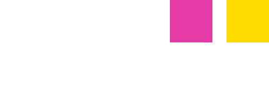
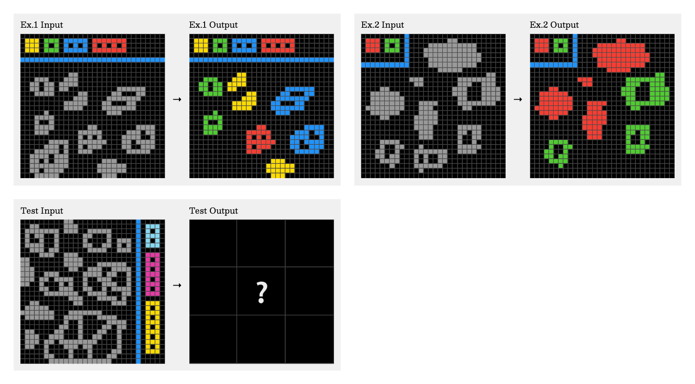
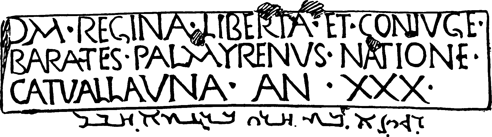

# MESA: Adapting and Testing an EFPA-Based Framework for AI Benchmark Review

Colleague survey

## Instructions

This form introduces MESA, the Meta-Evaluation Standard for AI Benchmarks. MESA is a framework for reviewing whether an AI test is well designed and whether its scores support the claims made about AI performance. Here, you will use a shorter questionnaire to review ARC-AGI-2 and Humanity’s Last Exam, with an answered DesignQA example to show how the questions work.

You are reviewing the tests, not rating particular AI systems or answering their test problems. Complete the same 25 questions for ARC-AGI-2 and HLE: 50 selections in total. Use only this packet; no source reading is required. Read each benchmark’s passage before answering its 25 questions. Interpret the supplied information and make your own judgments. You may refer back to the passage at any time; this is not a memory test. There is no time limit, answer key or total quality score.

Choose one: **Yes** (the whole condition is supported), **Partly** (some parts are supported), **No** (the information shows the condition is not met), **Not sure** (insufficient information), or **Not applicable** (the issue does not apply). An unanswered item stays blank. If the passage does not describe research on an issue, that does not show poor performance; it may mean there is not enough information to decide. For “Was it tested?”, Yes concerns whether testing happened, not whether its result was favourable. Comments are optional; no evidence notes or citations are required.

Your name: ____________________

When you finish a benchmark online, the Finish & email responses button sends your name, that benchmark’s answers and comments, and completion time to vitorraposo2@gmail.com through FormSubmit. The printable copy can be returned by email.

## Useful terms

- **Benchmark:** A test used to assess an AI system.
- **Benchmark version:** A particular edition or revision of a test. Its problems, answers or marking rules may differ from an earlier edition. The edition matters when comparing scores.
- **Ability or skill:** Something the AI is meant to be able to do, such as finding a rule in a pattern or answering a science question. A score on one skill does not automatically describe every skill.
- **AI system or model:** The software taking the test, sometimes with extra tools.
- **Task, item or test problem:** One question or puzzle the AI must solve.
- **Prompt:** The instructions and information given to the AI.
- **Reference answer:** The supplied answer used to mark the AI’s response.
- **Score:** The result of marking, such as percentage correct.
- **Evaluation set:** The group of problems used to test a system. A separate development set may be used to improve it.
- **Scoring software or harness:** Code that calculates scores or runs the test.
- **Score uncertainty:** How uncertain a score estimate is under the method used to calculate it. This is different from the AI saying it is confident.
- **Intended use:** The claim or decision a score is meant to support.

Under each numbered question, **Meaning** explains the wording. It is not an extra question. Choose just one answer for the numbered question.

This is a pilot questionnaire, not a validated certification instrument. The packet contains selected source-based facts and clearly stated limits, not recommended answers.

## DesignQA — answered example

The AI receives written engineering rules, vehicle images or drawings and must answer questions about them. It may need to find a rule, explain a technical term, identify a part, or check whether a design meets a requirement. The questions draw on Formula SAE, a competition in which university students design and build racing cars. You do not need engineering knowledge or to solve these problems to follow the completed example.

**Which test this survey covers:** The original DesignQA benchmark described in the 2024 paper, together with its public scoring software. Sources were inspected on 6 October 2026. Later changes to the questions or software may affect results.

**How to interpret its scores:** Using scores to compare how well AI systems find and apply engineering rules and understand vehicle drawings, while considering how far these results support claims about understanding other engineering documents.

### Reading passage

#### What the AI is asked to do

DesignQA was created by researchers and engineers working with materials from **Formula SAE, a competition in which university students design and build racing cars**. Their aim was to test whether an AI can find engineering rules, understand technical terms and drawings, and apply rules to a design. The paper describes **1,451 question-and-answer pairs in six groups**. These ask the AI to find an individual rule, gather related rules, explain a technical term, identify whether a component is present, check dimensions, or assess performance against a requirement. Depending on the question, the AI receives written rules, a vehicle image or a drawing and must give a text answer or a yes/no answer, sometimes with an explanation. These tasks follow parts of an engineer’s work, which is the authors’ reason for using them to assess understanding of engineering documents. Sources: [DQ-P](#source-DQ-P).

#### How the questions were chosen and checked

The developers used a real competition rulebook, vehicle designs and test data, drawing on contributions from engineering practitioners and researchers. This gives the questions a clear connection to practical work, but the benchmark uses **one rulebook and a limited range of tasks**, rather than a representative sample of engineering work across industries. The groups are also very uneven: finding individual rules accounts for 1,192 questions, while checking functional performance accounts for only 16. The paper reports that two additional reviewers checked manually written questions, with exceptions for questions derived from others and some explanations. Those explanations received a more limited check that they supported the yes/no answer. The reviewed sources do not establish how often reviewers disagreed or how many errors remained. Sources: [DQ-P](#source-DQ-P).

#### How answers earn points

DesignQA uses several marking methods because its questions require different kinds of answers. Some methods compare the wording of an AI answer with a supplied answer, while yes/no questions receive credit for the correct decision and may also have their explanations scored for text similarity. These rules are described, but **wording and formatting can affect credit**: the paper gives examples involving missing commas and valid related rules that were absent from the supplied answer. The public software also produces an overall score by giving each of the six question groups equal weight, despite their different sizes and marking methods. The reviewed material does not show that this overall number, or the separate group scores, measures a distinct underlying skill. Small marking-test files and discussion of scoring problems show some checking, but do not establish a complete study of marking accuracy and consistency. Sources: [DQ-P](#source-DQ-P) [DQ-C1](#source-DQ-C1) [DQ-C2](#source-DQ-C2) [DQ-FIX](#source-DQ-FIX).

#### Testing conditions and comparisons

The paper names the AI systems tested and describes instructions and settings, but **not every system receives the same information**. Some receive the whole rulebook, while others receive passages selected by search software. Their results therefore describe the AI together with its information supply, which matters when comparing systems. The authors include results from random guessing and other AI systems, but no reported baseline from human engineers taking the test. They also examine changes in the supplied passages, dimension labels, scale bars and highlighted images. One AI is tested with five different sets of rule passages, providing some information about variation. Because the passages change, this does not isolate variation when an identical test is repeated. For the main model comparisons, the reported information is insufficient to judge small score differences confidently. In the 16-question performance group, for example, one additional correct answer changes accuracy by 6.25 percentage points. Sources: [DQ-P](#source-DQ-P).

#### Prior exposure and unintended ways to earn points

The authors discuss influences such as formatting, wording, the quality of retrieved passages and familiarity with components. This shows attention to some factors beyond engineering understanding, but the reviewed material does not fully test ways of gaining points without that understanding. For example, the described drawings with scale bars all comply with the relevant rule. A reviewer can therefore infer that always answering “yes” would earn the yes/no credit on that portion, although this **does not show that any tested AI used that strategy**. The authors also discuss the novelty of their vehicle images and possible exposure to similar images, without directly checking every AI’s training data. The rulebook and released questions are public, and a protected test set or systematic overlap check was not established in the review. Clear enough rules on training on the questions and repeatedly submitting results were also not available in the sources examined. Sources: [DQ-P](#source-DQ-P) [DQ-R](#source-DQ-R) [DQ-TREE](#source-DQ-TREE) [DQ-WEB](#source-DQ-WEB).

#### Available materials and later changes

Public questions, instructions, scoring code and some AI responses allow researchers to inspect parts of the evaluation. However, they do not provide **a complete record for repeating every result in the paper**: the exact historical software, settings and inputs are not fully linked to each result. One released answer file also contains fewer rows than the corresponding question count in the paper. Code history makes revisions identifiable, but the reviewer did not find a clear change record explaining their effects on scores, a licence file, or complete rules for responsible reuse. These findings describe limits of the materials inspected; they do not establish that permission is unavailable elsewhere or that reuse is prohibited. Sources: [DQ-R](#source-DQ-R) [DQ-ENV](#source-DQ-ENV) [DQ-OUT](#source-DQ-OUT) [DQ-TREE](#source-DQ-TREE).

#### What the results can support

DesignQA’s paper acknowledges the limits of using one rulebook, a small set of task types and imperfect marking methods. It also says that **performance on a different technical document remains uncertain**. Real vehicle materials make the test relevant to engineering, but they do not demonstrate that its scores predict success on other standards or real engineering projects. The completed review below therefore treats the benchmark as a way to examine performance on these tasks under stated conditions. Broader claims about engineering competence, or fine distinctions between closely ranked systems, require more support. Sources: [DQ-P](#source-DQ-P) [DQ-WEB](#source-DQ-WEB).

### Answered questions

These are the reviewer’s answers for DesignQA. Your ARC-AGI-2 and HLE answers remain for you to choose.

### Description

**Example Q1. Are the benchmark version, set of test problems and method for calculating scores identified?**

**Answer: Partly**

Why: The test and scoring code are identified, but the paper’s results are not linked to an exact saved edition of the code and data. Without that link, a reader cannot be sure they are using the same materials as the authors. Sources: [DQ-P](#source-DQ-P) [DQ-R](#source-DQ-R) [DQ-C1](#source-DQ-C1) [DQ-TREE](#source-DQ-TREE).

**Example Q2. Are the ability being tested, the intended AI systems and the intended uses described?**

**Answer: Yes**

Why: The paper describes testing AI on finding, understanding and applying engineering rules, to help researchers compare strengths and weaknesses. Sources: [DQ-P](#source-DQ-P).

**Example Q3. Are the test problems, the information provided and the required answers or actions described?**

**Answer: Yes**

Why: The paper describes the questions, supplied rules and drawings, and the answers the AI must give. Sources: [DQ-P](#source-DQ-P).

**Example Q4. Are the instructions, resources and limits for taking the test described?**

**Answer: Partly**

Why: Instructions and settings are described, but the exact inputs and software needed to repeat every reported run are not fully recorded. This means someone following the description may still be unable to repeat the test in exactly the same way. Sources: [DQ-P](#source-DQ-P) [DQ-ENV](#source-DQ-ENV).

**Example Q5. Is it described how answers or actions become scores and how results are presented?**

**Answer: Yes**

Why: The paper and code explain how responses earn points and how group and overall scores are reported. This does not mean every scoring choice is sound. Sources: [DQ-P](#source-DQ-P) [DQ-C1](#source-DQ-C1) [DQ-C2](#source-DQ-C2).

### Purpose and development

**Example Q6. Is it explained why the test problems measure the ability the benchmark claims to test?**

**Answer: Yes**

Why: The paper explains why finding rules, understanding drawings and applying rules are relevant to working with engineering documents. Sources: [DQ-P](#source-DQ-P).

**Example Q7. Are the origins and choice of test problems justified for the benchmark’s intended use?**

**Answer: Partly**

Why: The problems use real vehicle-design materials, but mainly one competition rulebook, with very different numbers of questions in each group. This makes the test relevant to vehicle design, but does not show that the chosen questions represent engineering documents more generally. Sources: [DQ-P](#source-DQ-P).

**Example Q8. Were the test problems and the answers used to mark them checked for errors during development?**

**Answer: Partly**

Why: Additional reviewers checked many questions, but some questions and explanations received less checking than others. The checks therefore give some confidence in the answers, but leave parts of the test less well checked. Sources: [DQ-P](#source-DQ-P).

**Example Q9. Is there evidence that the test problems cover the relevant parts of the ability being claimed?**

**Answer: Partly**

Why: The test covers several useful engineering-document skills, but one rulebook and six question types cannot establish coverage of all engineering work. Sources: [DQ-P](#source-DQ-P).

### Scoring and comparisons

**Example Q10. Is there evidence that the way points are awarded reflects the ability the benchmark is meant to measure?**

**Answer: Partly**

Why: Correct yes/no answers earn credit, but missing commas or different wording can also reduce scores even when an answer is useful. A lower score can therefore reflect how an answer is written as well as whether the AI understands the engineering problem. Sources: [DQ-P](#source-DQ-P) [DQ-C2](#source-DQ-C2).

**Example Q11. Is there evidence supporting how scores are combined and what any separate scores are said to measure?**

**Answer: Partly**

Why: The question groups have clear purposes, but giving all six groups equal weight has not been shown to produce a meaningful overall ability score. The final score could therefore give a misleading impression of how well the AI performs across different engineering skills. Sources: [DQ-P](#source-DQ-P) [DQ-C1](#source-DQ-C1).

**Example Q12. Was the marking process tested to see whether it awards the right scores consistently?**

**Answer: Partly**

Why: Small marking-test files and reported scoring problems show some checking. A full study of whether the marks are correct and consistent was not established. Sources: [DQ-P](#source-DQ-P) [DQ-C2](#source-DQ-C2) [DQ-FIX](#source-DQ-FIX).

**Example Q13. Are the comparison points used to explain the scores justified for the claims being made?**

**Answer: Partly**

Why: Other AI systems and random guessing provide comparisons, but there is no reported human-engineer baseline, and some systems receive different information. These comparisons help explain some results, but do not show how the AI compares with engineers given the same materials. Sources: [DQ-P](#source-DQ-P).

### Consistency of results

**Example Q14. Was it tested how much the same AI system’s score changes when the benchmark is run more than once?**

**Answer: Partly**

Why: One AI was tested with five different sets of rule passages. This gives limited repeat information, but does not isolate score changes under identical conditions. A score change could come from different information, rather than from the AI giving different answers to the same test. Sources: [DQ-P](#source-DQ-P).

**Example Q15. Was it tested how much scores change when instructions, presentation or the testing setup change?**

**Answer: Partly**

Why: The paper tests changes to supplied passages and images, but does not examine every important change to instructions or settings. This shows that some changes were tested, while leaving the effects of other changes unclear. Sources: [DQ-P](#source-DQ-P).

**Example Q16. Are estimates of how much scores could vary provided in enough detail to support the comparisons or decisions being made?**

**Answer: No**

Why: The main comparisons lack enough information about score variation to judge small differences confidently. A limited side experiment does report some variation. Sources: [DQ-P](#source-DQ-P).

### Meaning and fairness

**Example Q17. Were ways of earning points without using the ability being tested investigated?**

**Answer: Partly**

Why: The paper examines some unwanted influences on scores, such as wording and formatting, but does not fully test ways to gain points without engineering understanding. Sources: [DQ-P](#source-DQ-P).

**Example Q18. Was the risk that AI systems had already seen the test problems or answers assessed and addressed?**

**Answer: Partly**

Why: The authors discuss new images and possible prior exposure, but do not directly check what every AI saw during training. Creating new images reduces one possible source of prior exposure, but does not show that the rules or answers were unfamiliar to the AI. Sources: [DQ-P](#source-DQ-P).

**Example Q19. Are the rules on training specifically for this test and repeatedly submitting results justified for the intended use?**

**Answer: Not sure**

Why: The reviewed sources do not provide clear enough rules on training on the questions and repeated submissions to judge whether those rules are suitable. Sources: [DQ-P](#source-DQ-P) [DQ-R](#source-DQ-R) [DQ-WEB](#source-DQ-WEB).

**Example Q20. Is there evidence for any claim that the scores show how well an AI system will perform beyond the problems in this test?**

**Answer: Not sure**

Why: Realistic vehicle problems do not show that scores predict success on other rulebooks or real engineering projects. No such study was established in the reviewed sources. Sources: [DQ-P](#source-DQ-P).

**Example Q21. Is there evidence that comparisons are fair across the AI systems and situations the benchmark is meant to cover?**

**Answer: Partly**

Why: Settings are described, but some systems receive the whole rulebook and others only selected passages. Those results compare the AI together with its information supply. A score difference may therefore come from the information provided, as well as from differences between the AI systems. Sources: [DQ-P](#source-DQ-P).

### Use and reporting

**Example Q22. Are the test materials and methods available in enough detail for someone else to repeat the evaluation or examine how it was done?**

**Answer: Partly**

Why: Questions, scoring code and some AI outputs are public, but the materials do not form a complete record for reproducing every published result. Someone can inspect much of the test, but may still be unable to recreate the exact conditions behind a reported score. Sources: [DQ-R](#source-DQ-R) [DQ-C1](#source-DQ-C1) [DQ-C2](#source-DQ-C2) [DQ-ENV](#source-DQ-ENV) [DQ-OUT](#source-DQ-OUT).

**Example Q23. Are the rules for accessing and reusing the benchmark, and the protections needed for responsible use, stated?**

**Answer: Partly**

Why: Access instructions are available, but complete reuse permissions and responsible-use rules were not found in the reviewed sources. Being able to download the materials does not, by itself, explain what someone is allowed to do with them. Sources: [DQ-R](#source-DQ-R) [DQ-TREE](#source-DQ-TREE) [DQ-P](#source-DQ-P).

**Example Q24. Are changes to the benchmark recorded, including how they affect comparisons between old and new scores?**

**Answer: Partly**

Why: Code history identifies revisions, but a clear record explaining how changes affect old and new scores was not found. A reader may therefore be unable to tell whether a score changed because the AI improved or because the test changed. Sources: [DQ-TREE](#source-DQ-TREE).

**Example Q25. Do the published claims stay within what the evidence supports?**

**Answer: Partly**

Why: The paper explains important limits, but broad statements about engineering understanding and precise rankings still need more support. The stated limits help readers, but the evidence does not fully support those wider conclusions. Sources: [DQ-P](#source-DQ-P) [DQ-WEB](#source-DQ-WEB).

## ARC-AGI-2

Each puzzle shows several before-and-after grids of coloured squares. The AI must infer the hidden rule and produce outputs for new inputs. Public development tasks are available for practice; separate tasks are used for evaluation. You do not need to solve the puzzles to complete this survey.

**Version and scope:** ARC-AGI-2 public test problems, the official scoring software, and ARC Prize’s rules for tests that it runs or verifies. Sources were inspected on 7 October 2026. Other competitions and community results may use different rules.

**Intended use to consider:** Using scores to compare AI systems’ ability to solve unfamiliar grid problems, and considering the creators’ broader claims about reasoning.

### Reading passage

Read this passage before answering the questions below. You may refer back to it while answering.

#### What the AI is asked to do

ARC-AGI-2 is a test developed by ARC Prize Foundation staff and partners to assess whether an AI can **work out a new rule from examples**. Each problem presents pairs of coloured grids, showing a starting grid alongside its correct finished grid. Using those examples, the AI must work out how to complete a new starting grid and return an answer with the right size and colour in every square. The creators designed these problems to require little specialist knowledge while encouraging the AI to combine ideas. Their aim is to study reasoning that goes beyond recalling facts or trying large numbers of possible programs, which they connect to progress toward more general, human-like AI. Sources: [AR](#source-AR) [AB](#source-AB) [AP](#source-AP).

**A real ARC-AGI-2 problem**

The two pairs at the top show starting grids (“Input”) and completed grids (“Output”). The AI uses these examples to work out the missing output at the bottom. You do not need to solve it. [Source figure](https://arxiv.org/html/2505.11831v2/arc-agi-task-e3721c99.png).

#### How the problems were chosen

ARC-AGI-2’s developers began with a collection of newly written grid puzzles and puzzles prepared for earlier ARC work that had not been used. To help decide which puzzles to include and how difficult they were, the developers **conducted a study in which people tried solving them**. This involved **407 people taking part in 515 paid, 90-minute sessions**. The puzzles used in that study formed a larger pool than the final test, so the results do not all describe the final set. The developers also reviewed puzzles themselves and removed ones they judged could be solved by the same rule. The released benchmark contains **1,000 problems for practice and AI development**, along with **three test sets of 120 problems each**. These sets are called public, semi-private and private because access to their problems differs. Using the human participants’ results, the developers selected the three test sets to have similar difficulty for people. After release, they continued correcting the materials; a public change record lists fixes to some coloured squares and unclear examples. Sources: [AC](#source-AC) [AP](#source-AP).

#### How answers earn points

The AI is allowed **two attempts for each new input grid**, and it earns credit for that input only if an attempt matches the supplied answer in both size and every square’s colour. A nearly correct grid therefore receives no credit. A problem can contain several new inputs, however, so the official scoring software inspected for this survey calculates the fraction solved within each problem before averaging the problem scores. Solving one of two inputs, for example, earns **0.5 for that problem**. This differs from calling the whole problem “fully solved,” which the instructions published with the problems reserve for cases where every input is correct. The software does not provide separate scores established as measures of distinct skills. Its public tests cover correct answers, wrong sizes, changed squares and missing outputs; the survey preparer inspected those tests without independently testing the whole marking system. Sources: [AR](#source-AR) [AS](#source-AS) [AT](#source-AT).

**Example: a problem with two new input grids**

1. **Input 1: solved** — At least one permitted attempt matches the entire answer grid: 1.
2. **Input 2: unsolved** — Neither permitted attempt matches the entire answer grid: 0.
3. **Problem score: 0.5** — The inspected software calculates (1 + 0) ÷ 2. It then averages problem scores.

Illustration of the inspected software, not an observed AI result. A partly correct grid gets no credit. The dataset description calls the whole problem solved only when both inputs are correct. Sources: [AS](#source-AS) [AR](#source-AR).

#### Testing conditions and changes in scores

ARC Prize, the organization running the verified evaluations, specifies AI settings and a spending limit for the tests it verifies, although other testing routes may use different conditions. Its verified-testing policy uses **one run, rather than an average of repeated runs**. A technical report describing ARC-AGI-2’s development gives AI scores, but the materials reviewed here do not provide estimates or ranges showing how much the same AI’s score changes when the same test is repeated. Although the running software allows settings to be changed, those materials also contain no systematic study of the effects of changing instructions, grid presentation or software. Matching the test sets for human difficulty addresses a separate issue and does not measure these changes in AI scores. Sources: [AR](#source-AR) [POL](#source-POL) [AP](#source-AP) [AM](#source-AM).

#### Prior exposure and ways to earn points

The creators tried to limit ways of earning points without the intended reasoning by designing problems that resist searches through large numbers of possible programs and by checking for repeated solution rules. These steps do not establish that every such route to a high score has been ruled out. Prior exposure is another concern because anyone can see the public problems. For hidden tests sent to AI providers, ARC Prize describes agreements against retaining the data and monitoring of possible exposure, while acknowledging that information could still escape. To keep development separate from evaluation, **training on development problems is allowed, while changing a system specifically to improve on evaluation problems is discouraged**. ARC Prize also says its verified tests are not a service for repeatedly improving systems through its feedback. Sources: [AB](#source-AB) [AP](#source-AP) [POL](#source-POL) [AR](#source-AR).

#### Comparisons, access and updates

In the puzzle-solving study described above, the developers found no clear statistical relationship between performance and recorded background factors such as work and technical experience. For AI comparisons, verified tests record the settings used, though other testing routes may differ. Researchers can inspect **public problems, running software and marking tests**, while access to hidden problems is controlled. ARC Prize says it also releases public testing outputs, costs, times and problem scores, but the survey preparer did not check the complete archive. The public data use an Apache 2.0 licence; hidden-data rules address confidentiality, provider handling and code review for selected submissions. To help track revisions, a dated change record identifies corrected problems and exact code changes. It does not, however, recalculate every affected AI score, and ARC-AGI-1 and ARC-AGI-2 remain separate test versions. Sources: [AP](#source-AP) [POL](#source-POL) [AM](#source-AM) [AT](#source-AT) [AL](#source-AL) [AC](#source-AC).

#### What the findings cover

Although the creators connect ARC-AGI-2 to abstract reasoning and broader intelligence, the studies supplied here concern **two-dimensional grid problems**. This packet contains no study showing how scores predict success in language, social interaction or other real-world work, and it supplies no measure covering every kind of intelligence. These are **limits of the information available for this survey**: they leave those broader relationships unresolved, rather than showing that such relationships are impossible. Sources: [AB](#source-AB).

### Questions about ARC-AGI-2

Use the reading passage to make your own judgments. All comments are optional.

### Description

**Q1. Are the benchmark version, set of test problems and method for calculating scores identified?**

**Meaning:** The benchmark version is the particular edition of the test, like an exam revised in a new year. This item concerns whether the edition, the problems used and the rules for awarding points are identified.

**Example — DesignQA: Partly**

Why: The test and scoring code are identified, but the paper’s results are not linked to an exact saved edition of the code and data. Without that link, a reader cannot be sure they are using the same materials as the authors. Sources: [DQ-P](#source-DQ-P) [DQ-R](#source-DQ-R) [DQ-C1](#source-DQ-C1) [DQ-TREE](#source-DQ-TREE).

☐ Yes ☐ Partly ☐ No ☐ Not sure ☐ Not applicable

Comments (optional): ____________________________________________________

**Q2. Are the ability being tested, the intended AI systems and the intended uses described?**

**Meaning:** An ability is a skill the AI is meant to demonstrate, such as finding a rule in a pattern or answering a science question. This item concerns whether that skill, the types of AI being tested and the proposed uses of the results are described.

**Example — DesignQA: Yes**

Why: The paper describes testing AI on finding, understanding and applying engineering rules, to help researchers compare strengths and weaknesses. Sources: [DQ-P](#source-DQ-P).

☐ Yes ☐ Partly ☐ No ☐ Not sure ☐ Not applicable

Comments (optional): ____________________________________________________

**Q3. Are the test problems, the information provided and the required answers or actions described?**

**Meaning:** A test problem is one question or puzzle given to the AI. This item concerns whether the starting information and the answer or action expected from the AI are described.

**Example — DesignQA: Yes**

Why: The paper describes the questions, supplied rules and drawings, and the answers the AI must give. Sources: [DQ-P](#source-DQ-P).

☐ Yes ☐ Partly ☐ No ☐ Not sure ☐ Not applicable

Comments (optional): ____________________________________________________

**Q4. Are the instructions, resources and limits for taking the test described?**

**Meaning:** Testing conditions include the instructions, allowed tools, time, number of attempts and AI settings. These can affect the difficulty of the test.

**Example — DesignQA: Partly**

Why: Instructions and settings are described, but the exact inputs and software needed to repeat every reported run are not fully recorded. This means someone following the description may still be unable to repeat the test in exactly the same way. Sources: [DQ-P](#source-DQ-P) [DQ-ENV](#source-DQ-ENV).

☐ Yes ☐ Partly ☐ No ☐ Not sure ☐ Not applicable

Comments (optional): ____________________________________________________

**Q5. Is it described how answers or actions become scores and how results are presented?**

**Meaning:** Scoring means turning the AI’s responses into a result, such as percentage correct. This item concerns whether the marking rules and the way results are shown are described.

**Example — DesignQA: Yes**

Why: The paper and code explain how responses earn points and how group and overall scores are reported. This does not mean every scoring choice is sound. Sources: [DQ-P](#source-DQ-P) [DQ-C1](#source-DQ-C1) [DQ-C2](#source-DQ-C2).

☐ Yes ☐ Partly ☐ No ☐ Not sure ☐ Not applicable

Comments (optional): ____________________________________________________

### Purpose and development

**Q6. Is it explained why the test problems measure the ability the benchmark claims to test?**

**Meaning:** The test needs an explanation linking its problems to the skill it claims to measure. For example, remembering a fact and working out a new rule are different skills.

**Example — DesignQA: Yes**

Why: The paper explains why finding rules, understanding drawings and applying rules are relevant to working with engineering documents. Sources: [DQ-P](#source-DQ-P).

☐ Yes ☐ Partly ☐ No ☐ Not sure ☐ Not applicable

Comments (optional): ____________________________________________________

**Q7. Are the origins and choice of test problems justified for the benchmark’s intended use?**

**Meaning:** This item concerns the reasons for choosing these problems: where they came from, how many there are, their topics and their difficulty, in relation to the test’s purpose.

**Example — DesignQA: Partly**

Why: The problems use real vehicle-design materials, but mainly one competition rulebook, with very different numbers of questions in each group. This makes the test relevant to vehicle design, but does not show that the chosen questions represent engineering documents more generally. Sources: [DQ-P](#source-DQ-P).

☐ Yes ☐ Partly ☐ No ☐ Not sure ☐ Not applicable

Comments (optional): ____________________________________________________

**Q8. Were the test problems and the answers used to mark them checked for errors during development?**

**Meaning:** Reference answers are the supplied answers used to mark the AI’s work. This item concerns checks for mistakes in both the problems and those answers while the test was being made.

**Example — DesignQA: Partly**

Why: Additional reviewers checked many questions, but some questions and explanations received less checking than others. The checks therefore give some confidence in the answers, but leave parts of the test less well checked. Sources: [DQ-P](#source-DQ-P).

☐ Yes ☐ Partly ☐ No ☐ Not sure ☐ Not applicable

Comments (optional): ____________________________________________________

**Q9. Is there evidence that the test problems cover the relevant parts of the ability being claimed?**

**Meaning:** A claimed skill may have several parts. A test of science knowledge, for example, may need questions from several branches of science rather than just one.

**Example — DesignQA: Partly**

Why: The test covers several useful engineering-document skills, but one rulebook and six question types cannot establish coverage of all engineering work. Sources: [DQ-P](#source-DQ-P).

☐ Yes ☐ Partly ☐ No ☐ Not sure ☐ Not applicable

Comments (optional): ____________________________________________________

### Scoring and comparisons

**Q10. Is there evidence that the way points are awarded reflects the ability the benchmark is meant to measure?**

**Meaning:** This item concerns whether earning more points reflects doing better at the intended skill. A score can also be affected by details such as the required answer format.

**Example — DesignQA: Partly**

Why: Correct yes/no answers earn credit, but missing commas or different wording can also reduce scores even when an answer is useful. A lower score can therefore reflect how an answer is written as well as whether the AI understands the engineering problem. Sources: [DQ-P](#source-DQ-P) [DQ-C2](#source-DQ-C2).

☐ Yes ☐ Partly ☐ No ☐ Not sure ☐ Not applicable

Comments (optional): ____________________________________________________

**Q11. Is there evidence supporting how scores are combined and what any separate scores are said to measure?**

**Meaning:** An overall score combines results from different problems. Separate scores may describe particular subjects or skills. This item concerns support for those choices and interpretations.

**Example — DesignQA: Partly**

Why: The question groups have clear purposes, but giving all six groups equal weight has not been shown to produce a meaningful overall ability score. The final score could therefore give a misleading impression of how well the AI performs across different engineering skills. Sources: [DQ-P](#source-DQ-P) [DQ-C1](#source-DQ-C1).

☐ Yes ☐ Partly ☐ No ☐ Not sure ☐ Not applicable

Comments (optional): ____________________________________________________

**Q12. Was the marking process tested to see whether it awards the right scores consistently?**

**Meaning:** Marking may be done by people, fixed software rules or another AI. This item concerns whether the marking was tested for correct and consistent decisions.

**Example — DesignQA: Partly**

Why: Small marking-test files and reported scoring problems show some checking. A full study of whether the marks are correct and consistent was not established. Sources: [DQ-P](#source-DQ-P) [DQ-C2](#source-DQ-C2) [DQ-FIX](#source-DQ-FIX).

☐ Yes ☐ Partly ☐ No ☐ Not sure ☐ Not applicable

Comments (optional): ____________________________________________________

**Q13. Are the comparison points used to explain the scores justified for the claims being made?**

**Meaning:** A comparison point is a result used to help interpret an AI’s score, such as a human score, another AI’s score or the score expected from guessing. The comparison needs to fit the claim being made.

**Example — DesignQA: Partly**

Why: Other AI systems and random guessing provide comparisons, but there is no reported human-engineer baseline, and some systems receive different information. These comparisons help explain some results, but do not show how the AI compares with engineers given the same materials. Sources: [DQ-P](#source-DQ-P).

☐ Yes ☐ Partly ☐ No ☐ Not sure ☐ Not applicable

Comments (optional): ____________________________________________________

### Consistency of results

**Q14. Was it tested how much the same AI system’s score changes when the benchmark is run more than once?**

**Meaning:** A repeated run means testing the same AI again under the same conditions. This item concerns whether researchers measured how much its score changes across those runs.

**Example — DesignQA: Partly**

Why: One AI was tested with five different sets of rule passages. This gives limited repeat information, but does not isolate score changes under identical conditions. A score change could come from different information, rather than from the AI giving different answers to the same test. Sources: [DQ-P](#source-DQ-P).

☐ Yes ☐ Partly ☐ No ☐ Not sure ☐ Not applicable

Comments (optional): ____________________________________________________

**Q15. Was it tested how much scores change when instructions, presentation or the testing setup change?**

**Meaning:** The same problems can be presented with different wording, layouts or software settings. This item concerns whether the effect of those changes on scores was measured.

**Example — DesignQA: Partly**

Why: The paper tests changes to supplied passages and images, but does not examine every important change to instructions or settings. This shows that some changes were tested, while leaving the effects of other changes unclear. Sources: [DQ-P](#source-DQ-P).

☐ Yes ☐ Partly ☐ No ☐ Not sure ☐ Not applicable

Comments (optional): ____________________________________________________

**Q16. Are estimates of how much scores could vary provided in enough detail to support the comparisons or decisions being made?**

**Meaning:** A range around a score describes uncertainty under the method used to calculate it. This item concerns whether that information is detailed enough for the conclusions drawn from the scores.

**Example — DesignQA: No**

Why: The main comparisons lack enough information about score variation to judge small differences confidently. A limited side experiment does report some variation. Sources: [DQ-P](#source-DQ-P).

☐ Yes ☐ Partly ☐ No ☐ Not sure ☐ Not applicable

Comments (optional): ____________________________________________________

### Meaning and fairness

**Q17. Were ways of earning points without using the ability being tested investigated?**

**Meaning:** An AI might gain points from accidental clues or guessing rather than the intended skill. This item concerns whether such possibilities were investigated.

**Example — DesignQA: Partly**

Why: The paper examines some unwanted influences on scores, such as wording and formatting, but does not fully test ways to gain points without engineering understanding. Sources: [DQ-P](#source-DQ-P).

☐ Yes ☐ Partly ☐ No ☐ Not sure ☐ Not applicable

Comments (optional): ____________________________________________________

**Q18. Was the risk that AI systems had already seen the test problems or answers assessed and addressed?**

**Meaning:** An AI may remember a problem or answer encountered during training. This item concerns whether that risk was examined and steps were taken to reduce it.

**Example — DesignQA: Partly**

Why: The authors discuss new images and possible prior exposure, but do not directly check what every AI saw during training. Creating new images reduces one possible source of prior exposure, but does not show that the rules or answers were unfamiliar to the AI. Sources: [DQ-P](#source-DQ-P).

☐ Yes ☐ Partly ☐ No ☐ Not sure ☐ Not applicable

Comments (optional): ____________________________________________________

**Q19. Are the rules on training specifically for this test and repeatedly submitting results justified for the intended use?**

**Meaning:** Training specifically for a test means changing an AI to improve its results on that test. Repeated submissions can provide feedback for further changes. This item concerns whether the rules for both fit the test’s purpose.

**Example — DesignQA: Not sure**

Why: The reviewed sources do not provide clear enough rules on training on the questions and repeated submissions to judge whether those rules are suitable. Sources: [DQ-P](#source-DQ-P) [DQ-R](#source-DQ-R) [DQ-WEB](#source-DQ-WEB).

☐ Yes ☐ Partly ☐ No ☐ Not sure ☐ Not applicable

Comments (optional): ____________________________________________________

**Q20. Is there evidence for any claim that the scores show how well an AI system will perform beyond the problems in this test?**

**Meaning:** A claim about performance beyond the test predicts success on other problems or real work. This item concerns evidence for such predictions, when they are made.

**Example — DesignQA: Not sure**

Why: Realistic vehicle problems do not show that scores predict success on other rulebooks or real engineering projects. No such study was established in the reviewed sources. Sources: [DQ-P](#source-DQ-P).

☐ Yes ☐ Partly ☐ No ☐ Not sure ☐ Not applicable

Comments (optional): ____________________________________________________

**Q21. Is there evidence that comparisons are fair across the AI systems and situations the benchmark is meant to cover?**

**Meaning:** AI systems may receive different information, tools or problem sets. This item concerns whether comparisons remain fair and meaningful across the systems and situations the test is meant to include.

**Example — DesignQA: Partly**

Why: Settings are described, but some systems receive the whole rulebook and others only selected passages. Those results compare the AI together with its information supply. A score difference may therefore come from the information provided, as well as from differences between the AI systems. Sources: [DQ-P](#source-DQ-P).

☐ Yes ☐ Partly ☐ No ☐ Not sure ☐ Not applicable

Comments (optional): ____________________________________________________

### Use and reporting

**Q22. Are the test materials and methods available in enough detail for someone else to repeat the evaluation or examine how it was done?**

**Meaning:** Test materials include problems, marking rules, instructions and software. This item concerns whether enough is available to repeat the evaluation or inspect how it was carried out.

**Example — DesignQA: Partly**

Why: Questions, scoring code and some AI outputs are public, but the materials do not form a complete record for reproducing every published result. Someone can inspect much of the test, but may still be unable to recreate the exact conditions behind a reported score. Sources: [DQ-R](#source-DQ-R) [DQ-C1](#source-DQ-C1) [DQ-C2](#source-DQ-C2) [DQ-ENV](#source-DQ-ENV) [DQ-OUT](#source-DQ-OUT).

☐ Yes ☐ Partly ☐ No ☐ Not sure ☐ Not applicable

Comments (optional): ____________________________________________________

**Q23. Are the rules for accessing and reusing the benchmark, and the protections needed for responsible use, stated?**

**Meaning:** Access and reuse rules explain who can obtain, share or modify the materials. Protections may include keeping hidden answers private or limiting harmful content.

**Example — DesignQA: Partly**

Why: Access instructions are available, but complete reuse permissions and responsible-use rules were not found in the reviewed sources. Being able to download the materials does not, by itself, explain what someone is allowed to do with them. Sources: [DQ-R](#source-DQ-R) [DQ-TREE](#source-DQ-TREE) [DQ-P](#source-DQ-P).

☐ Yes ☐ Partly ☐ No ☐ Not sure ☐ Not applicable

Comments (optional): ____________________________________________________

**Q24. Are changes to the benchmark recorded, including how they affect comparisons between old and new scores?**

**Meaning:** A test can change when problems, answers or marking rules are revised. This item concerns whether those changes and their effects on comparisons with earlier scores are documented.

**Example — DesignQA: Partly**

Why: Code history identifies revisions, but a clear record explaining how changes affect old and new scores was not found. A reader may therefore be unable to tell whether a score changed because the AI improved or because the test changed. Sources: [DQ-TREE](#source-DQ-TREE).

☐ Yes ☐ Partly ☐ No ☐ Not sure ☐ Not applicable

Comments (optional): ____________________________________________________

**Q25. Do the published claims stay within what the evidence supports?**

**Meaning:** Published claims are statements about what a score shows the AI can do. This item concerns whether those statements fit what the available findings establish.

**Example — DesignQA: Partly**

Why: The paper explains important limits, but broad statements about engineering understanding and precise rankings still need more support. The stated limits help readers, but the evidence does not fully support those wider conclusions. Sources: [DQ-P](#source-DQ-P) [DQ-WEB](#source-DQ-WEB).

☐ Yes ☐ Partly ☐ No ☐ Not sure ☐ Not applicable

Comments (optional): ____________________________________________________

## Humanity’s Last Exam (HLE)

Imagine a very difficult exam assembled by specialists from many subjects. The AI must select an answer or give a short answer; some questions also include an image. A separate AI marks the response against a supplied answer. HLE aims to measure advanced academic knowledge and reasoning. You do not need to know the subject answers to evaluate how this test is built, marked and interpreted.

**Version and scope:** The original 2,500-question HLE described in the supplied paper, with the simple public evaluation code inspected on 7 October 2026. This survey does not cover HLE-Rolling, HLE-Diamond or their evaluations with extra tools.

**Intended use to consider:** Using scores to compare AI systems on difficult academic questions, and considering claims about academic expertise beyond the exact questions.

### Reading passage

Read this passage before answering the questions below. You may refer back to it while answering.

#### What the AI is asked to do

Humanity’s Last Exam, or HLE, aims to assess advanced academic knowledge and reasoning in AI systems that handle text or text and images. This survey focuses on **the original HLE, which contains 2,500 difficult questions**, rather than the separate HLE-Rolling and HLE-Diamond versions. About **24% of its questions are multiple-choice**, while the rest require short answers, and about **14% include an image**. A published biology example asks for a number about the anatomy of a hummingbird bone. You do not need to solve that problem to complete this survey; it illustrates the kind of specialist question the AI receives. Across these formats, HLE asks for specific answers rather than the completion of an open-ended research project. Sources: [HP](#source-HP) [HW](#source-HW).

**A real HLE image question**

In this example, the AI receives an image of an ancient inscription and is asked to translate the Palmyrene writing along the bottom. The image provides information needed to answer the question; you do not need to translate it for this survey. [Source figure](https://lastexam.ai/_next/static/media/classics.81111c73.png).

#### How the questions were chosen and checked

Experts from many institutions contributed questions covering a range of subjects, with particular emphasis on mathematics. Before expert review, questions that selected AI models could already answer were screened out, so the resulting set was **deliberately chosen to be difficult**, rather than randomly drawn from everyday academic work. HLE’s creators describe their development process in a research paper, which reports expert review and organizer approval, followed by two further checks of 200 questions each. After the second check, the authors estimated an **expert-disagreement rate of 15.4%**. That figure concerns disagreements about questions or answers; it should not be read as the percentage confirmed to be wrong. Because the test requires specific answers, it also leaves creative work and open-ended research outside its answer format. Sources: [HP](#source-HP).

#### Instructions and marking

HLE’s public evaluation software gives the AI each question, includes an image when needed, and asks it to return an explanation, a final answer and a percentage stating its confidence. The instructions for that software describe a default “temperature” of zero, a setting intended to reduce randomness, but the line that sends this setting is **disabled in the inspected code**. Once a response is produced, a separate **AI judge compares the final answer with the supplied reference answer**, accepting different wording when the meaning is the same. Because the judge is instructed to compare answers rather than solve the problem independently, agreement does not establish that the reference itself is correct. The judging code is public, but the inspected sources contain no full study comparing its marks with expert marks. The expert reviews of the questions described earlier therefore do not, by themselves, establish that the automatic marking is accurate. Sources: [HM](#source-HM) [HR](#source-HR) [HJ](#source-HJ) [HP](#source-HP).

**How an HLE answer is marked**

1. **Receive a question** — Text, sometimes with an image; choose an option or give a short answer.
2. **Give a response** — The AI provides an explanation, a final answer and its stated confidence.
3. **Compare with the reference** — A separate AI judge checks the final answer against the supplied answer. Equivalent meanings can count.

Process diagram based on the simple evaluation code. The judge is not asked to solve the question independently. Sources: [HM](#source-HM) [HJ](#source-HJ).

#### What the reported numbers mean

HLE reports **accuracy as the percentage of answers marked correct**, with each question counting equally. As a result, the mix of subjects affects the total score. The paper also reports results by subject, although the inspected material does not establish that these are separate measures of distinct skills. Alongside accuracy, the public scoring software calculates an **approximate 95% confidence range** using the number of questions and the fraction marked correct. This range describes score uncertainty under the calculation’s assumptions; it does not measure the effects of repeating the AI run or changing the judge. A separate calculation compares the AI’s stated confidence with how often its answers are correct, so **confidence in an answer and uncertainty in a test score refer to different things**. Sources: [HP](#source-HP) [HJ](#source-HJ).

**Three different numbers in the results**

1. **Accuracy** — What percentage of answers were marked correct?
2. **Score range** — How uncertain is that percentage under the calculation used? This is not a repeated-run test.
3. **Confidence check** — Does how confident the AI says it is match how often it is correct?

These are separate summaries of the answers. None substitutes for measuring changes across repeated runs. Sources: [HJ](#source-HJ).

#### Comparisons and repeated testing

To put results in context, the paper compares named AI models and reports scores for both the full question set and text-only questions. Although experts helped create the questions, this packet contains **no matched group of people taking the whole exam under the AI testing conditions**. The paper also notes that an AI can answer differently on different attempts, but the inspected sources do not provide a repeated-run study covering the main comparisons. Nor do they provide a systematic study of reworded instructions or changes to the judging AI. Using a fixed setting or a standard instruction therefore does not, on its own, establish how stable the reported scores are. Sources: [HP](#source-HP) [HM](#source-HM) [HJ](#source-HJ).

#### Prior exposure and ways to earn points

To reduce easy ways of gaining points, contributors were asked to avoid questions answerable by a simple lookup and could revise questions when an AI guessed correctly through faulty reasoning. Multiple-choice questions still allow guessing, however, and the supplied material does not measure every possible way of earning points without the intended knowledge or reasoning. The authors also retain a **private test set** to help assess whether improvements are specific to the public questions. For the public data, a distinctive text marker helps people identify material to exclude from future AI training, while the instructions warn against training on the test. These precautions do not establish what a particular AI has already seen. The packet also lacks a complete original-HLE policy covering repeated submissions, access to feedback and the reporting of systems trained specifically on the test. Sources: [HP](#source-HP) [HR](#source-HR).

#### Access, fair comparisons and updates

Fair comparisons depend partly on which questions each system receives. Systems that use images and those that only use text do not necessarily answer the same set, so the paper labels text-only results. The questions are in English and subjects are not equally represented; the supplied material contains no comprehensive study of comparisons across languages or populations. Public instructions and marking code allow some inspection, but downloading the dataset requires accepting contact-sharing conditions, and the private set is not released. The dataset page lists an MIT licence and asks users not to redistribute test data, while the code also has an MIT licence. The authors describe excluding certain kinds of dangerous content during collection. The survey preparer inspected the available documentation without downloading the gated questions or rerunning the AI evaluations. When comparing results over time, the edition also matters: HLE-Rolling has its own record of removed and restored questions, and **those changes do not automatically describe original HLE**. No study establishing equivalent scores across original HLE, HLE-Rolling and HLE-Diamond is supplied here. Sources: [HP](#source-HP) [HR](#source-HR) [HC](#source-HC) [HJ](#source-HJ) [HL](#source-HL) [HW](#source-HW) [HU](#source-HU).

#### What the findings cover

HLE’s title suggests a final exam at the edge of human knowledge, but the paper limits its interpretation to difficult academic questions with definite answers. It explicitly states that **a high score alone does not establish general intelligence or the ability to conduct independent research**. Consistent with that limit, this packet contains no measured relationship between HLE scores and success on independent scientific projects. Such gaps leave broader claims unresolved; they do not, by themselves, show that the benchmark fails. Sources: [HP](#source-HP).

### Questions about Humanity’s Last Exam (HLE)

Use the reading passage to make your own judgments. All comments are optional.

### Description

**Q1. Are the benchmark version, set of test problems and method for calculating scores identified?**

**Meaning:** The benchmark version is the particular edition of the test, like an exam revised in a new year. This item concerns whether the edition, the problems used and the rules for awarding points are identified.

**Example — DesignQA: Partly**

Why: The test and scoring code are identified, but the paper’s results are not linked to an exact saved edition of the code and data. Without that link, a reader cannot be sure they are using the same materials as the authors. Sources: [DQ-P](#source-DQ-P) [DQ-R](#source-DQ-R) [DQ-C1](#source-DQ-C1) [DQ-TREE](#source-DQ-TREE).

☐ Yes ☐ Partly ☐ No ☐ Not sure ☐ Not applicable

Comments (optional): ____________________________________________________

**Q2. Are the ability being tested, the intended AI systems and the intended uses described?**

**Meaning:** An ability is a skill the AI is meant to demonstrate, such as finding a rule in a pattern or answering a science question. This item concerns whether that skill, the types of AI being tested and the proposed uses of the results are described.

**Example — DesignQA: Yes**

Why: The paper describes testing AI on finding, understanding and applying engineering rules, to help researchers compare strengths and weaknesses. Sources: [DQ-P](#source-DQ-P).

☐ Yes ☐ Partly ☐ No ☐ Not sure ☐ Not applicable

Comments (optional): ____________________________________________________

**Q3. Are the test problems, the information provided and the required answers or actions described?**

**Meaning:** A test problem is one question or puzzle given to the AI. This item concerns whether the starting information and the answer or action expected from the AI are described.

**Example — DesignQA: Yes**

Why: The paper describes the questions, supplied rules and drawings, and the answers the AI must give. Sources: [DQ-P](#source-DQ-P).

☐ Yes ☐ Partly ☐ No ☐ Not sure ☐ Not applicable

Comments (optional): ____________________________________________________

**Q4. Are the instructions, resources and limits for taking the test described?**

**Meaning:** Testing conditions include the instructions, allowed tools, time, number of attempts and AI settings. These can affect the difficulty of the test.

**Example — DesignQA: Partly**

Why: Instructions and settings are described, but the exact inputs and software needed to repeat every reported run are not fully recorded. This means someone following the description may still be unable to repeat the test in exactly the same way. Sources: [DQ-P](#source-DQ-P) [DQ-ENV](#source-DQ-ENV).

☐ Yes ☐ Partly ☐ No ☐ Not sure ☐ Not applicable

Comments (optional): ____________________________________________________

**Q5. Is it described how answers or actions become scores and how results are presented?**

**Meaning:** Scoring means turning the AI’s responses into a result, such as percentage correct. This item concerns whether the marking rules and the way results are shown are described.

**Example — DesignQA: Yes**

Why: The paper and code explain how responses earn points and how group and overall scores are reported. This does not mean every scoring choice is sound. Sources: [DQ-P](#source-DQ-P) [DQ-C1](#source-DQ-C1) [DQ-C2](#source-DQ-C2).

☐ Yes ☐ Partly ☐ No ☐ Not sure ☐ Not applicable

Comments (optional): ____________________________________________________

### Purpose and development

**Q6. Is it explained why the test problems measure the ability the benchmark claims to test?**

**Meaning:** The test needs an explanation linking its problems to the skill it claims to measure. For example, remembering a fact and working out a new rule are different skills.

**Example — DesignQA: Yes**

Why: The paper explains why finding rules, understanding drawings and applying rules are relevant to working with engineering documents. Sources: [DQ-P](#source-DQ-P).

☐ Yes ☐ Partly ☐ No ☐ Not sure ☐ Not applicable

Comments (optional): ____________________________________________________

**Q7. Are the origins and choice of test problems justified for the benchmark’s intended use?**

**Meaning:** This item concerns the reasons for choosing these problems: where they came from, how many there are, their topics and their difficulty, in relation to the test’s purpose.

**Example — DesignQA: Partly**

Why: The problems use real vehicle-design materials, but mainly one competition rulebook, with very different numbers of questions in each group. This makes the test relevant to vehicle design, but does not show that the chosen questions represent engineering documents more generally. Sources: [DQ-P](#source-DQ-P).

☐ Yes ☐ Partly ☐ No ☐ Not sure ☐ Not applicable

Comments (optional): ____________________________________________________

**Q8. Were the test problems and the answers used to mark them checked for errors during development?**

**Meaning:** Reference answers are the supplied answers used to mark the AI’s work. This item concerns checks for mistakes in both the problems and those answers while the test was being made.

**Example — DesignQA: Partly**

Why: Additional reviewers checked many questions, but some questions and explanations received less checking than others. The checks therefore give some confidence in the answers, but leave parts of the test less well checked. Sources: [DQ-P](#source-DQ-P).

☐ Yes ☐ Partly ☐ No ☐ Not sure ☐ Not applicable

Comments (optional): ____________________________________________________

**Q9. Is there evidence that the test problems cover the relevant parts of the ability being claimed?**

**Meaning:** A claimed skill may have several parts. A test of science knowledge, for example, may need questions from several branches of science rather than just one.

**Example — DesignQA: Partly**

Why: The test covers several useful engineering-document skills, but one rulebook and six question types cannot establish coverage of all engineering work. Sources: [DQ-P](#source-DQ-P).

☐ Yes ☐ Partly ☐ No ☐ Not sure ☐ Not applicable

Comments (optional): ____________________________________________________

### Scoring and comparisons

**Q10. Is there evidence that the way points are awarded reflects the ability the benchmark is meant to measure?**

**Meaning:** This item concerns whether earning more points reflects doing better at the intended skill. A score can also be affected by details such as the required answer format.

**Example — DesignQA: Partly**

Why: Correct yes/no answers earn credit, but missing commas or different wording can also reduce scores even when an answer is useful. A lower score can therefore reflect how an answer is written as well as whether the AI understands the engineering problem. Sources: [DQ-P](#source-DQ-P) [DQ-C2](#source-DQ-C2).

☐ Yes ☐ Partly ☐ No ☐ Not sure ☐ Not applicable

Comments (optional): ____________________________________________________

**Q11. Is there evidence supporting how scores are combined and what any separate scores are said to measure?**

**Meaning:** An overall score combines results from different problems. Separate scores may describe particular subjects or skills. This item concerns support for those choices and interpretations.

**Example — DesignQA: Partly**

Why: The question groups have clear purposes, but giving all six groups equal weight has not been shown to produce a meaningful overall ability score. The final score could therefore give a misleading impression of how well the AI performs across different engineering skills. Sources: [DQ-P](#source-DQ-P) [DQ-C1](#source-DQ-C1).

☐ Yes ☐ Partly ☐ No ☐ Not sure ☐ Not applicable

Comments (optional): ____________________________________________________

**Q12. Was the marking process tested to see whether it awards the right scores consistently?**

**Meaning:** Marking may be done by people, fixed software rules or another AI. This item concerns whether the marking was tested for correct and consistent decisions.

**Example — DesignQA: Partly**

Why: Small marking-test files and reported scoring problems show some checking. A full study of whether the marks are correct and consistent was not established. Sources: [DQ-P](#source-DQ-P) [DQ-C2](#source-DQ-C2) [DQ-FIX](#source-DQ-FIX).

☐ Yes ☐ Partly ☐ No ☐ Not sure ☐ Not applicable

Comments (optional): ____________________________________________________

**Q13. Are the comparison points used to explain the scores justified for the claims being made?**

**Meaning:** A comparison point is a result used to help interpret an AI’s score, such as a human score, another AI’s score or the score expected from guessing. The comparison needs to fit the claim being made.

**Example — DesignQA: Partly**

Why: Other AI systems and random guessing provide comparisons, but there is no reported human-engineer baseline, and some systems receive different information. These comparisons help explain some results, but do not show how the AI compares with engineers given the same materials. Sources: [DQ-P](#source-DQ-P).

☐ Yes ☐ Partly ☐ No ☐ Not sure ☐ Not applicable

Comments (optional): ____________________________________________________

### Consistency of results

**Q14. Was it tested how much the same AI system’s score changes when the benchmark is run more than once?**

**Meaning:** A repeated run means testing the same AI again under the same conditions. This item concerns whether researchers measured how much its score changes across those runs.

**Example — DesignQA: Partly**

Why: One AI was tested with five different sets of rule passages. This gives limited repeat information, but does not isolate score changes under identical conditions. A score change could come from different information, rather than from the AI giving different answers to the same test. Sources: [DQ-P](#source-DQ-P).

☐ Yes ☐ Partly ☐ No ☐ Not sure ☐ Not applicable

Comments (optional): ____________________________________________________

**Q15. Was it tested how much scores change when instructions, presentation or the testing setup change?**

**Meaning:** The same problems can be presented with different wording, layouts or software settings. This item concerns whether the effect of those changes on scores was measured.

**Example — DesignQA: Partly**

Why: The paper tests changes to supplied passages and images, but does not examine every important change to instructions or settings. This shows that some changes were tested, while leaving the effects of other changes unclear. Sources: [DQ-P](#source-DQ-P).

☐ Yes ☐ Partly ☐ No ☐ Not sure ☐ Not applicable

Comments (optional): ____________________________________________________

**Q16. Are estimates of how much scores could vary provided in enough detail to support the comparisons or decisions being made?**

**Meaning:** A range around a score describes uncertainty under the method used to calculate it. This item concerns whether that information is detailed enough for the conclusions drawn from the scores.

**Example — DesignQA: No**

Why: The main comparisons lack enough information about score variation to judge small differences confidently. A limited side experiment does report some variation. Sources: [DQ-P](#source-DQ-P).

☐ Yes ☐ Partly ☐ No ☐ Not sure ☐ Not applicable

Comments (optional): ____________________________________________________

### Meaning and fairness

**Q17. Were ways of earning points without using the ability being tested investigated?**

**Meaning:** An AI might gain points from accidental clues or guessing rather than the intended skill. This item concerns whether such possibilities were investigated.

**Example — DesignQA: Partly**

Why: The paper examines some unwanted influences on scores, such as wording and formatting, but does not fully test ways to gain points without engineering understanding. Sources: [DQ-P](#source-DQ-P).

☐ Yes ☐ Partly ☐ No ☐ Not sure ☐ Not applicable

Comments (optional): ____________________________________________________

**Q18. Was the risk that AI systems had already seen the test problems or answers assessed and addressed?**

**Meaning:** An AI may remember a problem or answer encountered during training. This item concerns whether that risk was examined and steps were taken to reduce it.

**Example — DesignQA: Partly**

Why: The authors discuss new images and possible prior exposure, but do not directly check what every AI saw during training. Creating new images reduces one possible source of prior exposure, but does not show that the rules or answers were unfamiliar to the AI. Sources: [DQ-P](#source-DQ-P).

☐ Yes ☐ Partly ☐ No ☐ Not sure ☐ Not applicable

Comments (optional): ____________________________________________________

**Q19. Are the rules on training specifically for this test and repeatedly submitting results justified for the intended use?**

**Meaning:** Training specifically for a test means changing an AI to improve its results on that test. Repeated submissions can provide feedback for further changes. This item concerns whether the rules for both fit the test’s purpose.

**Example — DesignQA: Not sure**

Why: The reviewed sources do not provide clear enough rules on training on the questions and repeated submissions to judge whether those rules are suitable. Sources: [DQ-P](#source-DQ-P) [DQ-R](#source-DQ-R) [DQ-WEB](#source-DQ-WEB).

☐ Yes ☐ Partly ☐ No ☐ Not sure ☐ Not applicable

Comments (optional): ____________________________________________________

**Q20. Is there evidence for any claim that the scores show how well an AI system will perform beyond the problems in this test?**

**Meaning:** A claim about performance beyond the test predicts success on other problems or real work. This item concerns evidence for such predictions, when they are made.

**Example — DesignQA: Not sure**

Why: Realistic vehicle problems do not show that scores predict success on other rulebooks or real engineering projects. No such study was established in the reviewed sources. Sources: [DQ-P](#source-DQ-P).

☐ Yes ☐ Partly ☐ No ☐ Not sure ☐ Not applicable

Comments (optional): ____________________________________________________

**Q21. Is there evidence that comparisons are fair across the AI systems and situations the benchmark is meant to cover?**

**Meaning:** AI systems may receive different information, tools or problem sets. This item concerns whether comparisons remain fair and meaningful across the systems and situations the test is meant to include.

**Example — DesignQA: Partly**

Why: Settings are described, but some systems receive the whole rulebook and others only selected passages. Those results compare the AI together with its information supply. A score difference may therefore come from the information provided, as well as from differences between the AI systems. Sources: [DQ-P](#source-DQ-P).

☐ Yes ☐ Partly ☐ No ☐ Not sure ☐ Not applicable

Comments (optional): ____________________________________________________

### Use and reporting

**Q22. Are the test materials and methods available in enough detail for someone else to repeat the evaluation or examine how it was done?**

**Meaning:** Test materials include problems, marking rules, instructions and software. This item concerns whether enough is available to repeat the evaluation or inspect how it was carried out.

**Example — DesignQA: Partly**

Why: Questions, scoring code and some AI outputs are public, but the materials do not form a complete record for reproducing every published result. Someone can inspect much of the test, but may still be unable to recreate the exact conditions behind a reported score. Sources: [DQ-R](#source-DQ-R) [DQ-C1](#source-DQ-C1) [DQ-C2](#source-DQ-C2) [DQ-ENV](#source-DQ-ENV) [DQ-OUT](#source-DQ-OUT).

☐ Yes ☐ Partly ☐ No ☐ Not sure ☐ Not applicable

Comments (optional): ____________________________________________________

**Q23. Are the rules for accessing and reusing the benchmark, and the protections needed for responsible use, stated?**

**Meaning:** Access and reuse rules explain who can obtain, share or modify the materials. Protections may include keeping hidden answers private or limiting harmful content.

**Example — DesignQA: Partly**

Why: Access instructions are available, but complete reuse permissions and responsible-use rules were not found in the reviewed sources. Being able to download the materials does not, by itself, explain what someone is allowed to do with them. Sources: [DQ-R](#source-DQ-R) [DQ-TREE](#source-DQ-TREE) [DQ-P](#source-DQ-P).

☐ Yes ☐ Partly ☐ No ☐ Not sure ☐ Not applicable

Comments (optional): ____________________________________________________

**Q24. Are changes to the benchmark recorded, including how they affect comparisons between old and new scores?**

**Meaning:** A test can change when problems, answers or marking rules are revised. This item concerns whether those changes and their effects on comparisons with earlier scores are documented.

**Example — DesignQA: Partly**

Why: Code history identifies revisions, but a clear record explaining how changes affect old and new scores was not found. A reader may therefore be unable to tell whether a score changed because the AI improved or because the test changed. Sources: [DQ-TREE](#source-DQ-TREE).

☐ Yes ☐ Partly ☐ No ☐ Not sure ☐ Not applicable

Comments (optional): ____________________________________________________

**Q25. Do the published claims stay within what the evidence supports?**

**Meaning:** Published claims are statements about what a score shows the AI can do. This item concerns whether those statements fit what the available findings establish.

**Example — DesignQA: Partly**

Why: The paper explains important limits, but broad statements about engineering understanding and precise rankings still need more support. The stated limits help readers, but the evidence does not fully support those wider conclusions. Sources: [DQ-P](#source-DQ-P) [DQ-WEB](#source-DQ-WEB).

☐ Yes ☐ Partly ☐ No ☐ Not sure ☐ Not applicable

Comments (optional): ____________________________________________________

## Sources and links

Reading these documents is not required. All necessary reading for this survey is supplied above. For issues the packet cannot settle, Not sure is available.

- **AP** [ARC-AGI-2 technical report, v2, 15 January 2026](https://arxiv.org/html/2505.11831v2). §§4–5: human testing and task selection. The paper contains several differently aggregated human percentages; none is presented here as a universal human score.

- **AB** [ARC Prize technical-report summary, 20 May 2025](https://arcprize.org/blog/arc-agi-2-technical-report). Design goals and the connection between grid puzzles and the claimed reasoning ability.

- **AR** [ARC-AGI-2 dataset description](https://github.com/arcprize/ARC-AGI-2/blob/f3283f727488ad98fe575ea6a5ac981e4a188e49/readme.md). Public data, task format, permitted development data and success criterion.

- **AC** [ARC-AGI-2 change record](https://github.com/arcprize/ARC-AGI-2/blob/f3283f727488ad98fe575ea6a5ac981e4a188e49/changelog.md). Release counts and dated task corrections.

- **AL** [ARC-AGI-2 license](https://github.com/arcprize/ARC-AGI-2/blob/f3283f727488ad98fe575ea6a5ac981e4a188e49/LICENSE). Apache 2.0 for the public repository.

- **AS** [ARC benchmarking scorer](https://github.com/arcprize/arc-agi-benchmarking/blob/9e2828fb5bd3ab43f6b9fc545595b82b67473b93/src/arc_agi_benchmarking/scoring/scoring.py). Exact grid checks and aggregation over test pairs and tasks. Inspected, not executed on benchmark models.

- **AT** [ARC scorer tests](https://github.com/arcprize/arc-agi-benchmarking/blob/9e2828fb5bd3ab43f6b9fc545595b82b67473b93/src/arc_agi_benchmarking/tests/test_scoring.py). Test cases for correctness, dimensions, pixels and missing outputs. Existence is distinguished from independently verified test execution.

- **AM** [ARC runner instructions](https://github.com/arcprize/arc-agi-benchmarking/blob/9e2828fb5bd3ab43f6b9fc545595b82b67473b93/README.md). Local execution, saved outputs and model configuration.

- **POL** [ARC Prize verified-testing policy](https://arcprize.org/policy). Policy read on 7 October 2026. Applies to the verified-testing context described here, not a claim that all competition or community results follow the same protocol.

- **HP** [HLE paper: repository’s supplied transcription](https://arxiv.org/abs/2501.14249). §§1, 3–5 and Appendix B.3. This is the supplied local paper snapshot, fingerprinted in the source manifest; no unstated arXiv version is assigned to it. The public article may have later revisions; the supplied transcription is the snapshot used here.

- **HR** [HLE evaluation instructions](https://github.com/centerforaisafety/hle/blob/22ed3074b1e7b134bcbc09028d0ba320839b0655/README.md). Original cais/hle test split, configuration instructions and training-exclusion marker. The README’s illustrative output uses a different item count from its 2,500-question description; it is not used as a current result.

- **HJ** [HLE answer judge and metrics](https://github.com/centerforaisafety/hle/blob/22ed3074b1e7b134bcbc09028d0ba320839b0655/hle_eval/run_judge_results.py). Judge instructions and accuracy, confidence range and confidence-calibration calculations.

- **HM** [HLE prediction script](https://github.com/centerforaisafety/hle/blob/22ed3074b1e7b134bcbc09028d0ba320839b0655/hle_eval/run_model_predictions.py). Input construction and generation settings. The temperature argument exists, but its use in the API call is commented out.

- **HC** [HLE dataset access page](https://huggingface.co/datasets/cais/hle). MIT label and contact-sharing gate observed on 7 October 2026. Gated question files were not downloaded.

- **HL** [HLE code license](https://github.com/centerforaisafety/hle/blob/22ed3074b1e7b134bcbc09028d0ba320839b0655/LICENSE). MIT license for code.

- **HU** [HLE-Rolling change record](https://github.com/centerforaisafety/hle/blob/22ed3074b1e7b134bcbc09028d0ba320839b0655/hle-rolling-changes.txt). Dated removed/re-added item identifiers for the separate rolling version.

- **HW** [HLE official website](https://lastexam.ai/). Original HLE finalization and separate Rolling/Diamond announcements; no current model ranking is used.

- **DQ-P** [DesignQA: DesignQA paper, arXiv v2 (23 August 2024)](https://arxiv.org/abs/2404.07917v2). Primary source. Read the local transcription: introduction, dataset and scoring sections, evaluation, discussion, limitations and appendices. Used for task construction, reported experiments and claims. No new model runs; PDF tables were not independently re-extracted.

- **DQ-R** [DesignQA: Repository README](https://github.com/anniedoris/design_qa/blob/dd909455afb9a6023917b3b68fc88dab943721a1/README.md). Primary source, inspected at the pinned commit. Used for setup, averaging, dataset paths and the submission procedure. The README gives an approximate rulebook length that differs from the paper; the example uses the paper’s 140-page description.

- **DQ-C1** [DesignQA: Evaluation driver](https://github.com/anniedoris/design_qa/blob/dd909455afb9a6023917b3b68fc88dab943721a1/eval/full_evaluation.py). Primary code inspection. Checked optional subset arguments, the six-score average and results-file output. No end-to-end model evaluation was run.

- **DQ-C2** [DesignQA: Metric implementations](https://github.com/anniedoris/design_qa/blob/dd909455afb9a6023917b3b68fc88dab943721a1/eval/metrics/metrics.py). Primary code inspection. Checked answer normalization, comma-separated rule parsing, component synonyms, yes/no extraction and explanation metrics. Inspection is not a complete scorer validation.

- **DQ-ENV** [DesignQA: Dependencies](https://github.com/anniedoris/design_qa/blob/dd909455afb9a6023917b3b68fc88dab943721a1/requirements.txt). Lists nltk, rouge, pandas and sentence_transformers without version pins. This documents scoring dependencies, not a frozen model-running environment.

- **DQ-TREE** [DesignQA: Repository file inventory, tags and releases](https://github.com/anniedoris/design_qa/tree/dd909455afb9a6023917b3b68fc88dab943721a1). Recursive GitHub tree inspected at the commit; tags and releases endpoints returned empty lists on 2026-10-06. No license or changelog file was found in this inventory. This is a bounded file/document check, not a legal conclusion or proof that no policies exist elsewhere.

- **DQ-OUT** [DesignQA: Released LLaVA retrieval predictions](https://github.com/anniedoris/design_qa/blob/dd909455afb9a6023917b3b68fc88dab943721a1/eval/rule_extraction/retrieval_evaluation_llava-13b.csv). CSV inspected: 1,190 rows, with question, ground_truth and model_prediction columns. Establishes that some predictions are available. Its row count differs from the paper’s 1,192 retrieval questions, so it is not assumed to be a complete, exact paper-run archive.

- **DQ-FIX** [DesignQA: Presence-scoring test data](https://github.com/anniedoris/design_qa/blob/dd909455afb9a6023917b3b68fc88dab943721a1/eval/metrics/eval_metric_test_presence.csv). Seven rows inspected, including prediction, answer and category columns. The metrics file also contains commented test calls. Test data exist; no executed assertion suite or published scorer error rate was established.

- **DQ-WEB** [DesignQA: Official project website](https://design-qa.github.io/). Landing-page text was readable on 2026-10-06. The web extractor did not expose a leaderboard table or its rules. This access limit is not proof that the leaderboard is absent or broken.

- **ABRAND** [ARC Prize official website and logo](https://arcprize.org/). The ARC-AGI-2 header uses the official ARC Prize organization logo. The HLE header logo and classics example come from the official HLE website (HW). Images are included for identification and explanation.
